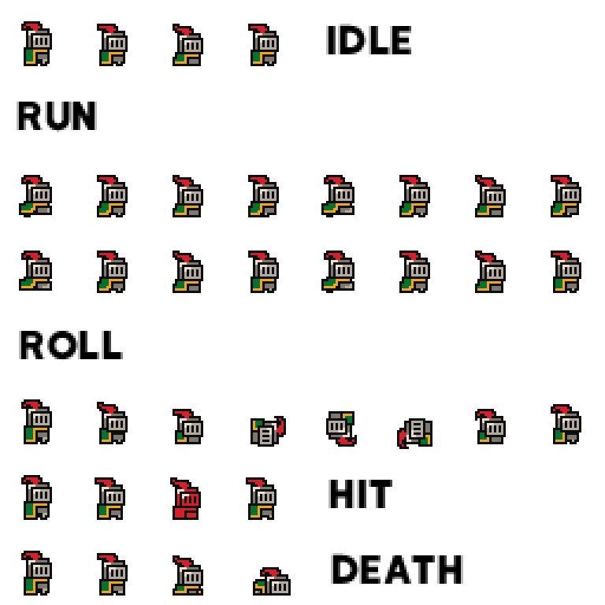
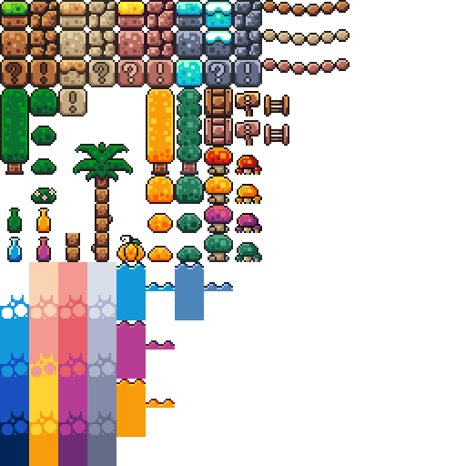

# Trabajo Práctico 4 — Un plataformero: juntá las monedas

> **Diplomatura de Videojuegos · Clase 4**
> Objetivo: armar un **mini plataformero jugable**. El corazón del TP son las **señales**: el jugador junta **monedas** al tocarlas (con `Area2D`, señales y grupos). Como **plus**, las plataformas las hacemos con un **TileSet** (colisión definida en los tiles, sin un `StaticBody2D` por cada uno). Todo con los sprites gratis de **Brackeys**.

---

## 🎯 Qué vas a lograr

Un nivel donde un **caballero animado**:

- **camina y salta** con física real (`move_and_slide()`, gravedad),
- se apoya en **plataformas hechas con tiles**,
- **junta monedas** que giran, y suma puntos en la consola (esto es lo central: **señales**),
- gana cuando las junta todas,
- y la **cámara lo sigue**.

> 💡 **Tiempo estimado:** 90–120 min. Es el TP más largo, pero cada parte se prueba sola. **Escribí el código vos.**

> 🔗 **Viene de la Clase 4:** cuerpos físicos, `CharacterBody2D` + `move_and_slide()`, `CollisionShape2D`, **señales**, `Area2D` y **grupos**. Todo eso se junta acá en un juego.

---

## 🎨 Los assets (Brackeys · CC0)

Están en la carpeta [`tp4-assets/`](tp4-assets/) de este repo. Son de **Brackeys** (licencia **CC0**: uso libre). Vas a usar tres:

**`knight.png`** — el jugador. Hoja de 8×8 con frames de **32×32**. Trae **texto** (IDLE, RUN…) metido en la hoja: ignoralo, vas a elegir solo los frames del caballero.



**`world_tileset.png`** — los tiles del mundo, de **16×16**. Vamos a usar los de **pasto/tierra** para el piso.



**`coin.png`** — la moneda que gira, **12 frames** de 16×16.


---

## 🧩 Cómo va a quedar el árbol de nodos

```
Nivel  (Node2D)
├── TileMapLayer                 ← las plataformas (colisión en el TileSet)
├── Jugador  (CharacterBody2D)
│   ├── AnimatedSprite2D         ← el caballero (idle / run)
│   ├── CollisionShape2D
│   └── Camera2D                 ← sigue al jugador
└── Monedas  (Node2D)            ← contenedor de las monedas
    └── Moneda (Area2D)  ×varias ← detecta al jugador (señal)
        ├── AnimatedSprite2D
        └── CollisionShape2D
```

---

## 🛠️ Parte 0 — Proyecto y assets

1. Godot → **New Project** → nombre `tp4-plataformero` → carpeta vacía → **Create & Edit**.
2. Copiá los sprites al proyecto: arrastrá `knight.png`, `world_tileset.png` y `coin.png` (de `tp4-assets/`) al panel **FileSystem**. Godot los importa solos.
3. **Que los píxeles se vean nítidos** (importante con pixel-art): andá a **Project → Project Settings → Rendering → Textures** y poné **Default Texture Filter = Nearest**. Sin esto, los sprites se ven borrosos.
4. Creá la escena: panel **Escena** → **Otro Nodo** → **`Node2D`** → renombralo **`Nivel`**. Guardá con **Ctrl + S** como `nivel.tscn`.

✅ **Punto de control 0:** tenés un `Nivel (Node2D)` guardado y los 3 sprites en el FileSystem.

---

## 🧱 Parte 1 — Las plataformas con TileSet

> **Plus de la clase:** en vez de un `StaticBody2D` por cada bloque, definimos la colisión **una vez** en el `TileSet` y la reusamos en todos los tiles. Es como se hacen los plataformeros de verdad.

### 1.1 · Crear el TileMapLayer y su TileSet

1. Seleccioná **`Nivel`** → **Otro Nodo** (Ctrl+A) → **`TileMapLayer`**.
2. Con el `TileMapLayer` seleccionado, en el **Inspector**, en la propiedad **Tile Set** elegí **Nuevo TileSet**.

   

3. Hacé clic en ese `TileSet` para editarlo. **Importante:** poné **Tile Size = `16` × `16`** (nuestros tiles son de 16 px).

   

   > 📸 La captura oficial usa 64×64 (otro pack). En **nuestro** caso es **16×16**.

4. Abajo se abre el editor del **TileSet**. Arrastrá **`world_tileset.png`** desde el FileSystem al panel de la izquierda (fuentes/atlas). Godot pregunta si quiere **crear los tiles automáticamente**: decí **Sí**.

   

### 1.2 · Agregar una Physics Layer (la colisión)

5. Seleccioná de nuevo el **`TileMapLayer`**. En el Inspector, dentro del `TileSet`, desplegá **Physics Layers** y clic en **Add Element**.

   

   > 🧠 Con esto el `TileSet` ya **puede guardar** formas de colisión. No hace falta ningún `StaticBody2D`.

### 1.3 · Pintar la colisión en los tiles del piso

6. Volvé al editor del **TileSet** (panel de abajo). Arriba, entrá en la pestaña **Paint** y en **Paint Properties** elegí **Physics Layer 0**.
7. En la lista de la derecha, hacé clic sobre un **tile de pasto/tierra** y presioná **F**: Godot le pone una **caja de colisión que cubre todo el tile**.

   

8. Repetí en **todos los tiles sólidos** que vayas a usar de piso y paredes. Los tiles de **decoración/fondo los dejás sin colisión**.

   

   > 💡 Alcanza con darles colisión a **2 o 3 tiles** (uno de pasto, uno de tierra). No hace falta configurarlos todos.

### 1.4 · Pintar el nivel

9. Con el `TileMapLayer` seleccionado, abrí el panel **TileMap** (abajo).

   

10. Elegí un tile de piso en la paleta y **pintá** en el viewport (clic izquierdo dibuja, derecho borra). Armá un **piso** abajo y **un par de plataformas** flotando.

    

✅ **Punto de control 1:** tenés un piso y plataformas pintadas, y esos tiles tienen colisión (Parte 1.3).

> 🛟 **No sé si los tiles tienen colisión**
>
> <details>
> <summary>Abrí para ver soluciones</summary>
>
> - En el editor del TileSet, con **Physics Layer 0** seleccionado en Paint, los tiles con colisión muestran la forma dibujada encima.
> - Si un tile no tiene la caja, seleccionalo y apretá **F**.
> - Más adelante, si el jugador atraviesa el piso, casi siempre es esto.
> </details>

---

## 🧍 Parte 2 — El jugador (CharacterBody2D + animación)

### 2.1 · El nodo

1. Seleccioná **`Nivel`** → **Otro Nodo** → **`CharacterBody2D`** → renombralo **`Jugador`**.

   > 🧠 `CharacterBody2D` es el nodo para personajes controlados (Clase 4). Se mueve con `velocity` + `move_and_slide()`.

### 2.2 · La animación con AnimatedSprite2D

2. Hijo de `Jugador` (Ctrl+A) → **`AnimatedSprite2D`**.
3. En el Inspector, propiedad **Sprite Frames** → **Nuevo SpriteFrames**.

   

4. Clic en el recurso SpriteFrames → se abre el panel de abajo. Renombrá la animación `default` a **`idle`**.
5. Clic en **Añadir Frames desde un Sprite Sheet** (el ícono de la cuadrícula).

   

6. Elegí **`knight.png`**. En el diálogo poné **Horizontal = 8** y **Vertical = 8** (la hoja es de 8×8 frames de 32 px). Se arma la grilla.
7. **Seleccioná los 4 primeros frames de la fila de arriba** (los del **IDLE**) y clic en **Add Frames**.

   

   > 📸 En la captura son ranas; en tu caso son caballeros. **No selecciones** las celdas con el texto “IDLE/RUN”.

8. **Ahora la corrida:** en el panel SpriteFrames creá una animación nueva llamada **`run`**. Con `run` seleccionada, **Añadir Frames desde un Sprite Sheet** otra vez con `knight.png` (8×8) y seleccioná los **8 frames de la fila del RUN** (la fila de caballeros que está debajo del texto “RUN”). **Add Frames**.
9. Para cada animación, activá **🔁 Loop**. En **`idle`** activá también **Autoplay on Load** (el ícono con la **A**), así arranca sola. Subí los FPS de `run` a ~**10**.
10. Si el caballero se ve muy grande o muy chico respecto de los tiles, ajustá **Transform → Scale** del `AnimatedSprite2D` (algo como `0.6, 0.6`).

### 2.3 · La colisión del jugador

11. Hijo de `Jugador` → **`CollisionShape2D`** → en **Shape** creá un **`CapsuleShape2D`** y ajustalo para que envuelva al caballero.

    

12. Poné al `Jugador` **arriba del piso** (movelo en el viewport).

✅ **Punto de control 2:** al dar **F6**, ves al caballero animado (aunque todavía cae, porque no tiene script).

---

## 🎮 Parte 3 — El Input Map

Abrí **Project → Project Settings → Input Map** y creá **3 acciones** (escribir nombre → **Add** → **`+`** → apretar la tecla → **OK**):


| Acción | Tecla |
| :---- | :---- |
| `move_left` | **A** o **←** |
| `move_right` | **D** o **→** |
| `jump` | **Espacio** |


✅ **Punto de control 3:** tenés `move_left`, `move_right` y `jump` en el Input Map.

---

## 🏃 Parte 4 — Movimiento, salto y animación

Adjuntá un script al **`Jugador`** (clic derecho → **Attach Script** → `res://jugador.gd`) y escribí:

```gdscript
extends CharacterBody2D

const VELOCIDAD := 130.0
const FUERZA_SALTO := -320.0
const GRAVEDAD := 900.0

@export var total_monedas := 3   # cuántas monedas hay en el nivel (se ve en el Inspector)
var puntos := 0

func _ready():
    add_to_group("jugador")                 # el grupo que la moneda va a buscar
    print("A juntar " + str(total_monedas) + " monedas!")

func _physics_process(delta):
    # 1) Gravedad
    if not is_on_floor():
        velocity.y += GRAVEDAD * delta

    # 2) Salto (solo en el suelo)
    if Input.is_action_just_pressed("jump") and is_on_floor():
        velocity.y = FUERZA_SALTO

    # 3) Movimiento horizontal
    var dir := Input.get_axis("move_left", "move_right")
    velocity.x = dir * VELOCIDAD

    # 4) Animación según lo que hace
    if dir != 0:
        $AnimatedSprite2D.play("run")
        $AnimatedSprite2D.flip_h = dir < 0   # mira a la izquierda si va a la izquierda
    else:
        $AnimatedSprite2D.play("idle")

    # 5) Que el motor resuelva las colisiones
    move_and_slide()
```

Apretá **F6**: el caballero **cae, aterriza sobre los tiles** y se mueve con las teclas, animándose y dándose vuelta según la dirección. 🎉

> 🧠 **`move_and_slide()`** usa `velocity` y la colisión del jugador para chocar con las plataformas del TileSet. El `@export` hace que `total_monedas` **aparezca en el Inspector** del Jugador: después lo ajustás a la cantidad de monedas que pongas.

✅ **Punto de control 4:** el caballero camina, salta y **no atraviesa** el piso.

> 🛟 **El caballero atraviesa el piso**
>
> <details>
> <summary>Abrí para ver soluciones</summary>
>
> - Los tiles del piso, ¿tienen colisión? (Parte 1.3, apretar **F** sobre el tile con Physics Layer 0).
> - El `Jugador`, ¿tiene su `CollisionShape2D` con forma?
> - ¿Estás llamando a **`move_and_slide()`** al final?
> - ¿El movimiento está en **`_physics_process`** (no en `_process`)?
> </details>

---

## 🪙 Parte 5 — Las monedas: señales (el corazón del TP)

> **Concepto central (Clase 4):** la moneda es un `Area2D` que **detecta** al jugador y **emite** la señal `body_entered`. Al recibirla, le suma un punto al jugador y se elimina. La moneda **no conoce** al jugador de antemano: solo “toca la campana”.

### 5.1 · Armar una moneda

1. Seleccioná **`Nivel`** → **Otro Nodo** → **`Area2D`** → renombralo **`Moneda`**.
2. Hijo de `Moneda` → **`AnimatedSprite2D`** → **Nuevo SpriteFrames** → animación `default`, **Añadir Frames desde un Sprite Sheet** con **`coin.png`**, **Horizontal = 12**, **Vertical = 1**, seleccioná los **12 frames** → **Add**. Activá **Loop** y **Autoplay on Load**. Así la moneda **gira sola**.
3. Hijo de `Moneda` → **`CollisionShape2D`** → **Shape** → **`CircleShape2D`** (radio chico, ~8 px, que cubra la moneda).

### 5.2 · El script de la moneda

4. Adjuntá un script a **`Moneda`** (`res://moneda.gd`):

```gdscript
extends Area2D

func _ready():
    # cuando un cuerpo entre al área, se llama a _on_body_entered
    body_entered.connect(_on_body_entered)

func _on_body_entered(body):
    if body.is_in_group("jugador"):   # ¿lo que entró es el jugador?
        body.sumar_punto()            # le pedimos que sume un punto
        queue_free()                  # y la moneda se elimina
```

5. Agregá al **`Jugador`** (en `jugador.gd`) la función que la moneda va a llamar:

```gdscript
func sumar_punto():
    puntos += 1
    print("¡Moneda! " + str(puntos) + "/" + str(total_monedas))
    if puntos == total_monedas:
        print("🏆 ¡Ganaste! Juntaste todas las monedas.")
```

> ⚠️ **Si la moneda no reacciona:** el `Area2D` necesita su `CollisionShape2D` con forma (sin forma no detecta nada), y el jugador tiene que estar en el grupo `"jugador"` (lo hace `add_to_group("jugador")` en su `_ready`).

✅ **Punto de control 5:** poné el `Jugador` de modo que toque la `Moneda` → en la consola aparece “¡Moneda! 1/3” y la moneda desaparece.

---

## 🏆 Parte 6 — Varias monedas, cámara y victoria

### 6.1 · Convertir la moneda en escena reutilizable

1. Clic derecho sobre **`Moneda`** → **Save Branch as Scene** → `moneda.tscn`. Ahora la moneda es una **pieza reutilizable** (como vimos en la Clase 1).
2. Creá un nodo **`Node2D`** hijo de `Nivel` llamado **`Monedas`** (para tenerlas ordenadas).
3. **Instanciá** varias monedas: seleccioná `Monedas` → ícono de **cadena** (Instantiate Child Scene) → elegí `moneda.tscn`. Repetí y **ubicá cada moneda** en distintos lugares del nivel (sobre las plataformas).

### 6.2 · La cámara que sigue al jugador

4. Seleccioná **`Jugador`** → hijo → **`Camera2D`**. Como es hija del jugador, **lo sigue**. Poné **Zoom** en `3, 3` (el mundo es chiquito) para verlo más grande.

### 6.3 · Ajustar el contador de victoria

5. Seleccioná el **`Jugador`** y en el Inspector poné **`Total Monedas`** = la **cantidad de monedas** que colocaste.

Apretá **F6** y jugá: corré, saltá de plataforma en plataforma, **juntá todas las monedas** y mirá el “🏆 ¡Ganaste!” en la consola.

✅ **Punto de control 6 (final):** juntás todas las monedas y aparece el mensaje de victoria.

---

## 📤 Entrega

Entregá **una** de estas opciones:

1. La **carpeta del proyecto** comprimida en `.zip` (sin `.godot/`), **o**
2. Un **video corto** (o GIF) jugando: moverse, saltar y juntar todas las monedas.

**Nombre:** `tp4-plataformero-ApellidoNombre.zip`

### ✔️ Checklist de autoevaluación

- [ ] El `TileSet` tiene una **Physics Layer** y los tiles del piso tienen colisión.
- [ ] El nivel está pintado con el **TileMapLayer**.
- [ ] El `Jugador` es un `CharacterBody2D` con `AnimatedSprite2D` (idle + run) y `CollisionShape2D`.
- [ ] Se mueve y salta con **`move_and_slide()`**, sin atravesar el piso.
- [ ] La `Moneda` es un `Area2D` que usa la **señal `body_entered`**.
- [ ] Usás el **grupo `"jugador"`** y la moneda llama a `sumar_punto()`.
- [ ] Hay **varias monedas** (instancias de `moneda.tscn`) y un mensaje de **victoria**.
- [ ] La **cámara sigue** al jugador.

---

## 🌟 Extra (opcional)

- **Plataformas one-way:** en el TileSet, en la forma de colisión de un tile-plataforma, activá **One Way** (se atraviesa desde abajo y se aterriza desde arriba). Ideal para plataformas finitas.
- **Enemigos:** usá `slime_green.png` (Brackeys) como un `Area2D` de daño; si toca al jugador, reiniciá con `get_tree().reload_current_scene()`.
- **Sonido:** un `AudioStreamPlayer` que suene al juntar una moneda (el pack de Brackeys trae efectos en `sounds/`).
- **Reaparecer:** una zona `Area2D` de “vacío” abajo del nivel que devuelva al jugador a la posición inicial si se cae.

---

## 📚 Recursos

- Usar TileSets (colisiones): **[docs.godotengine.org/es/4.x — Using TileSets](https://docs.godotengine.org/es/4.x/tutorials/2d/using_tilesets.html)**
- Usar TileMaps (pintar): **[Using TileMaps](https://docs.godotengine.org/es/4.x/tutorials/2d/using_tilemaps.html)**
- Animación 2D (sprite sheets): **[2D sprite animation](https://docs.godotengine.org/es/4.x/tutorials/2d/2d_sprite_animation.html)**
- Señales: **[Signals](https://docs.godotengine.org/es/4.x/getting_started/step_by_step/signals.html)**

> Sprites de **Brackeys** (analogStudios_, RottingPixels) — licencia **CC0**. Ver [`tp4-assets/LICENSE-brackeys.txt`](tp4-assets/LICENSE-brackeys.txt).
> Capturas del editor: documentación oficial de **Godot Engine**, CC BY 4.0.
