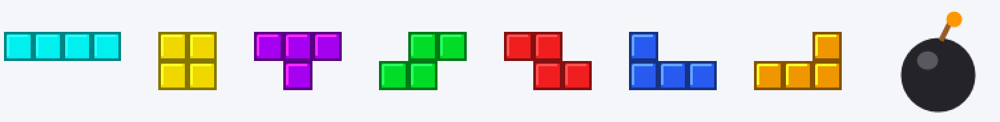
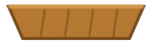

# Trabajo Práctico 5 — Atrapa las piezas (herencia y spawning)

> **Diplomatura de Videojuegos · Clase 5**
> Objetivo: hacer un mini-juego de **atrapar** con todo lo de la clase. El corazón es la **herencia**: una **clase base** para los objetos que caen, y **dos clases hijas** que la extienden — una **comida** (piezas de Tetris → suman) y una **basura** (bomba → resta). Más **grupos**, **instanciación** y **spawning** con `Timer`.

---

## 🎯 Qué vas a lograr

Una **canasta** que movés con las flechas en la parte de abajo. Desde arriba caen objetos:

- **Piezas de Tetris** (comida): atraparlas **suma** un punto. ✅
- **Bombas** (basura): atraparlas **resta** un punto. 💣

El puntaje aparece en la consola. Y todo el sistema de objetos que caen sale de **una sola clase base**.

> 💡 **Tiempo estimado:** 75–100 min. **Escribí el código vos** — la herencia se entiende tecleándola.

> 🔗 **Viene de la Clase 5:** cada script es una **clase**, `extends` es **herencia**, `preload` + `instantiate` es **instanciación**, y `Timer` + posiciones al azar es **spawning**. Reusamos también **grupos** (Clase 4).

---

## 🎨 Los assets

Están en [`tp5-assets/`](tp5-assets/) de este repo (hechos para el TP, libres de usar). Las **7 piezas de Tetris** son la *comida*; la **bomba** es la *basura*:



Y la **canasta** que vas a mover:



---

## 🧩 La idea: una clase base y dos hijas

Este es el concepto central. En vez de programar dos objetos separados, hacemos **una clase base** con lo común (caer, detectar la canasta) y **dos hijas** que solo cambian lo suyo:

```
        Area2D            (nodo de Godot)
          ▲  extends
     objeto_cae.gd        ← CAE + detecta la canasta  (lo común)
       ▲          ▲  extends
 comida.gd     basura.gd
 grupo         grupo
 "comida"      "basura"
 valor +1      valor -1
```

> 🧠 **Herencia:** `comida.gd` y `basura.gd` **heredan** de `objeto_cae.gd` todo el comportamiento de caer y chocar. Solo agregan **en qué grupo están** y **cuánto valen**. Si mañana querés cambiar cómo caen todos, tocás **un solo archivo**: la clase base.

### Árbol de la escena final

```
Nivel  (Node2D)
├── Canasta  (CharacterBody2D)   [grupo "canasta"]
│   ├── Sprite2D
│   └── CollisionShape2D
└── Spawner  (Node2D)            ← crea comidas y basuras con un Timer
```

---

## 🛠️ Parte 0 — Proyecto y assets

1. Godot → **New Project** → nombre `tp5-atrapar` → carpeta vacía → **Create & Edit**.
2. Copiá **toda la carpeta `tp5-assets/`** dentro del proyecto (arrastrala al panel **FileSystem**).
3. **Píxeles nítidos:** Project → Project Settings → **Rendering → Textures → Default Texture Filter = Nearest**.
4. **Espacio para jugar:** Project Settings → **Display → Window** → Viewport Width **1280**, Height **720**.
5. Creá la escena: panel **Escena** → **Otro Nodo** → **`Node2D`** → renombralo **`Nivel`**. Guardá (**Ctrl+S**) como `nivel.tscn`.

   

✅ **Punto de control 0:** tenés `Nivel (Node2D)` guardado y la carpeta `tp5-assets/` en el FileSystem.

---

## 🧬 Parte 1 — La clase base `objeto_cae.gd`

> **Concepto:** un script suelto que funciona como **clase base**. Todavía no lo colgamos de ningún nodo: es la plantilla de comportamiento.

1. En el panel **FileSystem**, clic derecho sobre la carpeta raíz → **New → Script…**
2. En el diálogo: **Inherits** = `Area2D`, **Name/Path** = `res://objeto_cae.gd`, plantilla **Empty**. **Create**.
3. Escribí esto:

```gdscript
extends Area2D

var velocidad := 250.0
var valor := 0     # cuánto suma/resta. Las clases hijas lo cambian.

func _ready() -> void:
    # Cuando un cuerpo entre a esta área, se llama a _on_body_entered
    body_entered.connect(_on_body_entered)

func _process(delta: float) -> void:
    position.y += velocidad * delta   # caer, siempre con delta
    if position.y > 760:              # se fue por abajo
        queue_free()

func _on_body_entered(body: Node) -> void:
    if body.is_in_group("canasta"):
        body.sumar_puntos(valor)      # le avisa a la canasta cuánto vale
        queue_free()                  # el objeto desaparece al ser atrapado
```

> 🧠 **Por qué `Area2D`:** detecta cuándo algo entra en su zona (la señal `body_entered`), pero **no bloquea** el paso. Perfecto para objetos que se “recogen”. El `valor` arranca en `0`: cada hija lo va a cambiar a `+1` o `-1`.

✅ **Punto de control 1:** tenés el archivo `objeto_cae.gd` sin errores (el editor no marca nada en rojo).

---

## 🧺 Parte 2 — La canasta (CharacterBody2D)

> **Concepto:** el jugador. Se mueve con las flechas y **lleva el puntaje**.

1. Seleccioná **`Nivel`** → **Otro Nodo** → **`CharacterBody2D`** → renombralo **`Canasta`**.
2. Hijo de `Canasta` (Ctrl+A) → **`Sprite2D`** → arrastrale `tp5-assets/canasta.png` a la propiedad **Texture**.
3. Hijo de `Canasta` → **`CollisionShape2D`** → **Shape** → **Nuevo RectangleShape2D**, ajustá el rectángulo al tamaño de la cesta.

   

4. Movés la `Canasta` **abajo y al centro** (por ejemplo Position `x = 640`, `y = 660`).
5. **Adjuntá un script** a `Canasta` (clic derecho → Attach Script → `res://canasta.gd`):

   

```gdscript
extends CharacterBody2D

var velocidad := 500.0
var puntos := 0

func _ready() -> void:
    add_to_group("canasta")      # el grupo que los objetos van a buscar
    print("¡A atrapar piezas! Puntos: 0")

func _physics_process(delta: float) -> void:
    velocity.x = Input.get_axis("ui_left", "ui_right") * velocidad
    move_and_slide()
    # que no se vaya de la pantalla
    var ancho := get_viewport_rect().size.x
    position.x = clamp(position.x, 0, ancho)

func sumar_puntos(valor: int) -> void:
    puntos += valor
    print("Puntos: " + str(puntos))
```

Apretá **F6** (guardá el nivel si te lo pide) y movéla con **← →**. **Clic en la ventana** para que reciba las teclas.

> 🧠 Usamos las acciones **`ui_left`** y **`ui_right`** que **ya vienen** en Godot (las flechas): no hace falta tocar el Input Map. `get_axis` devuelve `-1`, `0` o `1`.

✅ **Punto de control 2:** la canasta se mueve de lado a lado y no se escapa de la pantalla.

---

## 🍕 Parte 3 — La comida: piezas de Tetris (primera clase hija)

> **Concepto central:** una clase que **hereda** de `objeto_cae.gd`.

1. Seleccioná **`Nivel`** → **Otro Nodo** → **`Area2D`** → renombralo **`Comida`**.
2. Hijo → **`Sprite2D`** (dejalo sin textura; la elige el código). Bajale la escala a `0.7, 0.7`.
3. Hijo → **`CollisionShape2D`** → **RectangleShape2D** (~60×45, que cubra las piezas).
4. **Adjuntá el script**, pero acá está el truco de la herencia: en el diálogo **Attach Node Script**, en el campo **Inherits** hacé clic en la carpeta 📁 y elegí **`objeto_cae.gd`**. Path: `res://comida.gd`. **Create**.

   

   > 🧠 Al poner **Inherits = `objeto_cae.gd`**, Godot crea el script empezando con `extends "res://objeto_cae.gd"`. ¡Eso es herencia! `comida.gd` ya sabe caer y detectar la canasta, sin escribir nada de eso.

5. Completá `comida.gd`:

```gdscript
extends "res://objeto_cae.gd"

var texturas := [
    preload("res://tp5-assets/tetromino-i.png"),
    preload("res://tp5-assets/tetromino-o.png"),
    preload("res://tp5-assets/tetromino-t.png"),
    preload("res://tp5-assets/tetromino-s.png"),
    preload("res://tp5-assets/tetromino-z.png"),
    preload("res://tp5-assets/tetromino-j.png"),
    preload("res://tp5-assets/tetromino-l.png"),
]

func _ready() -> void:
    super()                                # ejecuta el _ready() de la clase base
    add_to_group("comida")
    valor = 1
    $Sprite2D.texture = texturas.pick_random()   # una pieza al azar
```

6. Guardá la escena de la comida como **`comida.tscn`** (Ctrl+S).
7. **Probala:** volvé a `nivel.tscn`, subí la `Comida` arriba de la canasta y corré. Movete para atraparla → en la consola sale **“Puntos: 1”** y la pieza desaparece.

> 🧠 **`super()`** llama al `_ready()` de la clase base (que conecta la señal `body_entered`). Si te lo olvidás, la comida no detecta la canasta. La herencia **suma**, no reemplaza.

✅ **Punto de control 3:** al atrapar una pieza de Tetris, el puntaje **sube**.

> 🛟 **La comida no suma / atraviesa la canasta**
>
> <details>
> <summary>Abrí para ver soluciones</summary>
>
> - ¿Pusiste **`super()`** como primera línea del `_ready()` de la comida?
> - ¿La `Comida` (Area2D) y la `Canasta` tienen su `CollisionShape2D` con forma?
> - ¿La `Canasta` hace `add_to_group("canasta")` en su `_ready()`?
> - El `Sprite2D` de la comida tiene que llamarse **`Sprite2D`** (por el `$Sprite2D`).
> </details>

---

## 💣 Parte 4 — La basura: bombas (segunda clase hija)

> **Concepto:** otra clase hija de la misma base. Casi no hay que escribir nada — esa es la gracia de la herencia.

1. En el **FileSystem**, clic derecho sobre `comida.tscn` → **Duplicate…** → llamala **`basura.tscn`**.
2. Abrí `basura.tscn`, renombrá el nodo raíz a **`Basura`**.
3. Clic derecho en la raíz → **Attach Script** con **Inherits = `objeto_cae.gd`**, path `res://basura.gd`. Completá:

```gdscript
extends "res://objeto_cae.gd"

func _ready() -> void:
    super()
    add_to_group("basura")
    valor = -1
    $Sprite2D.texture = preload("res://tp5-assets/basura.png")
```

4. Guardá.

> 🧠 Mirá lo corto que es: `basura.gd` **hereda todo** de `objeto_cae.gd` (caer, detectar la canasta) y solo cambia el grupo, el valor y el sprite. **Escribir una vez, usar muchas.**

✅ **Punto de control 4:** poné una `Basura` sobre la canasta, atrapala, y el puntaje **baja** a −1.

---

## 🌊 Parte 5 — El Spawner: que caigan solas

> **Concepto:** **instanciación** + **spawning** con `Timer`.

1. Seleccioná **`Nivel`** → **Otro Nodo** → **`Node2D`** → renombralo **`Spawner`**.
2. Adjuntale un script `res://spawner.gd`:

```gdscript
extends Node2D

var escena_comida := preload("res://comida.tscn")
var escena_basura := preload("res://basura.tscn")

func _ready() -> void:
    var t := Timer.new()          # creamos un Timer por código
    add_child(t)
    t.wait_time = 1.0
    t.timeout.connect(soltar)     # cada segundo llama a soltar()
    t.start()

func soltar() -> void:
    # 75% comida, 25% basura
    var escena = escena_comida if randf() < 0.75 else escena_basura
    var obj = escena.instantiate()          # copia viva de la escena
    var ancho := get_viewport_rect().size.x
    obj.position = Vector2(randf_range(40, ancho - 40), -40)
    add_child(obj)                           # aparece como hijo del Spawner
```

3. **Sacá** del nivel las `Comida`/`Basura` que pusiste a mano para probar (ahora las crea el Spawner).
4. Apretá **F6** y jugá: llueven piezas y bombas; atrapá las piezas, esquivá las bombas.

> 🧠 **`preload`** carga las escenas plantilla una vez. **`instantiate()`** crea una copia viva de cada objeto, y **`add_child()`** la hace aparecer. El `Timer` dispara todo con su señal `timeout`.

✅ **Punto de control 5 (final):** caen objetos solos, el puntaje sube con las piezas y baja con las bombas.

> 🛟 **Errores comunes**
>
> <details>
> <summary>Abrí para ver soluciones</summary>
>
> - **“Invalid call … instantiate”**: revisá que las rutas de `preload` coincidan con los `.tscn` en el FileSystem.
> - **Caen todas encimadas**: usá `randf_range(40, ancho - 40)` para la X.
> - **No pasa nada**: ¿el `Timer` tiene `start()` y su `timeout` conectado a `soltar`?
> - **Indentación mezclada**: usá espacios **o** tabs en todo el archivo, no los combines.
> </details>

---

## 📤 Entrega

Entregá **una** de estas opciones:

1. La **carpeta del proyecto** comprimida en `.zip` (sin `.godot/`), **o**
2. Un **video/GIF** corto jugando: atrapar piezas (sube) y una bomba (baja).

**Nombre:** `tp5-atrapar-ApellidoNombre.zip`

### ✔️ Checklist de autoevaluación

- [ ] Existe la **clase base** `objeto_cae.gd` (cae + detecta la canasta).
- [ ] `comida.gd` y `basura.gd` **heredan** de ella con `extends "res://objeto_cae.gd"`.
- [ ] La comida se agrega al grupo **`comida`** (valor +1); la basura a **`basura`** (valor −1).
- [ ] La `Canasta` está en el grupo **`canasta`** y se mueve con las flechas.
- [ ] Al atrapar, el puntaje **sube o baja** según el tipo.
- [ ] El **Spawner** instancia objetos con un `Timer` y posiciones al azar.

---

## 🌟 Extra (opcional)

- **Puntaje en pantalla:** agregá un `CanvasLayer` con un `Label` y que la canasta actualice su texto en `sumar_puntos()` (adelanto de la Clase 6).
- **Dificultad progresiva:** que el `wait_time` del Timer baje con el tiempo, o que la `velocidad` de los objetos suba.
- **Sonido:** un `AudioStreamPlayer` distinto al atrapar comida y al atrapar basura.
- **Game Over:** que el puntaje no pueda bajar de 0, o que 3 bombas terminen la partida con `get_tree().reload_current_scene()`.
- **Más variedad:** una tercera clase hija (ej. una pieza **dorada** que valga +5), heredando de la misma base. Vas a ver lo fácil que es sumar tipos nuevos.

---

## 📚 Recursos

- Scripts como clases y herencia: **[docs.godotengine.org/es/4.x — GDScript basics](https://docs.godotengine.org/es/4.x/tutorials/scripting/gdscript/gdscript_basics.html)**
- Instanciar escenas: **[Instancing](https://docs.godotengine.org/es/4.x/getting_started/step_by_step/instancing.html)**
- Nodo Timer: **[clase Timer](https://docs.godotengine.org/es/4.x/classes/class_timer.html)**

> Capturas del editor: documentación oficial de **Godot Engine** — CC BY 4.0. Sprites de piezas, bomba y canasta: hechos para este TP, libres de usar.
