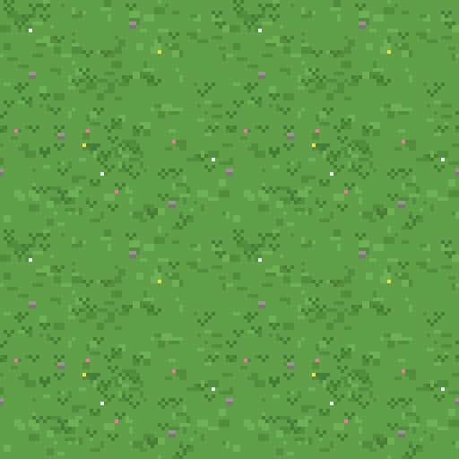
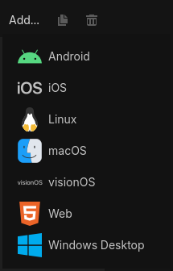

# Trabajo Práctico 8 — Proyecto final: terminá tu juego

> **Diplomatura de Videojuegos · Proyecto final**
> Objetivo: convertir el prototipo del TP7 en un **juego terminado**: una cámara que te sigue, un piso **infinito**, un **menú de inicio** con tu nombre, un **ranking** que se **guarda en disco**, una pantalla final, el juego **exportado** a `.exe`… y **algo tuyo**: una idea propia que le agregue algo al juego.

---

## 🎯 Qué vas a lograr

- La **cámara sigue al caballero** y el mundo deja de terminar en el borde de la ventana.
- Un **piso que no se acaba nunca**, con un solo nodo (`Parallax2D`).
- Un **Autoload** que cuenta el tiempo sobrevivido y los slimes eliminados, y que sobrevive a los cambios de escena.
- Un **menú de inicio** donde escribís tu nombre, y una **pantalla final** con el **top 5** de partidas, resaltando la tuya.
- El ranking **guardado en un archivo** (`FileAccess` + `JSON`): cerrás el juego, lo abrís, y sigue ahí.
- El juego **exportado** y corriendo en una compu sin Godot.
- **Tu aporte**: una mecánica, un arma o un enemigo nuevo, elegido de una lista o propuesto por vos.

> 💡 **Tiempo estimado:** 2 h 30 a 3 h, en varias sentadas. Cada parte se prueba sola y deja el juego andando. **Escribí el código vos**: es la última vez que lo hacemos con la red de seguridad de un tutorial.

> 🔗 **Viene de todo el curso:** menús, `change_scene_to_file()` y el Autoload `Partida` (TP6), grupos, `Timer` e instanciar (TP5 y TP7), señales y `Area2D` (TP4), y la máquina de estados del jefe (Clase 8). Lo nuevo de hoy: `Camera2D`, `Parallax2D`, `LineEdit`, `FileAccess` y `JSON`.

---

## 📍 Punto de partida

Este TP continúa **`tp7-sobrevivir`** con el **jefe de la Clase 8** (acechar → perseguir → atacar → golpeado). Copiá la carpeta como **`tp8-final`** y abrila en Godot.

Confirmá que anda: los slimes te persiguen, las balas salen solas, cada 8 slimes entra el jefe violeta con su barra, y cuando le pegás se pone rojo y se frena medio segundo.

<details>
<summary>¿No llegaste a terminar el jefe en clase? Acá está <code>enemigo_elite.gd</code> completo</summary>

Reemplazá `enemigo_elite.gd` por esto (hereda de `enemigo.gd`, que queda igual que en el TP7):

```gdscript
extends "res://enemigo.gd"

enum Estado { ACECHAR, PERSEGUIR, ATACAR, GOLPEADO }

var estado := Estado.ACECHAR
var jugador: Node2D = null

func _ready() -> void:
	super()
	vida = 5
	velocidad = 35.0
	dano = 25
	$BarraVida.max_value = vida
	$BarraVida.value = vida

	jugador = get_tree().get_first_node_in_group("jugador")

	var etiqueta := Label.new()
	etiqueta.name = "LabelEstado"
	etiqueta.position = Vector2(-36, -66)
	add_child(etiqueta)

	var timer_ataque := Timer.new()
	timer_ataque.name = "TimerAtaque"
	timer_ataque.wait_time = 1.0
	timer_ataque.one_shot = true
	add_child(timer_ataque)

	var timer_golpe := Timer.new()
	timer_golpe.name = "TimerGolpe"
	timer_golpe.wait_time = 0.5
	timer_golpe.one_shot = true
	add_child(timer_golpe)

func _process(delta: float) -> void:
	if jugador == null:
		return
	var d := distancia_al_jugador()
	match estado:
		Estado.ACECHAR:
			acechar(delta)
			if d < 250: estado = Estado.PERSEGUIR
		Estado.PERSEGUIR:
			perseguir(delta)
			if d < 40:    estado = Estado.ATACAR
			elif d > 350: estado = Estado.ACECHAR
		Estado.ATACAR:
			atacar()
			if d > 60:  estado = Estado.PERSEGUIR
		Estado.GOLPEADO:
			golpeado()
			if $TimerGolpe.is_stopped():
				$AnimatedSprite2D.modulate = Color.WHITE
				estado = Estado.PERSEGUIR
	$LabelEstado.text = Estado.keys()[estado]

func _on_body_entered(body: Node) -> void:
	pass

func acechar(delta: float) -> void:
	var dir := (jugador.position - position).normalized()
	position += dir * velocidad * 0.5 * delta
	$AnimatedSprite2D.flip_h = dir.x < 0

func perseguir(delta: float) -> void:
	var dir := (jugador.position - position).normalized()
	position += dir * velocidad * delta
	$AnimatedSprite2D.flip_h = dir.x < 0

func atacar() -> void:
	if $TimerAtaque.is_stopped():
		jugador.recibir_dano(dano)
		$TimerAtaque.start()

func golpeado() -> void:
	$AnimatedSprite2D.modulate = Color(1, 0.4, 0.4)

func distancia_al_jugador() -> float:
	return position.distance_to(jugador.position)

func recibir_dano(cantidad: int) -> void:
	super(cantidad)
	$BarraVida.value = vida
	if vida > 0:
		position += (position - jugador.position).normalized() * 20
		$TimerGolpe.start()
		estado = Estado.GOLPEADO
```
</details>

### Cómo queda el proyecto al final

```
menu.tscn        ← NUEVA: título, tu nombre, Jugar / Salir          (Main Scene)
nivel.tscn       ← el juego, con cámara, piso infinito y tiempo
game_over.tscn   ← NUEVA: resumen de la partida + ranking top 5
partida.gd       ← NUEVO: Autoload "Partida" — nombre, kills, tiempo y ranking guardado
```

| Parte | Qué se agrega | Qué se ve |
| :---- | :---- | :---- |
| 1 | `Camera2D` + spawner alrededor del jugador | El mundo se mueve con vos; el HUD queda fijo |
| 2 | `Parallax2D` con el piso | Caminás para siempre sin ver un borde |
| 3 | Autoload `Partida` + tiempo en el HUD | `Tiempo: 37` que sigue contando aunque reinicies |
| 4 | Menú con `LineEdit` | Escribís tu nombre y jugás |
| 5 | Ranking con `FileAccess` + `JSON` | Un archivo `ranking.json` con tus partidas |
| 6 | Pantalla final | Top 5 con tu puesto resaltado |
| 7 | Exportar | `mi_juego.exe` corriendo sin Godot |
| 8 | **Tu aporte** | Algo que no estaba en ningún TP |

---

## 🎥 Parte 1 — La cámara sigue al jugador

> **Concepto:** hasta hoy el mundo era la ventana: el caballero tenía un `clamp` para no salir y los slimes nacían en los bordes. Con una **`Camera2D`** hija del jugador, lo que se ve es **lo que rodea al caballero**, y el mundo pasa a ser tan grande como quieras.

### 1.1 · La cámara

1. Abrí `nivel.tscn`. Seleccioná **`Jugador`** → **Ctrl+A** → **`Camera2D`**. Al ser hija del jugador, **va a donde va él**: no hace falta ni una línea de código.
2. Con `Camera2D` seleccionada, en el Inspector: **Position Smoothing → Enabled** ✔, **Speed** `5`.
3. Abrí `jugador.gd` y **borrá** las tres líneas del `clamp` al final de `_physics_process` (las que empiezan con `var limites := get_viewport_rect().size`).

Apretá **F6** y caminá para cualquier lado. El caballero queda en el centro y **el mundo se mueve**. El HUD (barra y contador) **no se mueve**: sigue clavado en su esquina.

> 🧠 **¿Por qué el HUD no se movió?** Porque está en un **`CanvasLayer`** (TP7), y un `CanvasLayer` dibuja en **coordenadas de pantalla**, no del mundo: la cámara no lo afecta. Es exactamente para esto que existe. Y el *smoothing* hace que la cámara **llegue** a donde está el jugador en vez de estar pegada: se siente más suave, y cuando el jefe te empuja no da un latigazo.

### 1.2 · Los slimes aparecen alrededor tuyo

Ahora hay un problema: el spawner sigue usando los bordes **de la ventana** (`get_viewport_rect()`), que ya no coinciden con lo que ves. Si caminás lejos, los slimes aparecen en el lugar equivocado. La solución: que nazcan en un **círculo alrededor del jugador**, justo fuera de la vista.

4. Abrí `spawner.gd`. Agregá una variable y buscá al jugador en `_ready()`, como hace el jefe:

```gdscript
var jugador: Node2D = null

func _ready() -> void:
	$Timer.timeout.connect(spawnear)
	jugador = get_tree().get_first_node_in_group("jugador")
```

5. **Borrá** la función `posicion_en_el_borde()` entera y poné esta en su lugar:

```gdscript
func posicion_alrededor_del_jugador() -> Vector2:
	var angulo := randf_range(0, TAU)                          # un ángulo al azar (TAU = una vuelta entera)
	var desplazamiento := Vector2.RIGHT.rotated(angulo) * 750  # una flecha de 750 px en esa dirección
	return jugador.position + desplazamiento
```

6. En `spawnear()`, cambiá la línea de la posición y protegete por si no hay jugador:

```gdscript
func spawnear() -> void:
	if jugador == null:
		return
	contador += 1
	var enemigo
	if contador >= 8:
		contador = 0
		enemigo = escena_elite.instantiate()
	else:
		enemigo = escena_enemigo.instantiate()
	enemigo.position = posicion_alrededor_del_jugador()   # CAMBIÓ
	get_node("../Enemigos").add_child(enemigo)
```

> 🧠 **Un punto al azar en un círculo.** `Vector2.RIGHT` es la flecha `(1, 0)`. `.rotated(angulo)` la gira, y `* 750` la estira a 750 píxeles. Sumársela a la posición del jugador da un punto a 750 px de él, en una dirección al azar. ¿Por qué 750? La ventana es de 1280×720: desde el centro, la esquina más lejana está a unos 735 px. Con 750 el slime **siempre nace fuera de la vista**, y como te persigue, entra en pantalla solo. Es la misma cuenta de dirección × distancia que usan las balas.

✅ **Punto de control 1:** caminás en cualquier dirección y el mundo se mueve con vos, el HUD queda fijo, y los slimes siguen apareciendo de a uno, siempre desde afuera de la pantalla, aunque te hayas ido lejos del punto de partida.

> 🛟 **Errores comunes en esta parte**
>
> <details>
> <summary>Abrí para ver soluciones</summary>
>
> - **La cámara no sigue al jugador** → `Camera2D` tiene que ser **hija de `Jugador`**, no de `Nivel`. Arrastrala en el árbol si quedó mal.
> - **El caballero sigue sin poder salir de un rectángulo** → quedaron las líneas del `clamp`. Borrá las tres.
> - **Los slimes aparecen en pantalla** → 750 es poco si cambiaste el tamaño de la ventana o el zoom de la cámara. Subilo a `900`.
> - **"Invalid get index 'position' (on base: 'Nullinstance')" en el spawner** → `jugador` es `null`: el `Jugador` tiene que estar **arriba** del `Spawner` en el árbol (Godot ejecuta los `_ready()` en orden) y en el grupo `"jugador"`.
> - **Hay un gris feo alrededor** → es el fondo vacío de Godot: el mundo ahora es infinito y no hay nada dibujado ahí. Lo arreglamos ya mismo.
> </details>

---

## 🌿 Parte 2 — Un piso que no se termina

> **Concepto:** en un juego visto desde arriba, el "fondo" es el piso. Un `Parallax2D` con una textura repetida da un piso **infinito** con un solo nodo y cero código: cuando la cámara avanza el tamaño de la imagen, el nodo la **vuelve a poner adelante** sin que se note. Es exactamente lo que hace *Vampire Survivors*.

1. Descargá **[piso.png](tp8-assets/piso.png)** (pasto en *pixel art*, 1536×1024, hecho para repetirse sin costuras) y copialo a la carpeta del proyecto. Así se ve un pedazo:

   

2. En `nivel.tscn`, seleccioná **`Nivel`** → **Ctrl+A** → **`Parallax2D`** → renombralo **`Fondo`**.
3. **Arrastrá `Fondo` hasta arriba de todo** en el árbol, por encima de `Jugador`. En 2D, lo que está más arriba en el árbol se dibuja **primero**, o sea, debajo.
4. Hijo de `Fondo` → **`Sprite2D`** → renombralo **`Piso`**. Arrastrá `piso.png` a su propiedad **Texture**. En **Offset → Centered**, **destildalo**: la imagen tiene que empezar en `(0, 0)` y extenderse hacia abajo y a la derecha.
5. Seleccioná **`Fondo`** y en el Inspector, sección **Repeat**: **Repeat Size** = `1536` × `1024` (el tamaño exacto de la imagen).

Apretá **F6** y caminá para cualquier lado, todo lo que quieras: **el pasto no se acaba nunca**.

> 🧠 **Cómo funciona `repeat_size`.** El `Parallax2D` dibuja la textura y **una copia** corrida exactamente `repeat_size` píxeles. Cuando la cámara avanzó esa distancia, el nodo **vuelve la textura al principio** en el mismo frame: como la copia es idéntica, el ojo no lo ve. Por eso la imagen tiene que ser (a) **más grande que la ventana** (1536×1024 contra 1280×720) y (b) **continua**: el borde derecho encaja con el izquierdo y el de abajo con el de arriba. Si dibujás tu propio piso, cuidá esas dos cosas.
>
> **¿Y el "parallax"?** El nodo se llama así porque sirve para hacer que un fondo se mueva **más lento** que el mundo (`Scroll Scale` menor que 1) y parezca lejano, como las montañas de un plataformero. En un juego visto desde arriba el piso está **a la misma altura** que el caballero, así que lo dejamos en `(1, 1)`: se mueve igual que todo lo demás. Solo usamos el "infinito".

✅ **Punto de control 2:** caminás en cualquier dirección sin ver jamás el borde del piso ni el gris de fondo, y el caballero, los slimes y las balas se dibujan **encima** del pasto.

> 🛟 **Errores comunes en esta parte**
>
> <details>
> <summary>Abrí para ver soluciones</summary>
>
> - **No aparece `Parallax2D` en la lista de nodos** → tenés Godot **4.2 o anterior** (`Parallax2D` existe desde 4.3). Lo mismo se hace con los nodos viejos: `Nivel` → hijo **`ParallaxBackground`** → hijo **`ParallaxLayer`** → hijo `Sprite2D` con la textura (Centered OFF). En el `ParallaxLayer`, **Motion → Mirroring** = `1536` × `1024`. Mismo resultado.
> - **Se ve una franja gris al caminar** → *Centered* quedó tildado en el `Sprite2D`, o *Repeat Size* no es exactamente `1536 × 1024`.
> - **El piso tapa al jugador** → `Fondo` tiene que ser el **primer** hijo de `Nivel`. Arrastralo arriba de `Jugador`.
> - **El pasto se ve borroso** → Godot suaviza las texturas por defecto. **Project → Project Settings → Rendering → Textures → Canvas Textures → Default Texture Filter** = `Nearest` (si lo hiciste en el TP4, ya está).
> </details>

---

## ⏱️ Parte 3 — Contar el tiempo: el Autoload `Partida`

> **Concepto:** el puntaje de esta partida son dos números: **cuántos slimes** eliminaste y **cuántos segundos** aguantaste. Van a tener que sobrevivir al cambio de escena (del nivel a la pantalla final), así que viven en un **Autoload**, como en el TP6.

1. En **FileSystem**, clic derecho → **New → Script…** → Inherits `Node`, path **`res://partida.gd`** → **Create**. Escribí:

```gdscript
extends Node

var nombre := ""
var kills := 0
var segundos := 0

func nueva_partida(nombre_jugador: String) -> void:
	nombre = nombre_jugador
	kills = 0
	segundos = 0
```

2. **Project → Project Settings → Globals → Autoload** → en **Path** elegí `partida.gd`, en **Node Name** escribí **`Partida`** → **Add**. Tiene que quedar en la lista, tildado.

   

3. En `nivel.tscn`: **`Nivel`** → **Ctrl+A** → **`Timer`** → renombralo **`TimerSegundos`**. **Wait Time** `1`, **Autostart** ✔.
4. Hijo de **`HUD`** → **`Label`** → renombralo **`LabelTiempo`**. **Text** = `Tiempo: 0`. Ubicalo debajo de `LabelKills`.
5. Seleccioná **`Nivel`** → **Attach Script** → `res://nivel.gd`:

```gdscript
extends Node2D

func _ready() -> void:
	$TimerSegundos.timeout.connect(_on_segundo)

func _on_segundo() -> void:
	Partida.segundos += 1
	$HUD/LabelTiempo.text = "Tiempo: " + str(Partida.segundos)
```

6. En `jugador.gd`, que `sumar_kill()` le avise a `Partida`:

```gdscript
func sumar_kill() -> void:
	kills += 1
	Partida.kills = kills        # NUEVO
	actualizar_hud()
```

Apretá **F6**: el HUD cuenta `Tiempo: 1, 2, 3…`. Dejá que te maten. La escena se reinicia (todavía con `reload_current_scene()`)… y **el tiempo sigue desde donde estaba**. No es un error: `Partida` vive **fuera** de la escena, y por eso no se reinicia con ella. Es justo lo que necesitamos para llevar los números a la pantalla final. Ponerlo en cero es trabajo del menú, en la próxima parte.

✅ **Punto de control 3:** el HUD muestra el tiempo sobrevivido, y al morir y reiniciar, el contador **sigue**: prueba de que el Autoload sobrevive a la escena.

> 🛟 **Errores comunes en esta parte**
>
> <details>
> <summary>Abrí para ver soluciones</summary>
>
> - **"Identifier 'Partida' not declared"** → falta el Autoload, o el *Node Name* no es exactamente `Partida`. Mirá **Project Settings → Globals → Autoload**.
> - **El tiempo no avanza** → `TimerSegundos` sin **Autostart**, o la señal conectada en un script que no es el de `Nivel`.
> - **"Node not found: HUD/LabelTiempo"** → `LabelTiempo` tiene que ser hija de `HUD`, y `HUD` hija de `Nivel`. Los nombres, exactos.
> </details>

---

## 🚪 Parte 4 — El menú de inicio (con tu nombre)

> **Concepto:** es el menú del TP6, con una pieza nueva: un **`LineEdit`**, el nodo de "campo de texto". Lo que escribas ahí va a `Partida.nombre` y después aparece en el ranking.

1. **Escena → Otro Nodo** → **`Control`** → renombralo **`MenuPrincipal`**. Guardá como **`menu.tscn`**.
2. Hijo → **`ColorRect`** → **`Fondo`** → ancla **Full Rect**. Elegí un color oscuro.
3. Hijo de `MenuPrincipal` → **`VBoxContainer`** → **`Botonera`** → ancla **Center**. **Theme Overrides → Constants → Separation** = `16`.
4. Hijo de `Botonera` → **`Label`** → **`LabelTitulo`**. **Text** = `Sobreviví a los slimes`. **Font Size** = `48`.
5. Hijo de `Botonera` → **`LineEdit`** → **`CampoNombre`**. **Placeholder Text** = `Tu nombre`, **Max Length** = `12`, **Alignment** = `Center`. En **Layout → Custom Minimum Size**, `x` = `260` para que no quede finito.
6. Hijo de `Botonera` → **`Button`** → **`BtnJugar`**, **Text** = `Jugar`.
7. Hijo de `Botonera` → **`Button`** → **`BtnSalir`**, **Text** = `Salir`.

```
MenuPrincipal  (Control)
├── Fondo        (ColorRect)      ← Full Rect
└── Botonera     (VBoxContainer)  ← Center
    ├── LabelTitulo   (Label)
    ├── CampoNombre   (LineEdit)   ← NUEVO
    ├── BtnJugar      (Button)
    └── BtnSalir      (Button)
```

8. **`MenuPrincipal`** → **Attach Script** → `res://menu.gd`:

```gdscript
extends Control

func _ready() -> void:
	$Botonera/BtnJugar.pressed.connect(_on_jugar_pressed)
	$Botonera/BtnSalir.pressed.connect(_on_salir_pressed)
	$Botonera/CampoNombre.text_submitted.connect(_on_nombre_submitted)
	$Botonera/CampoNombre.text = Partida.nombre   # recuerda el último nombre usado
	$Botonera/CampoNombre.grab_focus()            # el cursor ya está en el campo

func _on_jugar_pressed() -> void:
	var nombre := $Botonera/CampoNombre.text.strip_edges()   # saca espacios de más
	if nombre == "":
		nombre = "Anónimo"
	Partida.nueva_partida(nombre)
	get_tree().change_scene_to_file("res://nivel.tscn")

func _on_nombre_submitted(_texto: String) -> void:   # Enter en el campo = Jugar
	_on_jugar_pressed()

func _on_salir_pressed() -> void:
	get_tree().quit()
```

9. **Project → Project Settings → General → Application → Run → Main Scene** → `menu.tscn`.

> 🧠 **`LineEdit`** tiene su texto en `.text` y emite **`text_submitted`** cuando apretás Enter: una señal más, como `pressed` de los botones. `strip_edges()` saca los espacios del principio y del final, así "  Javi " queda "Javi". Y fijate que `nueva_partida()` **pone kills y segundos en cero**: por eso el tiempo de la Parte 3 ya no "sigue" entre partidas. Cada partida arranca desde el menú.

✅ **Punto de control 4:** con **F5** el juego arranca en el menú, escribís tu nombre, apretás Jugar (o Enter) y empieza el nivel con el tiempo en 0. Salir cierra el juego.

> 🛟 **Errores comunes en esta parte**
>
> <details>
> <summary>Abrí para ver soluciones</summary>
>
> - **F5 abre el nivel directo** → falta cambiar la **Main Scene** (paso 9).
> - **"Node not found: Botonera/CampoNombre"** → el `LineEdit` tiene que ser hijo de `Botonera` y llamarse exactamente así.
> - **El campo es muy angosto o no se ve** → *Custom Minimum Size* `x = 260`. Y si el título es más ancho que el campo, es normal: el `VBoxContainer` los centra.
> - **Enter no hace nada** → la señal es **`text_submitted`** (no `text_changed`), y va conectada en `_ready()`.
> </details>

---

## 💾 Parte 5 — Guardar el ranking en un archivo

> **Concepto:** hasta ahora, al cerrar el juego se perdía todo. Para que un ranking **sobreviva** hay que escribirlo en el disco: `FileAccess` abre un archivo y `JSON` convierte nuestros datos a texto y de vuelta. Todo vive en `Partida`, que ya es el dueño de los números.

1. **Reemplazá `partida.gd`** por esta versión completa:

```gdscript
extends Node

const ARCHIVO := "user://ranking.json"
const MAXIMO := 5

var nombre := ""
var kills := 0
var segundos := 0
var ranking: Array = []     # lista de diccionarios: { "nombre": …, "kills": …, "segundos": … }

func _ready() -> void:
	cargar_ranking()        # al abrir el juego, lo que quedó de la última vez

func nueva_partida(nombre_jugador: String) -> void:
	nombre = nombre_jugador
	kills = 0
	segundos = 0

func terminar_partida() -> void:
	var partida := { "nombre": nombre, "kills": kills, "segundos": segundos }
	ranking.append(partida)
	ranking.sort_custom(mejor_que)      # ordena de mejor a peor
	if ranking.size() > MAXIMO:
		ranking.resize(MAXIMO)          # se queda con los 5 mejores
	guardar_ranking()

func mejor_que(a: Dictionary, b: Dictionary) -> bool:
	if a["kills"] != b["kills"]:
		return a["kills"] > b["kills"]        # más slimes = mejor
	return a["segundos"] > b["segundos"]      # a igual slimes, más tiempo = mejor

func guardar_ranking() -> void:
	var archivo := FileAccess.open(ARCHIVO, FileAccess.WRITE)
	archivo.store_string(JSON.stringify(ranking, "\t"))
	archivo.close()

func cargar_ranking() -> void:
	if not FileAccess.file_exists(ARCHIVO):
		return                                          # primera vez: no hay nada que cargar
	var archivo := FileAccess.open(ARCHIVO, FileAccess.READ)
	var datos = JSON.parse_string(archivo.get_as_text())
	archivo.close()
	if datos is Array:
		ranking = datos
```

2. En `jugador.gd`, en `recibir_dano()`, avisá que la partida terminó **antes** de reiniciar:

```gdscript
func recibir_dano(cantidad: int) -> void:
	vida -= cantidad
	actualizar_hud()
	if vida <= 0:
		Partida.terminar_partida()               # NUEVO
		get_tree().reload_current_scene()
```

> 🧠 **Cuatro ideas nuevas, todas chicas:**
> - **`user://`** es la carpeta que Godot le da a tu juego para escribir. En Windows es `%APPDATA%\Godot\app_userdata\<nombre del juego>`. Nunca escribas en `res://`: es el proyecto, y en el juego exportado es **de solo lectura**.
> - **`FileAccess.open()`** devuelve un objeto para leer o escribir (`READ` o `WRITE`). `WRITE` **crea** el archivo si no existe y lo **pisa** si existe. Cerralo siempre con `close()`.
> - **`JSON.stringify()`** convierte un `Array` de diccionarios en texto (el `"\t"` es para que quede prolijo y lo puedas leer). **`JSON.parse_string()`** hace el camino inverso. Es el mismo formato que usan las páginas web para mandarse datos.
> - **`sort_custom()`** ordena la lista usando **tu** función de comparación: `mejor_que(a, b)` devuelve `true` si `a` tiene que ir antes que `b`. Cambiás esa función y cambiás el criterio del ranking.
>
> Un detalle: los números que vuelven de un JSON son **decimales** (`23.0`, no `23`). No molesta para ordenar, pero para mostrarlos vamos a usar `int()`.

3. **Probalo:** **F5**, jugá, morí, jugá otra vez con otro nombre, morí. Después, en el editor: **Project → Open User Data Folder**. Se abre la carpeta `user://` de tu juego: ahí está **`ranking.json`**. Abrilo con el bloc de notas:

```json
[
	{
		"nombre": "Javi",
		"kills": 23.0,
		"segundos": 47.0
	},
	{
		"nombre": "Anónimo",
		"kills": 9.0,
		"segundos": 21.0
	}
]
```

✅ **Punto de control 5:** `ranking.json` existe, tiene tus partidas **ordenadas de mejor a peor**, nunca más de 5, y si cerrás Godot y volvés a jugar, las viejas siguen ahí.

> 🛟 **Errores comunes en esta parte**
>
> <details>
> <summary>Abrí para ver soluciones</summary>
>
> - **No aparece `ranking.json`** → ¿llegaste a morir? El archivo se escribe en `terminar_partida()`. Y revisá que la llamada esté **antes** de `reload_current_scene()`.
> - **"Invalid call. Nonexistent function 'store_string' in base 'Nil'"** → `FileAccess.open()` devolvió `null`: la ruta tiene que empezar con `user://`, no `res://`.
> - **Se guarda pero al reabrir está vacío** → `cargar_ranking()` va en `_ready()` de `partida.gd`, y `datos is Array` tiene que dar verdadero: si editaste el JSON a mano y le rompiste una coma, `parse_string` devuelve `null`. Borrá el archivo y volvé a jugar.
> - **El ranking no está ordenado** → `sort_custom` va **antes** del `resize`, si no recortás los equivocados.
> </details>

---

## 🏆 Parte 6 — La pantalla final con el ranking

> **Concepto:** la pantalla de Game Over del TP6, pero en vez de un puntaje muestra el resumen de tu partida y el **top 5**, creando un `Label` por fila **desde el código**: no sabemos de antemano cuántas filas hay.

1. **Escena → Otro Nodo** → **`Control`** → **`GameOver`**. Guardá como **`game_over.tscn`**.
2. Hijo → **`ColorRect`** → **`Fondo`** → **Full Rect**, color oscuro o rojizo.
3. Hijo de `GameOver` → **`VBoxContainer`** → **`Botonera`** → **Center**, **Separation** `12`.
4. Hijos de `Botonera`, en este orden:
   - **`Label`** → **`LabelTitulo`**, **Text** = `Sobreviviste`, **Font Size** `48`.
   - **`Label`** → **`LabelResumen`**, **Text** = `…` (lo pisa el código).
   - **`Label`** → **`LabelRanking`**, **Text** = `Mejores 5`. **Font Size** `28`.
   - **`VBoxContainer`** → **`Filas`** (vacío: acá van a caer las filas del ranking).
   - **`Button`** → **`BtnReintentar`**, **Text** = `Jugar de nuevo`.
   - **`Button`** → **`BtnMenu`**, **Text** = `Menú`.

```
GameOver  (Control)
├── Fondo          (ColorRect)      ← Full Rect
└── Botonera       (VBoxContainer)  ← Center
    ├── LabelTitulo    (Label)
    ├── LabelResumen   (Label)
    ├── LabelRanking   (Label)
    ├── Filas          (VBoxContainer)   ← vacío, se llena por código
    ├── BtnReintentar  (Button)
    └── BtnMenu        (Button)
```

5. **`GameOver`** → **Attach Script** → `res://game_over.gd`:

```gdscript
extends Control

func _ready() -> void:
	$Botonera/LabelResumen.text = Partida.nombre + ": " + str(Partida.kills) + " slimes en " + str(Partida.segundos) + " segundos"
	armar_ranking()
	$Botonera/BtnReintentar.pressed.connect(_on_reintentar_pressed)
	$Botonera/BtnMenu.pressed.connect(_on_menu_pressed)

func armar_ranking() -> void:
	var puesto := 1
	for fila in Partida.ranking:
		var etiqueta := Label.new()
		etiqueta.text = str(puesto) + ". " + fila["nombre"] + " — " + str(int(fila["kills"])) + " slimes · " + str(int(fila["segundos"])) + " s"
		etiqueta.horizontal_alignment = HORIZONTAL_ALIGNMENT_CENTER
		if es_la_partida_actual(fila):
			etiqueta.modulate = Color.YELLOW          # tu partida, resaltada
		$Botonera/Filas.add_child(etiqueta)
		puesto += 1

func es_la_partida_actual(fila: Dictionary) -> bool:
	return fila["nombre"] == Partida.nombre and int(fila["kills"]) == Partida.kills and int(fila["segundos"]) == Partida.segundos

func _on_reintentar_pressed() -> void:
	Partida.nueva_partida(Partida.nombre)      # mismo nombre, números en cero
	get_tree().change_scene_to_file("res://nivel.tscn")

func _on_menu_pressed() -> void:
	get_tree().change_scene_to_file("res://menu.tscn")
```

6. Y el último cambio en `jugador.gd`: al morir, en vez de reiniciar, ir a la pantalla final:

```gdscript
	if vida <= 0:
		Partida.terminar_partida()
		get_tree().change_scene_to_file("res://game_over.tscn")   # CAMBIÓ
```

> 🧠 **Crear nodos desde el código** es lo mismo que hiciste con la etiqueta del jefe: `Label.new()`, configurarlo, `add_child()`. Como `Filas` es un `VBoxContainer`, cada etiqueta nueva se acomoda sola debajo de la anterior. Y `es_la_partida_actual()` compara los tres datos porque podés tener varias partidas con tu nombre en el top 5: la de **esta** vez es la que coincide en todo.

✅ **Punto de control 6 (el juego completo):** menú → escribís tu nombre → jugás → morís → ves "Javi: 23 slimes en 47 segundos", el top 5 con tu fila en amarillo (si entró), y los botones te llevan a jugar de nuevo o al menú. Cerrás el juego, lo abrís, y el ranking sigue.

> 🛟 **Errores comunes en esta parte**
>
> <details>
> <summary>Abrí para ver soluciones</summary>
>
> - **"Cannot load scene res://game_over.tscn"** → el archivo tiene que llamarse **exactamente** así y estar en la raíz del proyecto.
> - **El ranking sale vacío** → ¿`Partida.terminar_partida()` está antes del `change_scene_to_file`? Y si nunca moriste desde que agregaste la Parte 5, no hay partidas guardadas todavía.
> - **"Invalid operands 'String' and 'float'"** → falta un `str()` o un `int()` en la línea del texto de la etiqueta. Todo lo que se pega con `+` tiene que ser texto.
> - **Tu fila no está en amarillo** → no entró en el top 5 (mirá el resumen arriba), o el nombre tiene espacios distintos. Normal.
> - **Las filas se ven apretadas** → `Filas` también es un `VBoxContainer`: ponele **Separation** `4`.
> </details>

---

## 📦 Parte 7 — Exportar: tu juego fuera de Godot

> **Concepto:** hasta ahora tu juego solo existe dentro del editor. **Exportar** es empaquetarlo en un `.exe` que cualquiera puede abrir. Godot necesita unas **plantillas** (los ejecutables base de cada plataforma) que se bajan una sola vez.

### 7.1 · Antes de exportar

- **Main Scene** = `menu.tscn` (lo hiciste en la Parte 4).
- **Project → Project Settings → Application → Config**: **Name** = el nombre de tu juego. Ese nombre define la carpeta `user://` (y tu `ranking.json` va a vivir ahí, separado del de las pruebas).
- (Opcional) En **Application → Config → Icon**, un `.png` de 256×256 para el ícono del `.exe`.
- Jugá una vez de punta a punta **sin errores rojos** en la consola.

> ⚠️ Si en algún script escribiste una ruta como `C:\Users\...` en vez de `res://` o `user://`, funciona en tu compu y **se rompe en cualquier otra**. Es el error número uno al exportar.

### 7.2 · Exportar a Windows en 4 pasos

1. **Editor → Manage Export Templates → Download and Install**. Una sola vez; pesan bastante. Esperá a que diga que están instaladas.

   

2. **Project → Export… → Add… → Windows Desktop**.

   

3. Abajo, **Export Project…**: elegí una carpeta **nueva** (por ejemplo `export/`) y el nombre `mi_juego.exe`. Destildá *Export With Debug* si querés la versión final.
4. Godot genera **dos archivos**: `mi_juego.exe` y `mi_juego.pck`. **Van siempre juntos**: el `.exe` es el motor y el `.pck` es tu juego. Sin el `.pck`, el `.exe` no arranca.

> 💡 Si preferís un solo archivo: en el preset, **Options → Binary Format → Embed PCK** ✔. Queda todo dentro del `.exe`.

5. **Probalo de verdad:** cerrá Godot, abrí `mi_juego.exe` desde la carpeta, jugá, morí, cerrá, volvé a abrir. El ranking tiene que seguir. Si podés, pasáselo a alguien que no tenga Godot.

✅ **Punto de control 7:** el `.exe` corre en una compu **sin Godot**, se juega igual que en el editor y el ranking se guarda entre una ejecución y otra.

> 🛟 **Errores comunes en esta parte**
>
> <details>
> <summary>Abrí para ver soluciones</summary>
>
> - **"No export template found"** → las plantillas no se instalaron, o son de **otra versión** de Godot que la tuya. Volvé a *Manage Export Templates* y fijate que la versión coincida.
> - **El `.exe` abre y se cierra** → falta el `.pck` al lado, o copiaste solo el `.exe` a otra carpeta.
> - **Se ve una ventana negra** → la *Main Scene* no está configurada, o apunta a una escena borrada.
> - **En otra compu no encuentra una imagen o un sonido** → una ruta absoluta (`C:\...`) en algún script, o un archivo que está fuera de la carpeta del proyecto. Todo tiene que estar dentro de `res://`.
> </details>

---

## 🧩 Parte 8 — Tu aporte: algo que no estaba en ningún TP

> **Concepto:** ya tenés un juego terminado. Ahora **agregale una cosa tuya**. No importa cuál: importa que la elijas, la hagas andar, y puedas explicar cómo la hiciste. Eso es diseñar y programar un juego.

### Las reglas

1. **Una sola cosa.** Bien hecha vale más que tres a medias.
2. **Se tiene que notar jugando.** Si hay que leer el código para darse cuenta, no cuenta.
3. **Solo con lo que ya sabés.** Todo lo de la lista se hace con nodos y funciones que usaste en TP1–TP8 y en las clases. No hace falta buscar nada nuevo (aunque podés).
4. **Del tamaño justo:** un script nuevo **o** una función nueva. Si necesita más de dos escenas nuevas, es demasiado grande para este cierre.
5. **Contala** en un archivo **`aporte.md`** dentro del proyecto, de 5 a 10 líneas: qué agregaste, en qué archivos, y cómo se prueba.

### Elegí una de estas (o proponé la tuya)

Cada una dice qué es, qué del curso usa y una pista. La pista **no es la solución**: es el empujón.

| # | Aporte | Qué usás | Pista |
| :--- | :--- | :--- | :--- |
| 1 | **Disparo triple.** Cada disparo salen tres balas en abanico. | `for` (TP2), `rotated()` (esta misma guía) | En `disparar()`, un `for angulo in [-15, 0, 15]:` que instancie una bala con `direccion.rotated(deg_to_rad(angulo))`. |
| 2 | **Orbe que gira** alrededor del caballero y daña lo que toca. | `Area2D` + `area_entered` (TP4), `delta` (TP3) | Un `Area2D` hijo de `Jugador` con un sprite; en `_process`: `angulo += 3 * delta` y `position = Vector2(60, 0).rotated(angulo)`. Al tocar un `"enemigo"`, `recibir_dano(1)`. |
| 3 | **Bomba** cada 10 segundos: una explosión alrededor tuyo que mata todo lo que toca. | `Timer` (TP7), instanciar (TP5), `TimerVida` de la bala | Una escena `bomba.tscn` (`Area2D` con un círculo grande) que se instancia sobre el jugador y se borra sola a los 0.2 s. `area_entered` → `recibir_dano(99)`. |
| 4 | **Slime veloz**: un tercer enemigo, rápido y frágil, que aparece cada 4 slimes. | Herencia (TP5, TP7) | `enemigo_veloz.gd` que hereda de `enemigo.gd` y en `_ready()` pone `velocidad = 120`, `vida = 1`, `dano = 5` y `modulate = Color.CYAN`. Un `if contador % 4 == 0` en el spawner. |
| 5 | **El jefe dispara**: en `ATACAR` se frena a distancia y te tira balas. | Máquina de estados (Clase 8), instanciar (TP5) | Copiá `bala.tscn` como `bala_enemiga.tscn` en el grupo `"bala_enemiga"`, que use `body_entered` para pegarle al jugador. En `atacar()` del élite, instanciala hacia el jugador; y que entre en `ATACAR` a 150 px en vez de 40. |
| 6 | **Corazones que curan**: cada 15 s aparece uno cerca tuyo. | `Area2D` + `body_entered` (TP4, las monedas), `Timer` | `corazon.tscn` con un sprite; al tocarlo el jugador, `vida = min(vida + 20, 100)`, `actualizar_hud()` y `queue_free()`. Un `Timer` en `Nivel` lo instancia a `jugador.position + Vector2(200, 0).rotated(randf_range(0, TAU))`. |
| 7 | **Mejora cada 10 kills**: el arma dispara más rápido. | `%` (TP2), `Timer` | En `sumar_kill()`: `if kills % 10 == 0: $TimerDisparo.wait_time *= 0.8`. Mostrá un aviso en el HUD un segundo. |
| 8 | **Dificultad que sube**: cada 20 segundos salen más slimes. | `Timer`, `if` | En `_on_segundo()` de `nivel.gd`: `if Partida.segundos % 20 == 0: $Spawner/Timer.wait_time = max(0.2, $Spawner/Timer.wait_time * 0.8)`. |
| 9 | **Esquive**: con Shift, un dash y medio segundo de invulnerabilidad. | Dash (TP3), `Timer` one shot | Un `TimerInvulnerable`; `recibir_dano()` no hace nada mientras corre. Poné `modulate.a = 0.5` mientras dura, para que se note. |
| 10 | **Pausa con Esc**: el juego se congela y muestra "PAUSA". | `CanvasLayer` + `Label` (TP6), Input Map (TP3) | `get_tree().paused = not get_tree().paused`. El `CanvasLayer` de la pausa necesita **Process → Mode = Always** para seguir escuchando la tecla. |
| 11 | **Se siente**: sonido al disparar y al matar, y la cámara tiembla cuando te pega el jefe. | Clase 7 (`AudioStreamPlayer`, `Tween`) | Un `Tween` sobre `offset` de la `Camera2D`: `tween_property($Camera2D, "offset", Vector2(8, 0), 0.05)` y volver a `Vector2.ZERO`. |

**¿Tenés otra idea?** Genial: **consultala antes** de empezar (un mensaje con dos líneas: qué querés hacer y con qué nodos). Así nos aseguramos de que sea del tamaño justo y no te trabe en el cierre.

### El archivo `aporte.md`

Guardalo en la raíz del proyecto, al lado de `project.godot`. Plantilla:

```markdown
# Mi aporte: <nombre de la idea>

**Qué agregué:** una o dos líneas.
**Dónde está:** archivos nuevos o modificados (por ejemplo: jugador.gd → disparar(); bomba.tscn + bomba.gd).
**Cómo se prueba:** qué hay que hacer en el juego para verlo.
**Qué me costó / qué cambiaría:** (opcional) una línea honesta.
```

✅ **Punto de control 8 (final):** tu aporte se nota jugando, el resto del juego sigue funcionando igual, y `aporte.md` lo explica.

---

## 📤 Entrega — Proyecto final

Entregá **tres cosas**:

1. La **carpeta del proyecto** comprimida en `.zip` (sin la carpeta `.godot/`), con **`aporte.md`** adentro.
2. El **juego exportado**: `mi_juego.exe` + `mi_juego.pck` (o el `.exe` con el PCK embebido) en un `.zip` aparte.
3. (Opcional, pero suma) un **video corto**: menú con tu nombre → jugar → morir → ranking con tu fila → **tu aporte** en acción.

**Nombre:** `tp8-final-ApellidoNombre.zip` y `tp8-final-ApellidoNombre-exe.zip`

### ✔️ Checklist de autoevaluación

- [ ] La cámara sigue al caballero y el HUD queda fijo.
- [ ] Los slimes aparecen alrededor del jugador, siempre fuera de la vista.
- [ ] El piso es infinito y se dibuja debajo de todo.
- [ ] El HUD muestra el **tiempo** y `Partida` guarda kills y segundos.
- [ ] El juego arranca en el **menú**, con campo de nombre, Jugar y Salir.
- [ ] `ranking.json` se escribe en `user://`, ordenado, con 5 partidas como máximo, y sobrevive al cerrar el juego.
- [ ] La pantalla final muestra el resumen y el **top 5** con tu fila resaltada.
- [ ] El `.exe` exportado corre sin Godot.
- [ ] **Mi aporte** se nota jugando, no rompió nada, y está explicado en `aporte.md`.

---

## 📄 Código completo de referencia

Por si te perdiste en algún paso. `enemigo.gd`, `enemigo_elite.gd` y `bala.gd` **no cambian** en este TP.

<details>
<summary><code>partida.gd</code> (Autoload <code>Partida</code>)</summary>

```gdscript
extends Node

const ARCHIVO := "user://ranking.json"
const MAXIMO := 5

var nombre := ""
var kills := 0
var segundos := 0
var ranking: Array = []

func _ready() -> void:
	cargar_ranking()

func nueva_partida(nombre_jugador: String) -> void:
	nombre = nombre_jugador
	kills = 0
	segundos = 0

func terminar_partida() -> void:
	var partida := { "nombre": nombre, "kills": kills, "segundos": segundos }
	ranking.append(partida)
	ranking.sort_custom(mejor_que)
	if ranking.size() > MAXIMO:
		ranking.resize(MAXIMO)
	guardar_ranking()

func mejor_que(a: Dictionary, b: Dictionary) -> bool:
	if a["kills"] != b["kills"]:
		return a["kills"] > b["kills"]
	return a["segundos"] > b["segundos"]

func guardar_ranking() -> void:
	var archivo := FileAccess.open(ARCHIVO, FileAccess.WRITE)
	archivo.store_string(JSON.stringify(ranking, "\t"))
	archivo.close()

func cargar_ranking() -> void:
	if not FileAccess.file_exists(ARCHIVO):
		return
	var archivo := FileAccess.open(ARCHIVO, FileAccess.READ)
	var datos = JSON.parse_string(archivo.get_as_text())
	archivo.close()
	if datos is Array:
		ranking = datos
```
</details>

<details>
<summary><code>menu.gd</code></summary>

```gdscript
extends Control

func _ready() -> void:
	$Botonera/BtnJugar.pressed.connect(_on_jugar_pressed)
	$Botonera/BtnSalir.pressed.connect(_on_salir_pressed)
	$Botonera/CampoNombre.text_submitted.connect(_on_nombre_submitted)
	$Botonera/CampoNombre.text = Partida.nombre
	$Botonera/CampoNombre.grab_focus()

func _on_jugar_pressed() -> void:
	var nombre := $Botonera/CampoNombre.text.strip_edges()
	if nombre == "":
		nombre = "Anónimo"
	Partida.nueva_partida(nombre)
	get_tree().change_scene_to_file("res://nivel.tscn")

func _on_nombre_submitted(_texto: String) -> void:
	_on_jugar_pressed()

func _on_salir_pressed() -> void:
	get_tree().quit()
```
</details>

<details>
<summary><code>game_over.gd</code></summary>

```gdscript
extends Control

func _ready() -> void:
	$Botonera/LabelResumen.text = Partida.nombre + ": " + str(Partida.kills) + " slimes en " + str(Partida.segundos) + " segundos"
	armar_ranking()
	$Botonera/BtnReintentar.pressed.connect(_on_reintentar_pressed)
	$Botonera/BtnMenu.pressed.connect(_on_menu_pressed)

func armar_ranking() -> void:
	var puesto := 1
	for fila in Partida.ranking:
		var etiqueta := Label.new()
		etiqueta.text = str(puesto) + ". " + fila["nombre"] + " — " + str(int(fila["kills"])) + " slimes · " + str(int(fila["segundos"])) + " s"
		etiqueta.horizontal_alignment = HORIZONTAL_ALIGNMENT_CENTER
		if es_la_partida_actual(fila):
			etiqueta.modulate = Color.YELLOW
		$Botonera/Filas.add_child(etiqueta)
		puesto += 1

func es_la_partida_actual(fila: Dictionary) -> bool:
	return fila["nombre"] == Partida.nombre and int(fila["kills"]) == Partida.kills and int(fila["segundos"]) == Partida.segundos

func _on_reintentar_pressed() -> void:
	Partida.nueva_partida(Partida.nombre)
	get_tree().change_scene_to_file("res://nivel.tscn")

func _on_menu_pressed() -> void:
	get_tree().change_scene_to_file("res://menu.tscn")
```
</details>

<details>
<summary><code>nivel.gd</code></summary>

```gdscript
extends Node2D

func _ready() -> void:
	$TimerSegundos.timeout.connect(_on_segundo)

func _on_segundo() -> void:
	Partida.segundos += 1
	$HUD/LabelTiempo.text = "Tiempo: " + str(Partida.segundos)
```
</details>

<details>
<summary><code>spawner.gd</code></summary>

```gdscript
extends Node2D

var escena_enemigo := preload("res://enemigo.tscn")
var escena_elite := preload("res://enemigo_elite.tscn")
var contador := 0
var jugador: Node2D = null

func _ready() -> void:
	$Timer.timeout.connect(spawnear)
	jugador = get_tree().get_first_node_in_group("jugador")

func spawnear() -> void:
	if jugador == null:
		return
	contador += 1
	var enemigo
	if contador >= 8:
		contador = 0
		enemigo = escena_elite.instantiate()
	else:
		enemigo = escena_enemigo.instantiate()
	enemigo.position = posicion_alrededor_del_jugador()
	get_node("../Enemigos").add_child(enemigo)

func posicion_alrededor_del_jugador() -> Vector2:
	var angulo := randf_range(0, TAU)
	var desplazamiento := Vector2.RIGHT.rotated(angulo) * 750
	return jugador.position + desplazamiento
```
</details>

<details>
<summary><code>jugador.gd</code>: lo que cambia respecto del TP7</summary>

```gdscript
# En _physics_process(): se BORRAN estas tres líneas
	var limites := get_viewport_rect().size
	position.x = clamp(position.x, 0, limites.x)
	position.y = clamp(position.y, 0, limites.y)

# recibir_dano() queda así
func recibir_dano(cantidad: int) -> void:
	vida -= cantidad
	actualizar_hud()
	if vida <= 0:
		Partida.terminar_partida()
		get_tree().change_scene_to_file("res://game_over.tscn")

# sumar_kill() queda así
func sumar_kill() -> void:
	kills += 1
	Partida.kills = kills
	actualizar_hud()
```
</details>

---

## 🌟 Extra (opcional)

- **Ahora sí, parallax.** Una segunda capa en `Fondo`: otro `Parallax2D` con nubes semitransparentes y **Scroll Scale** `(1.3, 1.3)`. Al moverse **más rápido** que el piso, se leen como "están más arriba que vos": es el truco de los shooters verticales como *1942* o *Raiden*. Necesitás una imagen de nubes con transparencia, también de 1536×1024.
- **Ranking por tiempo.** Cambiá `mejor_que()` para que gane quien más segundos aguantó. Una función, ningún otro cambio.
- **Exportar a la web.** Preset **Web** en vez de Windows Desktop: genera un `.html` que se sube a [itch.io](https://itch.io) y se juega en el navegador. `user://` funciona igual (usa el almacenamiento del navegador).
- **Un segundo aporte.** Si te sobró tiempo y ganas, elegí otro de la lista. Contalo también en `aporte.md`.

---

## 📚 Recursos

- Cámara: **[Camera2D](https://docs.godotengine.org/es/4.x/classes/class_camera2d.html)**
- Fondo infinito: **[Parallax2D](https://docs.godotengine.org/es/4.x/classes/class_parallax2d.html)** y la guía **[2D Parallax](https://docs.godotengine.org/es/4.x/tutorials/2d/2d_parallax.html)** (con los errores típicos de `repeat_size`). Para Godot anterior a 4.3: **[ParallaxBackground](https://docs.godotengine.org/es/4.x/classes/class_parallaxbackground.html)**.
- Autoload: **[Singletons (Autoload)](https://docs.godotengine.org/es/4.x/tutorials/scripting/singletons_autoload.html)**
- Campo de texto: **[LineEdit](https://docs.godotengine.org/es/4.x/classes/class_lineedit.html)**
- Archivos: **[FileAccess](https://docs.godotengine.org/es/4.x/classes/class_fileaccess.html)**, **[JSON](https://docs.godotengine.org/es/4.x/classes/class_json.html)**, dónde está `user://`: **[Rutas de datos](https://docs.godotengine.org/es/4.x/tutorials/io/data_paths.html)**, y la guía **[Guardar partidas](https://docs.godotengine.org/es/4.x/tutorials/io/saving_games.html)**
- Exportar: **[Exporting projects](https://docs.godotengine.org/es/4.x/tutorials/export/exporting_projects.html)**

> `piso.png`: elaboración propia para la diplomatura, CC0. Sprites de **Brackeys** (CC0), heredados del TP7. Capturas del exportador: documentación oficial de Godot (CC BY 3.0).
>
> **¡Felicitaciones! Terminaste la diplomatura con un juego completo, exportado, con ranking… y con una idea tuya adentro.** 🎉
