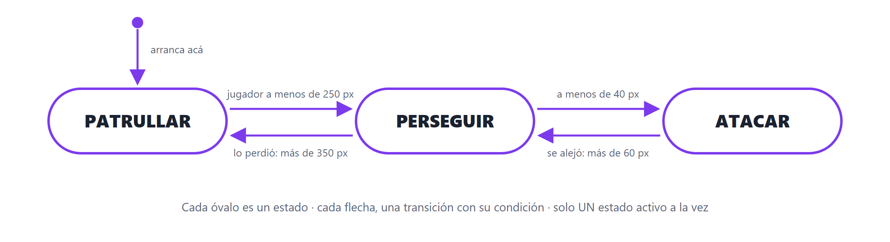
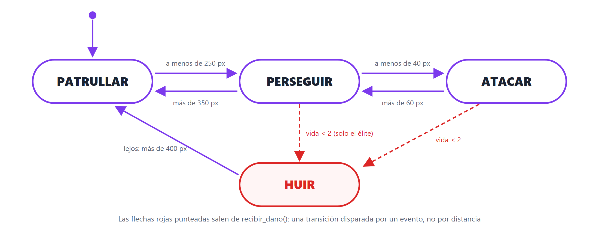

# Trabajo Práctico 8 — El slime aprende a pensar (máquina de estados)

> **Diplomatura de Videojuegos · Clase 8 · Proyecto final**
> Objetivo: darle **cerebro** a los slimes del TP7 con una **máquina de estados**. El slime básico va a **patrullar**, **perseguirte** cuando te ve y **atacarte** cuando te alcanza; el élite, además, va a **huir** cuando le quede poca vida. Y al final, **exportás** el juego: es tu proyecto final.

---

## 🎯 Qué vas a lograr

- Un slime con **tres estados** —`PATRULLAR`, `PERSEGUIR`, `ATACAR`— y las transiciones entre ellos, escritas con `enum` + `match` como en la clase.
- Una **etiqueta sobre cada slime** que muestra en qué estado está: vas a *ver* la máquina de estados funcionando.
- El slime **ya no es kamikaze**: se frena y te pega cada segundo mientras estés cerca.
- El **élite** hereda los tres estados y suma un cuarto, **`HUIR`**, sin tocar nada del básico.
- El juego **exportado** a `.exe`, listo para compartir.

> 💡 **Tiempo estimado:** 90–120 min. Solo se tocan **dos scripts** (`enemigo.gd` y `enemigo_elite.gd`). El jugador, las balas y el spawner quedan como estaban.

> 🔗 **Viene de la Clase 8:** comportamientos básicos, el problema del spaghetti de `if`, máquinas de estado, `enum` y `match`, y el patrón **hacer + decidir**. Y de todo el curso: herencia (TP5), `Timer`, grupos y `distance_to` (TP7).

---

## 📍 Punto de partida

Este TP continúa **`tp7-sobrevivir`**. Abrilo (o copiá la carpeta como `tp8-final`).

Confirmá que el **punto de control 5 del TP7** sigue andando: los slimes te persiguen, las balas salen solas, y cada 8 aparece un élite con su barra.

> 🧠 **Recordá cómo quedó `enemigo.gd` en el TP7:** un `Area2D` con `velocidad`, `vida` y `dano`; un `_process` que **persigue**; `recibir_dano()` y `morir()`; y `_on_body_entered()` que hacía que el slime **pegara y desapareciera** al tocarte. Eso último se va: ahora el ataque lo maneja un **estado**.

---

## 🧩 El plan: primero el diagrama

En la clase dijimos: **si no lo podés dibujar, no lo podés programar.** Este es el diagrama que vamos a implementar, con los mismos umbrales de la clase:



Y lo vamos a construir **de a un estado por vez**, probando cada uno antes de seguir:

| Parte | Estados | Qué se ve |
| :---- | :---- | :---- |
| 1 | `PATRULLAR` ⇄ `PERSEGUIR` | Slimes que deambulan y salen a perseguirte al verte |
| 2 | + `ATACAR` | Se frenan al alcanzarte y te pegan cada segundo |
| 3 | + `HUIR` (élite) | El élite escapa cuando le queda 1 de vida |
| 4 | — | Ajustar, exportar y entregar |

---

## 🛠️ Parte 0 — Dibujar antes de programar

Antes de escribir una línea, respondé estas tres preguntas **mirando el diagrama** (en papel o mentalmente):

1. Un slime está **patrullando** y el jugador pasa a **200 px**. ¿En qué estado queda?
2. Un slime está **persiguiendo** y el jugador está a **300 px**. ¿Cambia de estado?
3. Un slime está **atacando** y el jugador se aleja a **50 px**. ¿Cambia? ¿Y si se aleja a **70 px**?

<details>
<summary>Respuestas (abrí después de pensarlas)</summary>

1. **`PERSEGUIR`**: 200 es menos de 250, así que cruza la flecha de "lo vio".
2. **No.** 300 no es menos de 40 (no ataca) ni más de 350 (no lo perdió). **Se queda persiguiendo.** Las flechas solo se cruzan cuando se cumple su condición.
3. A **50 px sigue atacando** (50 no es más de 60). A **70 px vuelve a `PERSEGUIR`**.

> 🧠 **¿Por qué entra a atacar a 40 y sale a 60, y no a 40 en los dos?** Si el umbral fuera el mismo, un jugador parado justo en el borde haría que el slime **parpadee** entre atacar y perseguir cada frame. Dejar un margen entre "entrar" y "salir" se llama **histéresis**, y es un truco que vas a usar en toda máquina de estados.
</details>

✅ **Punto de control 0:** contestaste las tres, entendés que cada flecha tiene **su** condición, y por qué los umbrales de entrada y salida son distintos.

---

## 🚶 Parte 1 — Dos estados: PATRULLAR y PERSEGUIR

> **Concepto:** reemplazamos el `_process` del TP7 por la máquina de estados. Arrancamos con **dos** estados, y una **etiqueta** sobre el slime que muestra cuál está activo.

**Reemplazá `enemigo.gd`** por esta versión completa:

```gdscript
extends Area2D

enum Estado { PATRULLAR, PERSEGUIR }

var velocidad := 60.0
var vida := 1
var dano := 10

var estado := Estado.PATRULLAR
var jugador: Node2D = null
var direccion_patrulla := Vector2.RIGHT

func _ready() -> void:
	add_to_group("enemigo")
	$AnimatedSprite2D.play("caminar")
	jugador = get_tree().get_first_node_in_group("jugador")

	# Nodos de apoyo creados por código: así el élite los hereda sin tocar su escena
	var timer_patrulla := Timer.new()
	timer_patrulla.name = "TimerPatrulla"
	timer_patrulla.wait_time = 2.0
	timer_patrulla.timeout.connect(cambiar_direccion_patrulla)
	add_child(timer_patrulla)
	timer_patrulla.start()

	var etiqueta := Label.new()
	etiqueta.name = "LabelEstado"
	etiqueta.position = Vector2(-36, -66)
	add_child(etiqueta)

	cambiar_direccion_patrulla()

func _process(delta: float) -> void:
	if jugador == null:
		return
	var d := distancia_al_jugador()
	match estado:
		Estado.PATRULLAR:
			patrullar(delta)                          # hacer
			if d < 250: estado = Estado.PERSEGUIR     # decidir
		Estado.PERSEGUIR:
			perseguir(delta)
			if d > 350: estado = Estado.PATRULLAR
	$LabelEstado.text = Estado.keys()[estado]        # mostrar el estado encima

# ---- comportamientos: cada estado, una función ----
func patrullar(delta: float) -> void:
	position += direccion_patrulla * velocidad * 0.5 * delta   # despacio
	var tam := get_viewport_rect().size
	position.x = clamp(position.x, 20, tam.x - 20)             # no salir de la arena
	position.y = clamp(position.y, 20, tam.y - 20)
	$AnimatedSprite2D.flip_h = direccion_patrulla.x < 0

func perseguir(delta: float) -> void:                        # lo del TP7
	var dir := (jugador.position - position).normalized()
	position += dir * velocidad * delta
	$AnimatedSprite2D.flip_h = dir.x < 0

func cambiar_direccion_patrulla() -> void:                  # cada 2 s, rumbo al azar
	direccion_patrulla = Vector2(randf_range(-1, 1), randf_range(-1, 1)).normalized()

func distancia_al_jugador() -> float:
	return position.distance_to(jugador.position)

# ---- vida: igual que en el TP7 ----
func recibir_dano(cantidad: int) -> void:
	vida -= cantidad
	if vida <= 0:
		morir()

func morir() -> void:
	if jugador != null:
		jugador.sumar_kill()
	queue_free()
```

> 🧠 **Qué cambió respecto del TP7:**
> - El `_process` ya no persigue directamente: **elige** qué función llamar según `estado`. Es el patrón **hacer + decidir** de la clase: en cada estado, primero se hace lo que corresponde, después se pregunta si hay que cambiar.
> - **`Estado.keys()[estado]`** devuelve el nombre del estado como texto (`"PATRULLAR"`). Eso es lo que muestra la etiqueta. Es *la* herramienta para depurar una máquina de estados: si algo anda raro, mirás la etiqueta y sabés exactamente en qué estado está.
> - El `Timer` y el `Label` se crean **por código** en `_ready()` (como el Timer del TP5). ¿Por qué? Porque el élite hereda ese `_ready()` con `super()`, y así **los recibe gratis** sin que tengas que agregarlos a su escena.
> - `jugador` se guarda **una vez** en `_ready()`, en vez de buscarlo cada frame.
> - **`_on_body_entered()` desapareció**: por ahora el slime **no pega**. Eso llega en la Parte 2, con el estado `ATACAR`.

Apretá **F6**. Los slimes entran por los bordes **deambulando** con `PATRULLAR` encima. Acercate a uno: la etiqueta cambia a **`PERSEGUIR`** y viene por vos. Corré lejos: vuelve a **`PATRULLAR`**.

Probá también con el **élite** (aparece cada 8): hereda todo y se comporta igual, con su barra de vida y su etiqueta.

✅ **Punto de control 1:** cada slime muestra su estado encima, deambula, te persigue al acercarte y se rinde al alejarte. El élite también.

> 🛟 **Errores comunes en esta parte**
>
> <details>
> <summary>Abrí para ver soluciones</summary>
>
> - **Los slimes se quedan quietos con la etiqueta vacía** → `jugador` es `null`: el jugador tiene que estar en el grupo `"jugador"` (su `_ready` del TP7 lo hace). Si probás instanciando un slime a mano, ponelo **debajo** de `Jugador` en el árbol, así el jugador se anota en el grupo antes.
> - **"Invalid get index 'PERSEGUIR'"** → el `enum` se escribe **una sola vez**, arriba, y los nombres van **en mayúsculas exactas**.
> - **La etiqueta no aparece** → es una `Label` con texto blanco; sobre fondo claro puede no verse. Probá con un fondo oscuro o poné `etiqueta.modulate = Color.BLACK` después de crearla.
> - **El élite tira error en `$BarraVida`** → nada cambió ahí: revisá que su script del TP7 siga teniendo `super()` como primera línea de `_ready()`.
> </details>

---

## ⚔️ Parte 2 — Tercer estado: ATACAR

> **Concepto:** el slime deja de ser kamikaze. Al alcanzarte **se frena** y te pega **cada segundo** mientras estés cerca. Es un estado más en la máquina y una función más — nada del resto se toca.

Tres cambios en **`enemigo.gd`**:

**1.** Agregá el estado al `enum` (línea de arriba):

```gdscript
enum Estado { PATRULLAR, PERSEGUIR, ATACAR }
```

**2.** En `_ready()`, **debajo del bloque del `Label`** y antes de `cambiar_direccion_patrulla()`, creá el temporizador de ataque:

```gdscript
	var timer_ataque := Timer.new()
	timer_ataque.name = "TimerAtaque"
	timer_ataque.wait_time = 1.0      # un golpe por segundo
	timer_ataque.one_shot = true      # se dispara una vez y se frena
	add_child(timer_ataque)
```

**3.** **Reemplazá la función `_process` entera** por esta (es la de la clase, con las tres flechas):

```gdscript
func _process(delta: float) -> void:
	if jugador == null:
		return
	var d := distancia_al_jugador()
	match estado:
		Estado.PATRULLAR:
			patrullar(delta)
			if d < 250: estado = Estado.PERSEGUIR
		Estado.PERSEGUIR:
			perseguir(delta)
			if d < 40:    estado = Estado.ATACAR
			elif d > 350: estado = Estado.PATRULLAR
		Estado.ATACAR:
			atacar()
			if d > 60:  estado = Estado.PERSEGUIR
	$LabelEstado.text = Estado.keys()[estado]
```

**4.** Y agregá la función del nuevo estado, junto a las otras:

```gdscript
func atacar() -> void:                 # quieto: no se mueve
	if $TimerAtaque.is_stopped():      # ¿ya pasó el segundo desde el último golpe?
		jugador.recibir_dano(dano)
		$TimerAtaque.start()
```

> 🧠 **Cómo funciona el golpe cada segundo.** El `TimerAtaque` es *one shot*: al entrar en `ATACAR` está **frenado**, así que pega **enseguida** y lo arranca. Mientras corre (1 s), `is_stopped()` es falso y no pega. Al terminar se frena solo, y en el próximo frame vuelve a pegar. Sin variables extra, sin contar `delta` a mano.
>
> Y fijate que `atacar()` **no mueve** al slime: estar quieto también es un comportamiento.

Apretá **F6**. Dejá que un slime te alcance: la etiqueta pasa a **`ATACAR`**, se frena pegado a vos, y tu barra baja **10 cada segundo**. Date un paso atrás: vuelve a **`PERSEGUIR`**.

✅ **Punto de control 2:** el slime te persigue, al alcanzarte se frena y te pega una vez por segundo, y si te alejás retoma la persecución. Compará con el diagrama: **cada `if` es una flecha**.

> 🛟 **Errores comunes en esta parte**
>
> <details>
> <summary>Abrí para ver soluciones</summary>
>
> - **"Node not found: TimerAtaque"** → el bloque que lo crea tiene que estar **dentro de `_ready()`**, con la misma sangría que el del `Label`.
> - **Pega todo el tiempo, no cada segundo** → te faltó `one_shot = true`, o el `$TimerAtaque.start()` después de pegar.
> - **Parpadea entre ATACAR y PERSEGUIR** → revisá los umbrales: entra a **40** y sale a **60**. Si pusiste el mismo número en los dos, es la histéresis de la Parte 0.
> - **Nunca llega a ATACAR** → 40 px es poco si tu `CollisionShape2D` es grande. Probá con `d < 60` y `d > 80`.
> </details>

---

## 🏳️ Parte 3 — HUIR: la base sabe, el élite decide

> **Concepto:** el cuarto estado, y la prueba de fuego de la clase: agregarlo **sin romper nada**. Con un detalle de herencia: el **estado y su función** van en la base (para que el `match` los conozca), pero **la decisión de huir la toma solo el élite**.



> 🧠 **¿Por qué en la base y no en el élite?** Porque un `enum` **no se puede extender** desde una clase hija: se declara completo en un lugar. Entonces la base declara `HUIR` y sabe **cómo** huir, pero **nunca entra sola** a ese estado. El élite, al recibir daño, es el que dice "ahora sí, huí". Es una división muy común: la clase base ofrece la **capacidad**, la hija define la **política**.

### 3.1 · En `enemigo.gd`: la capacidad de huir

**1.** El `enum`, completo:

```gdscript
enum Estado { PATRULLAR, PERSEGUIR, ATACAR, HUIR }
```

**2.** En `_process`, agregá la rama de `HUIR` **al final del `match`**, debajo de la de `ATACAR`:

```gdscript
		Estado.HUIR:
			huir(delta)
			if d > 400: estado = Estado.PATRULLAR
```

**3.** Y la función, junto a las otras (es **perseguir al revés**):

```gdscript
func huir(delta: float) -> void:
	var dir := (position - jugador.position).normalized()   # del jugador hacia mí
	position += dir * velocidad * 1.5 * delta                # más rápido que caminando
	$AnimatedSprite2D.flip_h = dir.x < 0
```

Apretá **F6**: **nada cambió** a la vista. Los slimes básicos nunca entran a `HUIR` porque ninguna flecha los lleva ahí. Eso es exactamente lo que queríamos.

### 3.2 · En `enemigo_elite.gd`: la decisión

**Reemplazá `enemigo_elite.gd`** por esta versión (es la del TP7 **más una condición** en `recibir_dano`):

```gdscript
extends "res://enemigo.gd"

func _ready() -> void:
	super()
	vida = 5
	velocidad = 35.0
	dano = 25
	$BarraVida.max_value = vida
	$BarraVida.value = vida

func recibir_dano(cantidad: int) -> void:
	super(cantidad)
	$BarraVida.value = vida
	if vida > 0 and vida < 2:          # NUEVO: con 1 de vida, escapa
		estado = Estado.HUIR
```

> 🧠 **Esta flecha es distinta.** Las otras transiciones viven en el `match` y se disparan por **distancia**. Esta vive en `recibir_dano()` y se dispara por un **evento**: recibir un golpe. Las dos formas conviven sin problema — una máquina de estados no exige que todas las flechas salgan del mismo lugar. Y `vida > 0` evita mandar a huir a un slime que ya murió con ese golpe.

Apretá **F6** y aguantá hasta que aparezca un élite (cada 8 slimes). Dejá que se acerque y que las balas le peguen **cuatro veces**: con 1 de vida, la etiqueta cambia a **`HUIR`** y sale disparado en dirección contraria. Si se aleja más de 400 px, vuelve a **`PATRULLAR`**… y si te ve de nuevo, te persigue **con 1 de vida**.

✅ **Punto de control 3:** el élite huye al quedar con 1 de vida; los slimes básicos **nunca** huyen. Agregaste un estado y **nada de lo anterior se rompió**.

> 🛟 **Errores comunes en esta parte**
>
> <details>
> <summary>Abrí para ver soluciones</summary>
>
> - **"Identifier 'HUIR' not declared"** → falta agregarlo al `enum` de **`enemigo.gd`** (la base), no al élite.
> - **El élite no huye** → la condición va **después** de `super(cantidad)`, si no `vida` todavía no bajó. Y revisá que sea `vida > 0 and vida < 2`.
> - **Los slimes básicos también huyen** → pusiste la condición en `enemigo.gd`. Va **solo** en `enemigo_elite.gd`.
> - **Huye pero vuelve enseguida** → 400 px es mucho en una arena chica; bajalo a 300. O subí el `1.5` a `2.0` para que escape más rápido.
> </details>

---

## 🏁 Parte 4 — Proyecto final: ajustar, exportar, entregar

Ya está todo. Ahora convertilo en **tu** juego.

### 4.1 · Ajustar los números

Todo lo que define cómo se siente el juego son **cinco números**. Jugá y tocalos hasta que te guste:

| Dónde | Variable | Qué cambia |
| :---- | :---- | :---- |
| `enemigo.gd` | `velocidad` | Qué tan rápido persiguen (patrullan a la mitad, huyen a 1.5×) |
| `enemigo.gd` | umbrales `250` / `350` | Desde cuán lejos te ven y cuándo se rinden |
| `enemigo.gd` | `wait_time` del `TimerAtaque` | Cada cuánto pegan |
| `spawner.gd` | `wait_time` del `Timer` | Cuántos slimes por segundo |
| `spawner.gd` | `contador >= 8` | Cada cuántos aparece un élite |

(Opcional) Para la versión final, ocultá la etiqueta de estado agregando `etiqueta.visible = false` justo después de crearla en `_ready()`. O dejala: es simpática y muestra que el enemigo piensa.

### 4.2 · Exportar

Como vimos en la clase 8:

1. **Editor → Manage Export Templates → Download and Install** (solo la primera vez).
2. **Project → Project Settings → Application → Config**: poné el **nombre** de tu juego.
3. **Project → Export → Add… → Windows Desktop** → carpeta y nombre (`mi_juego.exe`) → **Export Project**.
4. Godot genera `mi_juego.exe` **y** `mi_juego.pck`. **Van siempre juntos**: sin el `.pck` el `.exe` no arranca.

✅ **Punto de control 4 (final):** el `.exe` corre en una compu **sin Godot instalado**, y se juega igual que en el editor.

---

## 📤 Entrega — Proyecto final

Entregá **las dos cosas**:

1. La **carpeta del proyecto** comprimida en `.zip` (sin la carpeta `.godot/`), **y**
2. El juego **exportado**: `mi_juego.exe` + `mi_juego.pck` en un `.zip` aparte.

(Opcional) Un **video corto** donde se vea: slimes patrullando, uno que te ve y te persigue, uno atacándote, y un élite huyendo con 1 de vida.

**Nombre:** `tp8-final-ApellidoNombre.zip` y `tp8-final-ApellidoNombre-exe.zip`

### ✔️ Checklist de autoevaluación

- [ ] `enemigo.gd` tiene `enum Estado` con **cuatro** estados y un `_process` con `match`.
- [ ] Cada estado tiene **su función** (`patrullar`, `perseguir`, `atacar`, `huir`).
- [ ] Cada slime muestra su **estado** en una etiqueta encima (aunque después la ocultes).
- [ ] Los slimes **patrullan** al azar y **no salen** de la arena.
- [ ] Te **ven** a menos de 250 px y se **rinden** a más de 350.
- [ ] Al alcanzarte **se frenan** y pegan **una vez por segundo** (ya no desaparecen al tocarte).
- [ ] El élite **hereda** los estados y suma `HUIR` con **una sola condición** en `recibir_dano()`.
- [ ] Los slimes básicos **nunca** huyen.
- [ ] El juego está **exportado** y corre sin Godot.

---

## 📄 Código completo de referencia

Por si te perdiste en algún paso: así tienen que quedar los dos scripts al final.

<details>
<summary><code>enemigo.gd</code> completo</summary>

```gdscript
extends Area2D

enum Estado { PATRULLAR, PERSEGUIR, ATACAR, HUIR }

var velocidad := 60.0
var vida := 1
var dano := 10

var estado := Estado.PATRULLAR
var jugador: Node2D = null
var direccion_patrulla := Vector2.RIGHT

func _ready() -> void:
	add_to_group("enemigo")
	$AnimatedSprite2D.play("caminar")
	jugador = get_tree().get_first_node_in_group("jugador")

	var timer_patrulla := Timer.new()
	timer_patrulla.name = "TimerPatrulla"
	timer_patrulla.wait_time = 2.0
	timer_patrulla.timeout.connect(cambiar_direccion_patrulla)
	add_child(timer_patrulla)
	timer_patrulla.start()

	var etiqueta := Label.new()
	etiqueta.name = "LabelEstado"
	etiqueta.position = Vector2(-36, -66)
	add_child(etiqueta)

	var timer_ataque := Timer.new()
	timer_ataque.name = "TimerAtaque"
	timer_ataque.wait_time = 1.0
	timer_ataque.one_shot = true
	add_child(timer_ataque)

	cambiar_direccion_patrulla()

func _process(delta: float) -> void:
	if jugador == null:
		return
	var d := distancia_al_jugador()
	match estado:
		Estado.PATRULLAR:
			patrullar(delta)
			if d < 250: estado = Estado.PERSEGUIR
		Estado.PERSEGUIR:
			perseguir(delta)
			if d < 40:    estado = Estado.ATACAR
			elif d > 350: estado = Estado.PATRULLAR
		Estado.ATACAR:
			atacar()
			if d > 60:  estado = Estado.PERSEGUIR
		Estado.HUIR:
			huir(delta)
			if d > 400: estado = Estado.PATRULLAR
	$LabelEstado.text = Estado.keys()[estado]

func patrullar(delta: float) -> void:
	position += direccion_patrulla * velocidad * 0.5 * delta
	var tam := get_viewport_rect().size
	position.x = clamp(position.x, 20, tam.x - 20)
	position.y = clamp(position.y, 20, tam.y - 20)
	$AnimatedSprite2D.flip_h = direccion_patrulla.x < 0

func perseguir(delta: float) -> void:
	var dir := (jugador.position - position).normalized()
	position += dir * velocidad * delta
	$AnimatedSprite2D.flip_h = dir.x < 0

func atacar() -> void:
	if $TimerAtaque.is_stopped():
		jugador.recibir_dano(dano)
		$TimerAtaque.start()

func huir(delta: float) -> void:
	var dir := (position - jugador.position).normalized()
	position += dir * velocidad * 1.5 * delta
	$AnimatedSprite2D.flip_h = dir.x < 0

func cambiar_direccion_patrulla() -> void:
	direccion_patrulla = Vector2(randf_range(-1, 1), randf_range(-1, 1)).normalized()

func distancia_al_jugador() -> float:
	return position.distance_to(jugador.position)

func recibir_dano(cantidad: int) -> void:
	vida -= cantidad
	if vida <= 0:
		morir()

func morir() -> void:
	if jugador != null:
		jugador.sumar_kill()
	queue_free()
```
</details>

<details>
<summary><code>enemigo_elite.gd</code> completo</summary>

```gdscript
extends "res://enemigo.gd"

func _ready() -> void:
	super()
	vida = 5
	velocidad = 35.0
	dano = 25
	$BarraVida.max_value = vida
	$BarraVida.value = vida

func recibir_dano(cantidad: int) -> void:
	super(cantidad)
	$BarraVida.value = vida
	if vida > 0 and vida < 2:
		estado = Estado.HUIR
```
</details>

---

## 🌟 Extra (opcional)

- **Un quinto estado: `BUSCAR`.** Cuando te pierde de vista, en vez de patrullar al azar, que vaya a **la última posición donde te vio** durante unos segundos, y recién después patrulle. Pista: guardá `jugador.position` en una variable al salir de `PERSEGUIR`.
- **Que se note el cambio.** Un color por estado con `modulate` (`Color.WHITE` patrullando, amarillo persiguiendo, rojo atacando), o un `Tween` de escala al entrar a `ATACAR` (Clase 7). Los buenos enemigos **avisan** en qué estado están.
- **Un enemigo que dispara.** Un tercer tipo que en `ATACAR`, en vez de acercarse, se **frena a distancia** e instancia una bala hacia vos (todo lo que hace falta ya lo tenés del TP7).
- **Dificultad progresiva.** Que la `velocidad` y el radio de visión suban un poco por cada élite que aparece.
- **Game Over de verdad.** Puntaje en un Autoload y pantalla final, como en el TP6.

---

## 📚 Recursos

- `enum` y `match` en GDScript: **[GDScript basics](https://docs.godotengine.org/es/4.x/tutorials/scripting/gdscript/gdscript_basics.html)**
- Máquinas de estado en Godot, con más profundidad: **[GDQuest — Finite State Machine](https://www.gdquest.com/tutorial/godot/design-patterns/finite-state-machine/)**
- El nodo `Timer`: **[Timer](https://docs.godotengine.org/es/4.x/classes/class_timer.html)**
- Exportar el proyecto: **[Exporting projects](https://docs.godotengine.org/es/4.x/tutorials/export/exporting_projects.html)**

> Diagramas: elaboración propia para la diplomatura. Sprites de **Brackeys** (CC0), heredados del TP7.
>
> **¡Felicitaciones! Terminaste la diplomatura con un juego exportado, con enemigos que piensan.** 🎉
