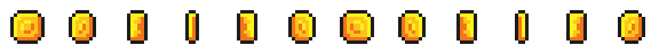

# Trabajo Práctico 2 — Un personaje que se mueve, y un plataformero con monedas

> **Diplomatura de Videojuegos · Semana 2** (clases 3 y 4)
> Objetivo: en la **Parte A** se hace un **personaje controlable** visto desde arriba: cuatro direcciones con acciones del **Input Map**, movimiento parejo con **`delta`** y límites con **`clamp()`**. En la **Parte B** se arma un **mini plataformero**: un caballero que camina y salta con `move_and_slide()` sobre plataformas de **TileSet**, y junta **monedas** con **señales** y **grupos**.

---

## 🎯 Al finalizar este TP

**Parte A · La arena.** Un explorador que se mueve en 4 direcciones con teclas **mapeadas en el propio proyecto**, igual de rápido en cualquier computadora, y que no puede salir de la ventana.

**Parte B · El nivel.** Un caballero animado que cae, aterriza sobre tiles, camina, salta, y **junta monedas** que desaparecen y suman puntos en la consola. Lo central es lo de la Clase 4: la moneda **avisa** con una señal, y el jugador **reacciona**.

> 💡 **Tiempo estimado:** dos sesiones. **45–60 min** la Parte A (después de la Clase 3) y **90–120 min** la Parte B (después de la Clase 4). Cada parte se prueba sola. **Escribir el código a mano.**

> 🔗 **Viene de las clases 3 y 4:** `_process(delta)` y la regla de oro del `delta`, vectores y `Vector2`, Input Map, los tres cuerpos físicos, `move_and_slide()`, `Area2D`, señales y grupos.

---

## 🎨 Los assets (Brackeys · CC0)

Están en la carpeta [`assets/`](assets/) de esta semana. Son de **Brackeys** (licencia **CC0**: uso libre). La Parte A usa el `icon.svg` que viene con Godot; la Parte B usa tres:

**`knight.png`**: el jugador. Hoja de 8×8 con frames de **32×32**. Trae **texto** (IDLE, RUN…) metido en la hoja: se ignora, y solo se eligen los frames del caballero.


**`world_tileset.png`**: los tiles del mundo, de **16×16**. Se usan los de **pasto/tierra** para el piso.


**`coin.png`**: la moneda que gira, **12 frames** de 16×16.



---

## 🗂️ Cómo va a quedar el proyecto

Todo vive en **un solo proyecto**, `tp2`, con dos escenas principales y una escena “molde”:

```
res://
├── arena.tscn        explorador.gd     ← Parte A (visto desde arriba)
├── nivel.tscn        jugador.gd        ← Parte B (plataformero)
├── moneda.tscn       moneda.gd         ← Parte B (escena reutilizable)
├── knight.png · world_tileset.png · coin.png
└── icon.svg
```

Las dos partes comparten el **Input Map** del proyecto: las acciones que se crean en la Parte A se usan también en la B.

---

# Parte A — Un personaje que se mueve

## 🧩 Cómo va a quedar el árbol de nodos

```
Arena  (Node2D)
└── Explorador  (CharacterBody2D)   ← el script va acá
    ├── Sprite2D                    ← su imagen
    └── CollisionShape2D            ← su cuerpo físico
```

---

## 🛠️ A.0 — Proyecto, escena y personaje

1. Abrir Godot → **New Project** → nombre `tp2` → carpeta vacía → **Create & Edit**.
2. En el panel **Escena**, clic en **Otro Nodo** (*Other Node*) → buscar **`Node2D`** → **Crear**. Renombrarlo **`Arena`**.
3. Seleccionar `Arena` → agregar hijo (**Ctrl + A**) → **`CharacterBody2D`** → renombrarlo **`Explorador`**.

   

   > 🧠 **¿Por qué `CharacterBody2D`?** Es el nodo pensado para **personajes controlados por el jugador**. En esta parte se mueve con `position`, como en la Clase 3; en la Parte B se usa su sistema de `velocity` + `move_and_slide()` para que además **choque** con el mundo.

4. **Darle imagen:** con `Explorador` seleccionado, agregar un hijo → **`Sprite2D`**. Arrastrar el `icon.svg` del panel **FileSystem** hasta la propiedad **Texture** del Inspector.
5. **Darle cuerpo:** seleccionar `Explorador` de nuevo → hijo → **`CollisionShape2D`**. En el Inspector → **Shape** → **Nuevo RectangleShape2D** y ajustar los puntos naranjas para cubrir el sprite.

   

6. Mover al `Explorador` al **centro** de la pantalla (por ejemplo **Position `x = 576`, `y = 324`**).
7. **Adjuntar el script:** clic derecho sobre **`Explorador`** → **Attach Script** → path `res://explorador.gd` → **Create**.

   

8. Borrar la plantilla y dejar esto:

   ```gdscript
   extends CharacterBody2D

   var nombre = "Explorador"
   var velocidad = 200      # píxeles por segundo

   func _ready():
   	print("=== " + nombre + " listo ===")
   	print("Velocidad: " + str(velocidad) + " px/seg")
   ```

9. Guardar (**Ctrl + S** → `arena.tscn`) y ejecutar con **F6**. En el panel **Output** tiene que aparecer el mensaje, y en la ventana el ícono de Godot.

> 🧠 `_ready()` corre **una sola vez**, al aparecer el nodo. Es el lugar para **preparar el estado inicial** e imprimir la configuración.

✅ **Punto de control A.0:** el personaje se ve en la ventana y los dos mensajes aparecen en Output.

---

## 🎮 A.1 — El Input Map: acciones con nombre

> **Concepto:** movimiento con **mapeo de entrada**. En vez de escribir la tecla en el código (frágil), se crean **acciones con nombre**. Si mañana hace falta cambiar la tecla, se cambia **en un solo lugar**.

Abrir **Project → Project Settings → Input Map** (*Proyecto → Configuración del proyecto → Mapa de Entrada*).

1. Escribir el nombre de la acción, **`mover_derecha`**, en la barra de arriba y hacer clic en **Add** (*Añadir*).

   

2. En la acción recién creada, clic en el **`+`** de la derecha para asignarle una tecla.

   

3. **Presionar la tecla** deseada (por ejemplo **D** o la flecha **→**) y confirmar con **OK**.

   

4. **Repetir** para las otras direcciones y para el salto (que se usa en la Parte B). Tiene que quedar así:

   | Acción | Tecla sugerida |
   | :---- | :---- |
   | `mover_derecha` | **D** o **→** |
   | `mover_izquierda` | **A** o **←** |
   | `mover_arriba` | **W** o **↑** |
   | `mover_abajo` | **S** o **↓** |
   | `saltar` | **Espacio** |

   

   > 📸 En la captura oficial las acciones se llaman `move_right`, `move_left`… Aquí se usan los **mismos nombres de la clase**. El nombre es libre; solo tiene que **coincidir** con el que se use en el código.

> 🧠 **Por qué así:** en el código se pregunta `Input.is_action_pressed("mover_derecha")`. El código **no sabe ni le importa** qué tecla es: solo pregunta por la **acción**. Cambiar el control es cambiar el mapeo, no el código.

✅ **Punto de control A.1:** hay 5 acciones en el Input Map (4 de movimiento + `saltar`).

🛟 **No toma la tecla / no aparece la acción**

<details>
<summary>Ver soluciones</summary>

- Después de escribir el nombre hay que hacer clic en **Add**; si no, la acción no se crea.
- La tecla se agrega con el **`+`** de esa fila, y hay que **confirmar con OK**.
- Los nombres van **sin espacios ni mayúsculas** y **exactamente igual** que en el código (`mover_derecha`, no `Mover Derecha`).
</details>

---

## 🕹️ A.2 — Movimiento en 4 direcciones (con `delta`)

> **Conceptos:** `_process(delta)`, `Vector2` para la dirección, y la **regla de oro del `delta`**.

Reemplazar el script por esto:

```gdscript
extends CharacterBody2D

var nombre = "Explorador"
var velocidad = 200

func _ready():
	print("=== " + nombre + " listo ===")
	print("Moverse con WASD o las flechas")

func _process(delta):
	# 1) Armar la dirección según las teclas apretadas
	var direccion = Vector2.ZERO
	if Input.is_action_pressed("mover_derecha"):
		direccion.x += 1
	if Input.is_action_pressed("mover_izquierda"):
		direccion.x -= 1
	if Input.is_action_pressed("mover_abajo"):
		direccion.y += 1
	if Input.is_action_pressed("mover_arriba"):
		direccion.y -= 1

	# 2) Mover, SIEMPRE multiplicando por delta
	position += direccion * velocidad * delta
```

Apretar **F6** y moverse con el teclado. **Hacer clic en la ventana del juego** para que reciba las teclas.

> 🧠 **La regla de oro del `delta`:** `position += direccion * velocidad * delta`. Como `velocidad` es **200 px por *segundo***, al multiplicar por `delta` (el tiempo del frame) el personaje avanza lo mismo **por segundo** en cualquier máquina, a 60 o a 30 FPS. Sin `delta`, en una computadora más rápida iría más rápido. **Todo movimiento en `_process()` se multiplica por `delta`. Siempre.**

> 🧠 **Es la suma de vectores de la clase:** `direccion` arranca en `(0, 0)` y cada tecla le suma una flecha. Derecha y arriba a la vez dan `(1, -1)`. Después se estira por `velocidad` y por `delta`.

> ⚠️ **El eje Y está invertido:** en Godot, **Y positivo es hacia abajo**. Por eso “arriba” es `direccion.y -= 1` y “abajo” es `direccion.y += 1`. Es la fuente de confusión más común.

🎯 **Para probar:** cambiar `velocidad` de `200` a `400`. ¿Se mueve más rápido? Volverla a `200`. Ahora moverse en **diagonal**: ¿va más rápido que derecho? Sí, y en el extra está el arreglo.

✅ **Punto de control A.2:** el personaje se mueve en las 4 direcciones.

🛟 **No se mueve**

<details>
<summary>Ver soluciones</summary>

- ¿Se hizo **clic en la ventana del juego**? Sin foco, no llegan las teclas.
- Los nombres de las acciones tienen que ser **idénticos** a los del Input Map.
- El movimiento va en **`_process(delta)`**, no en `_ready()`.
- ¿Falta el **`* delta`**? Sin él anda “raro” o rapidísimo, pero debería moverse igual. Si no se mueve, es el foco o los nombres.
</details>

---

## 🧱 A.3 — Límites de pantalla con `clamp()`

> **Concepto:** usar `clamp()` para que el personaje no se escape de la ventana.

`clamp(valor, minimo, maximo)` **recorta** un número para que quede dentro de un rango: si se pasa del máximo, lo deja en el máximo; si baja del mínimo, en el mínimo.

Agregar esto **al final** de `_process(delta)` (después de mover):

```gdscript
	# 3) No dejar que se vaya de la pantalla
	var limites = get_viewport_rect().size
	position.x = clamp(position.x, 0, limites.x)
	position.y = clamp(position.y, 0, limites.y)
```

Apretar **F6** e intentar salir por los bordes: el personaje **se frena** contra el borde.

> 🧠 `get_viewport_rect().size` da el **tamaño de la ventana** (ancho y alto) como un `Vector2`. Con `clamp(position.x, 0, ancho)` se obliga a que la X esté siempre entre `0` y el ancho. Igual la Y. Así el personaje queda **encerrado** en la pantalla.

🎯 **Para probar:** comentar las dos líneas del `clamp` (poner `#` adelante) y ver cómo ahora **sí** se escapa. Descomentarlas de nuevo.

✅ **Punto de control A.3:** el personaje no puede salir de la ventana. **Guardar.** Parte A terminada. 🎉

🛟 **Errores comunes de la Parte A**

<details>
<summary>Ver soluciones</summary>

- **`Invalid call ... clamp`**: `clamp` va con **tres** argumentos: `clamp(position.x, 0, limites.x)`.
- **Sangría mezclada**: usar Tab para todo el archivo, sin combinarlo con espacios.
- **Se mueve rarísimo de rápido**: falta el **`* delta`** en el `position +=`.
</details>

---

# Parte B — Un plataformero: juntar las monedas

## 🧩 Cómo va a quedar el árbol de nodos

```
Nivel  (Node2D)
├── TileMapLayer                 ← las plataformas (colisión en el TileSet)
├── Jugador  (CharacterBody2D)
│   ├── AnimatedSprite2D         ← el caballero (idle / run)
│   └── CollisionShape2D
└── Monedas  (Node2D)            ← contenedor de las monedas
    └── Moneda (Area2D)  ×varias ← instancias de moneda.tscn
        ├── AnimatedSprite2D
        └── CollisionShape2D
```

---

## 🛠️ B.0 — Escena y assets

1. Copiar los sprites al proyecto: arrastrar `knight.png`, `world_tileset.png` y `coin.png` (de la carpeta `assets/` de la semana) al panel **FileSystem**. Godot los importa solos.
2. **Que los píxeles se vean nítidos** (importante con pixel-art): ir a **Project → Project Settings → Rendering → Textures** y poner **Default Texture Filter = Nearest**. Sin esto, los sprites se ven borrosos.
3. Crear la escena: **Scene → New Scene** (**Ctrl + N**) → **Otro Nodo** → **`Node2D`** → renombrarlo **`Nivel`**. Guardar con **Ctrl + S** como `nivel.tscn`.

✅ **Punto de control B.0:** hay un `Nivel (Node2D)` guardado y los 3 sprites en el FileSystem.

---

## 🧱 B.1 — Las plataformas con TileSet

> **Concepto:** en vez de un `StaticBody2D` por cada bloque, se define la colisión **una vez** en el `TileSet` y se reusa en todos los tiles. Es como se hacen los plataformeros de verdad. Por dentro sigue siendo un cuerpo estático: no se mueve nunca.

### B.1.1 · Crear el TileMapLayer y su TileSet

1. Seleccionar **`Nivel`** → **Otro Nodo** (Ctrl+A) → **`TileMapLayer`**.
2. Con el `TileMapLayer` seleccionado, en el **Inspector**, en la propiedad **Tile Set** elegir **Nuevo TileSet**.

   

3. Hacer clic en ese `TileSet` para editarlo. **Importante:** poner **Tile Size = `16` × `16`** (los tiles de este pack son de 16 px).

   

   > 📸 La captura oficial usa 64×64 (otro pack). En **este** caso es **16×16**.

4. Abajo se abre el editor del **TileSet**. Arrastrar **`world_tileset.png`** desde el FileSystem al panel de la izquierda (fuentes/atlas). Godot pregunta si se quieren **crear los tiles automáticamente**: responder **Sí**.

   

### B.1.2 · Agregar una Physics Layer (la colisión)

5. Seleccionar de nuevo el **`TileMapLayer`**. En el Inspector, dentro del `TileSet`, desplegar **Physics Layers** y hacer clic en **Add Element**.

   

   > 🧠 Con esto el `TileSet` ya **puede guardar** formas de colisión. No hace falta ningún `StaticBody2D`.

### B.1.3 · Pintar la colisión en los tiles del piso

6. Volver al editor del **TileSet** (panel de abajo). Arriba, entrar en la pestaña **Paint** y en **Paint Properties** elegir **Physics Layer 0**.
7. En la lista de la derecha, hacer clic sobre un **tile de pasto/tierra** y presionar **F**: Godot le pone una **caja de colisión que cubre todo el tile**.

   

8. Repetir en **todos los tiles sólidos** que se vayan a usar de piso y paredes. Los tiles de **decoración/fondo quedan sin colisión**.

   

   > 💡 Alcanza con darles colisión a **2 o 3 tiles** (uno de pasto, uno de tierra). No hace falta configurarlos todos.

### B.1.4 · Pintar el nivel

9. Con el `TileMapLayer` seleccionado, abrir el panel **TileMap** (abajo).

   

10. Elegir un tile de piso en la paleta y **pintar** en el viewport (clic izquierdo dibuja, derecho borra). Armar un **piso** abajo y **un par de plataformas** flotando.

    

✅ **Punto de control B.1:** hay un piso y plataformas pintadas, y esos tiles tienen colisión (B.1.3).

🛟 **¿Los tiles tienen colisión?**

<details>
<summary>Ver soluciones</summary>

- En el editor del TileSet, con **Physics Layer 0** seleccionado en Paint, los tiles con colisión muestran la forma dibujada encima.
- Si un tile no tiene la caja, seleccionarlo y apretar **F**.
- Más adelante, si el jugador atraviesa el piso, casi siempre es esto.
</details>

---

## 🧍 B.2 — El jugador (CharacterBody2D + animación)

### B.2.1 · El nodo

1. Seleccionar **`Nivel`** → **Otro Nodo** → **`CharacterBody2D`** → renombrarlo **`Jugador`**.

   > 🧠 Otro `CharacterBody2D`, como el explorador. La diferencia está en el **script**: este se mueve con `velocity` + `move_and_slide()`, así que choca con los tiles.

### B.2.2 · La animación con AnimatedSprite2D

2. Hijo de `Jugador` (Ctrl+A) → **`AnimatedSprite2D`**.
3. En el Inspector, propiedad **Sprite Frames** → **Nuevo SpriteFrames**.

   

4. Clic en el recurso SpriteFrames → se abre el panel de abajo. Renombrar la animación `default` a **`idle`**.
5. Clic en **Añadir Frames desde un Sprite Sheet** (el ícono de la cuadrícula).

   

6. Elegir **`knight.png`**. En el diálogo poner **Horizontal = 8** y **Vertical = 8** (la hoja es de 8×8 frames de 32 px). Se arma la grilla.
7. **Seleccionar los 4 primeros frames de la fila de arriba** (los del **IDLE**) y hacer clic en **Add Frames**.

   

   > 📸 En la captura son ranas; en este caso son caballeros. **No seleccionar** las celdas con el texto “IDLE/RUN”.

8. **Ahora la corrida:** en el panel SpriteFrames crear una animación nueva llamada **`run`**. Con `run` seleccionada, **Añadir Frames desde un Sprite Sheet** otra vez con `knight.png` (8×8) y seleccionar los **8 frames de la fila del RUN** (la fila de caballeros que está debajo del texto “RUN”). **Add Frames**.
9. Para cada animación, activar **🔁 Loop**. En **`idle`** activar también **Autoplay on Load** (el ícono con la **A**), así arranca sola. Subir los FPS de `run` a ~**10**.
10. Si el caballero se ve muy grande o muy chico respecto de los tiles, ajustar **Transform → Scale** del `AnimatedSprite2D` (algo como `0.6, 0.6`).

### B.2.3 · La colisión del jugador

11. Hijo de `Jugador` → **`CollisionShape2D`** → en **Shape** crear un **`CapsuleShape2D`** y ajustarlo para que envuelva al caballero.

    

12. Poner al `Jugador` **arriba del piso** (moverlo en el viewport).

✅ **Punto de control B.2:** al dar **F6**, se ve al caballero animado (todavía flota, porque no tiene script: es el héroe del bloque 1 de la clase).

---

## 🏃 B.3 — Movimiento, salto y animación

> **Concepto:** el patrón de plataformas de la Clase 4, en `_physics_process()` porque choca con cosas.

Adjuntar un script al **`Jugador`** (clic derecho → **Attach Script** → `res://jugador.gd`) y escribir:

```gdscript
extends CharacterBody2D

const VELOCIDAD = 130.0
const FUERZA_SALTO = -320.0
const GRAVEDAD = 900.0

var puntos = 0

func _ready():
	add_to_group("jugador")        # la etiqueta que la moneda va a buscar
	print("¡A juntar monedas!")

func _physics_process(delta):
	# 1) Gravedad: se acumula en el aire
	if not is_on_floor():
		velocity.y += GRAVEDAD * delta

	# 2) Salto (solo en el suelo)
	if Input.is_action_just_pressed("saltar") and is_on_floor():
		velocity.y = FUERZA_SALTO

	# 3) Movimiento horizontal: -1, 0 o 1
	var dir = Input.get_axis("mover_izquierda", "mover_derecha")
	velocity.x = dir * VELOCIDAD

	# 4) Animación según lo que hace
	if dir != 0:
		$AnimatedSprite2D.play("run")
		$AnimatedSprite2D.flip_h = dir < 0   # mira a la izquierda si va a la izquierda
	else:
		$AnimatedSprite2D.play("idle")

	# 5) Que el motor resuelva las colisiones
	move_and_slide()
```

Apretar **F6**: el caballero **cae, aterriza sobre los tiles** y se mueve con las teclas, animándose y dándose vuelta según la dirección. 🎉

> 🧠 **`move_and_slide()`** usa `velocity` (un `Vector2`) y la colisión del jugador para chocar con las plataformas del TileSet. Notar que acá **no se multiplica `velocity` por `delta`**: `move_and_slide()` lo hace por dentro. Lo que sí se multiplica es la **gravedad**, porque se va **acumulando** frame a frame.

> 🧠 **`$AnimatedSprite2D`** es la forma corta de decir “el nodo hijo que se llama así”. Se va a usar mucho.

✅ **Punto de control B.3:** el caballero camina, salta y **no atraviesa** el piso.

🛟 **El caballero atraviesa el piso**

<details>
<summary>Ver soluciones</summary>

- Los tiles del piso, ¿tienen colisión? (B.1.3, apretar **F** sobre el tile con Physics Layer 0).
- El `Jugador`, ¿tiene su `CollisionShape2D` con forma?
- ¿Se está llamando a **`move_and_slide()`** al final?
- ¿El movimiento está en **`_physics_process`** (no en `_process`)?
</details>

---

## 🪙 B.4 — La moneda: una escena que avisa (el corazón del TP)

> **Concepto central (Clase 4):** la moneda es un `Area2D` que **detecta** al jugador y **emite** la señal `body_entered`. Al recibirla, le pide al jugador que sume un punto y se elimina. La moneda **no conoce** al jugador de antemano: solo “toca la campana” y pregunta quién entró.

### B.4.1 · Armar la moneda como escena propia

1. **Scene → New Scene** (**Ctrl + N**) → **Otro Nodo** → **`Area2D`** → renombrarlo **`Moneda`**.
2. Hijo de `Moneda` → **`AnimatedSprite2D`** → **Nuevo SpriteFrames** → animación `default`, **Añadir Frames desde un Sprite Sheet** con **`coin.png`**, **Horizontal = 12**, **Vertical = 1**, seleccionar los **12 frames** → **Add**. Activar **Loop** y **Autoplay on Load**. Así la moneda **gira sola**.
3. Hijo de `Moneda` → **`CollisionShape2D`** → **Shape** → **`CircleShape2D`** (radio chico, ~8 px, que cubra la moneda).
4. Guardar con **Ctrl + S** como `moneda.tscn`.

   > 🧠 Se arma como **escena aparte** desde el principio (Clase 1: la escena es el molde). Así después se ponen diez monedas y, si se cambia una cosa en `moneda.tscn`, cambian las diez.

### B.4.2 · El script de la moneda

5. Adjuntar un script a **`Moneda`** (`res://moneda.gd`):

```gdscript
extends Area2D

func _ready():
	# cuando un cuerpo entre al área, se llama a _on_body_entered
	body_entered.connect(_on_body_entered)

func _on_body_entered(body):
	print("Algo entró: " + body.name)
	if body.is_in_group("jugador"):   # ¿lo que entró es el jugador?
		body.sumar_punto()            # se le pide que sume un punto
		queue_free()                  # y la moneda se elimina
```

> 🧠 En clase se conectó **desde el editor** (Node → Signals → doble clic). Acá se hace **por código** para que quede todo en el script. Son equivalentes; **no hacer las dos**, o la función corre dos veces.

6. Agregar al **`Jugador`** (en `jugador.gd`, al final) la función que la moneda va a llamar:

```gdscript
func sumar_punto():
	puntos += 1
	print("¡Moneda! Puntos: " + str(puntos))
```

### B.4.3 · Ponerla en el nivel

7. Volver a `nivel.tscn`. Crear un nodo **`Node2D`** hijo de `Nivel` llamado **`Monedas`** (para tenerlas ordenadas).
8. Seleccionar `Monedas` → ícono de **cadena** 🔗 (**Instantiate Child Scene**) → elegir `moneda.tscn`. Ubicar la moneda **cerca del jugador**, sobre el piso.
9. **F6**, caminar hasta la moneda.

✅ **Punto de control B.4:** en la consola aparece `Algo entró: Jugador` y después `¡Moneda! Puntos: 1`, y la moneda desaparece.

🛟 **La moneda no reacciona**

<details>
<summary>Ver soluciones</summary>

- ¿La `Moneda` tiene su `CollisionShape2D` **con forma**? Sin forma, el área no tiene volumen y nunca detecta nada.
- ¿Aparece `Algo entró: Jugador` pero no suma? El jugador no está en el grupo: revisar el `add_to_group("jugador")` en su `_ready()`.
- `Nonexistent function 'sumar_punto'`: la función no está en `jugador.gd`, o está mal escrita.
- ¿Se conectó desde el editor **y** por código? Elegir una.
- ¿La moneda quedó como hija del `Jugador`? Tiene que ser hija de `Monedas`.
</details>

---

## 🏆 B.5 — Muchas monedas

1. Seleccionar la moneda dentro de `Monedas` y duplicarla con **Ctrl + D** varias veces. **Ubicar cada una** en distintos lugares del nivel (sobre las plataformas, en lugares a los que haya que saltar).
2. **F6** y jugar: correr, saltar de plataforma en plataforma y juntar todas.
3. Ahora abrir `moneda.tscn` y cambiarle algo (la escala del sprite, o el radio del círculo). Volver a `nivel.tscn`: **todas cambiaron**.

✅ **Punto de control B.5 (final):** se juntan todas las monedas y la consola cuenta `1, 2, 3…`. TP terminado. 🎉

---

## 📤 Entrega

Entregar **una** de estas opciones (según indique el/la docente):

1. La **carpeta del proyecto** `tp2` comprimida en `.zip` (sin la carpeta `.godot/`), **o**
2. Un **video corto** (o GIF) mostrando la arena (moverse en 4 direcciones y frenar en los bordes) y el nivel (saltar y juntar todas las monedas).

**Nombre del archivo:** `tp2-ApellidoNombre.zip`

### ✔️ Checklist de autoevaluación

**Parte A**

- [ ] Hay un **`CharacterBody2D`** con `Sprite2D` y `CollisionShape2D`, y un script adjunto.
- [ ] Se crearon **5 acciones** en el Input Map (4 de movimiento + `saltar`).
- [ ] El personaje se **mueve en 4 direcciones**, y todo el movimiento usa **`* delta`**.
- [ ] El personaje **no sale** de la pantalla (`clamp`).

**Parte B**

- [ ] El `TileSet` tiene una **Physics Layer** y los tiles del piso tienen colisión.
- [ ] El nivel está pintado con el **TileMapLayer**.
- [ ] El `Jugador` es un `CharacterBody2D` con `AnimatedSprite2D` (idle + run) y `CollisionShape2D`.
- [ ] Se mueve y salta con **`move_and_slide()`** en `_physics_process()`, sin atravesar el piso.
- [ ] La `Moneda` es un `Area2D` que usa la **señal `body_entered`**.
- [ ] Se usa el **grupo `"jugador"`** y la moneda llama a `sumar_punto()`.
- [ ] Hay **varias monedas** (instancias de `moneda.tscn`) y la consola las cuenta.

---

## 🌟 Extra (opcional, para quien quiera más)

**Sobre la arena (Parte A)**

- **Diagonales justas:** al moverse en diagonal se va **un poco más rápido** (se suman X e Y, largo 1.41). Se arregla normalizando la dirección:
  ```gdscript
  position += direccion.normalized() * velocidad * delta
  ```
  `.normalized()` deja el largo del vector en 1, así la diagonal no es más veloz.
- **En una línea:** reemplazar los cuatro `if` por `var direccion = Input.get_vector("mover_izquierda", "mover_derecha", "mover_arriba", "mover_abajo")`. Ya viene normalizado.
- **Correr:** una acción `correr` (Shift). Con `is_action_just_pressed` subir `velocidad` a 400 y con `is_action_just_released` volverla a 200. Imprimir “🏃” y “🚶” para comprobar que pasa **una vez** por pulsación.
- **Dash:** con `is_action_just_pressed("saltar")`, sumar `direccion * 120` a `position` de golpe. Guardar la última dirección real en una variable para que funcione aunque no se esté apretando nada.
- **Margen en los límites:** el `clamp` deja que el borde del sprite se asome. Restar un margen: `clamp(position.x, 40, limites.x - 40)`.

**Sobre el nivel (Parte B)**

- **Victoria:** una variable `@export var total_monedas = 3` en el jugador (aparece en el Inspector). En `sumar_punto()`, si `puntos == total_monedas`, imprimir “🏆 ¡Victoria!”.
- **Cámara:** `Camera2D` hijo del `Jugador`, con **Zoom** `3, 3` (el mundo es pequeño). Como cuelga del jugador, lo sigue.
- **Plataformas one-way:** en el TileSet, en la forma de colisión de un tile-plataforma, activar **One Way** (se atraviesa desde abajo y se aterriza desde arriba).
- **Pinchos:** otra escena `Area2D` que al detectar al jugador imprima “¡Ouch!” y reinicie con `get_tree().reload_current_scene()`.
- **Sonido:** un `AudioStreamPlayer` dentro de la moneda que suene al juntarla (atención: `queue_free()` la borra antes de que termine el sonido; una solución es ocultarla y borrarla cuando termine, con la señal `finished`).

---

## 📚 Recursos

- Configurar el Input Map (capturas de la Parte A): **[docs.godotengine.org/es/4.x — Coding the player](https://docs.godotengine.org/es/4.x/getting_started/first_2d_game/03.coding_the_player.html)**
- Usar CharacterBody2D: **[Using CharacterBody2D](https://docs.godotengine.org/es/4.x/tutorials/physics/using_character_body_2d.html)**
- Usar TileSets (colisiones): **[Using TileSets](https://docs.godotengine.org/es/4.x/tutorials/2d/using_tilesets.html)**
- Usar TileMaps (pintar): **[Using TileMaps](https://docs.godotengine.org/es/4.x/tutorials/2d/using_tilemaps.html)**
- Animación 2D (sprite sheets): **[2D sprite animation](https://docs.godotengine.org/es/4.x/tutorials/2d/2d_sprite_animation.html)**
- Señales: **[Signals](https://docs.godotengine.org/es/4.x/getting_started/step_by_step/signals.html)**

> Sprites de **Brackeys** (analogStudios_, RottingPixels), licencia **CC0**. Ver [`assets/LICENSE-brackeys.txt`](assets/LICENSE-brackeys.txt).
> Capturas del editor: documentación oficial de **Godot Engine**, CC BY 4.0.
