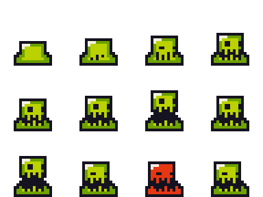
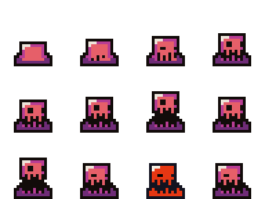

# Trabajo Práctico 3 — Sobrevivir a los slimes

> **Diplomatura de Videojuegos · Semana 3** (clases 5 y 5+)
> Objetivo: armar la **base del juego del curso**, un *survivors*: un caballero en una arena, **hordas de slimes** que aparecen por los bordes y lo persiguen, un arma que **dispara sola** al enemigo más cercano, y cada tanto un **slime élite** que hereda del común y muestra su **barra de vida sobre la cabeza**. Es lo de la Clase 5+, con sprites, HUD y balas.

---

## 🎯 Al finalizar este TP

- Un **jugador** que se mueve en 4 direcciones, animado, con un **HUD** de vida y slimes eliminados.
- Una clase **`Enemigo`**: slimes que **persiguen** al jugador y le pegan al tocarlo.
- Un **spawner** que crea un slime por segundo desde un **borde** al azar.
- **Balas automáticas**: cada 0.4 s sale una hacia el enemigo **más cercano**, sin apretar nada.
- Un **slime élite** cada 8 enemigos, que **hereda** de `Enemigo`: más lento, aguanta 5 balas y tiene barra de vida.

> 🎮 **¿Qué es un *survivors*?** Un género que explotó en 2022 con *Vampire Survivors*: el personaje **ataca solo**, el jugador solo se mueve, y la meta es **sobrevivir** al enjambre el mayor tiempo posible. *Brotato* (hecho en Godot) pertenece al mismo género.

> 💡 **Tiempo estimado:** 90–120 min. Cada parte se prueba sola. **Escribir el código a mano**, y leer el “por qué” de cada bloque: es el proyecto que se sigue hasta el final del curso.

> 🔗 **Viene de:** la Clase 5 (clases, objetos, herencia), la Clase 5+ (clase `Enemigo`, `preload` + `instantiate`, `Timer`, élite heredado), y la semana 2 (movimiento, `Area2D`, señales, grupos).

---

## 🎨 Los assets (Brackeys · CC0)

Están en la carpeta [`assets/`](assets/) de esta semana. Licencia **CC0** (uso libre, [créditos acá](assets/LICENSE-brackeys.txt)).

- **`knight.png`**: el jugador, el mismo caballero de la semana 2 (hoja 8×8, frames de 32×32, con texto incrustado que se ignora).
- **`slime_green.png`**: el slime común. Hoja de **4×3**, frames de **24×24**, sin texto. La **fila del medio** es la animación de caminar.
- **`slime_purple.png`**: el élite. **Misma hoja**, otro color.
- **`bala.png`**: un puntito de 8×8. Se escala en el editor.

 

---

## 🧩 Cómo va a quedar el proyecto

Una escena principal y tres **moldes** que se instancian mientras el juego corre:

```
arena.tscn
  Arena  (Node2D)
  ├── Jugador  (CharacterBody2D)   [grupo "jugador"]      jugador.gd
  │   ├── AnimatedSprite2D         ← caballero idle / run
  │   ├── CollisionShape2D
  │   └── TimerDisparo  (Timer)    ← dispara cada 0.4 s
  ├── Spawner  (Node2D)                                    spawner.gd
  │   └── Timer                    ← un slime por segundo
  ├── Enemigos  (Node2D)           ← contenedor: acá caen los slimes
  ├── Balas     (Node2D)           ← contenedor: acá caen las balas
  └── HUD  (CanvasLayer)
      ├── BarraVida  (ProgressBar)
      └── LabelKills (Label)

slime.tscn        Slime (Area2D) [grupo "enemigo"]           enemigo.gd  → class_name Enemigo
slime_elite.tscn  HEREDA de slime.tscn + barra de vida       slime_elite.gd → extends Enemigo
bala.tscn         Bala (Area2D) + Sprite2D + shape + Timer   bala.gd
```

> 🧠 **Quién le pide qué a quién** (el diseño de la Clase 5): el **spawner** crea slimes; el **slime** busca al jugador por su **grupo** y, al tocarlo, le pide `recibir_dano()`; el **jugador** dispara **balas**; la **bala** le pide `recibir_dano()` al slime. Nadie toca la vida de otro: **encapsulamiento**.

---

## 🛠️ Parte 0 — Proyecto, assets y controles

1. Godot → **New Project** → `tp3` → carpeta vacía → **Create & Edit**.
2. Arrastrar al **FileSystem** los cuatro archivos: `knight.png`, `slime_green.png`, `slime_purple.png`, `bala.png`.
3. **Píxeles nítidos:** **Project → Project Settings → Rendering → Textures → Default Texture Filter = Nearest**.
4. **Input Map** (**Project → Project Settings → Input Map**): las cuatro acciones de siempre.

   | Acción | Tecla |
   | :---- | :---- |
   | `mover_derecha` | **D** o **→** |
   | `mover_izquierda` | **A** o **←** |
   | `mover_arriba` | **W** o **↑** |
   | `mover_abajo` | **S** o **↓** |

5. Escena principal: **Otro Nodo → `Node2D`** → renombrarlo **`Arena`** → guardar como **`arena.tscn`**.
6. Hijos de `Arena`, dos **`Node2D`** vacíos: **`Enemigos`** y **`Balas`**. Son **contenedores**: ahí van a caer las instancias, para tener el árbol ordenado.

✅ **Punto de control 0:** `arena.tscn` tiene `Enemigos` y `Balas` vacíos, los 4 sprites están en el FileSystem y las 4 acciones en el Input Map.

---

## 🧍 Parte 1 — El jugador y su HUD

### 1.1 · El caballero

1. Hijo de `Arena` → **`CharacterBody2D`** → renombrarlo **`Jugador`**. Ubicarlo en el **centro** de la pantalla (Position ≈ `576, 324`).
2. Hijo de `Jugador` → **`AnimatedSprite2D`** → **Sprite Frames → Nuevo SpriteFrames**. Las dos animaciones, **igual que en la semana 2** (Parte B.2):

   - **`idle`**: *Añadir Frames desde un Sprite Sheet* → `knight.png`, **8 × 8** → los 4 primeros frames de la fila de arriba.
   - **`run`**: animación nueva → misma hoja → los 8 frames de la fila del **RUN**. FPS ≈ **10**.
   - En las dos: **🔁 Loop**. En `idle`: **Autoplay on Load**.

   

   Poner el **Scale** del `AnimatedSprite2D` en `2, 2` (el caballero es chiquito).

3. Hijo de `Jugador` → **`CollisionShape2D`** → **`CapsuleShape2D`** que envuelva al caballero.

### 1.2 · El HUD

4. Hijo de `Arena` → **`CanvasLayer`** → renombrarlo **`HUD`**.
5. Hijo de `HUD` → **`ProgressBar`** → renombrarlo **`BarraVida`**. En el Inspector: **Min Value** `0`, **Max Value** `100`, **Value** `100`, **Show Percentage** apagado. Tamaño de unos `220 × 22`, arriba a la izquierda.
6. Hijo de `HUD` → **`Label`** → renombrarlo **`LabelKills`**. **Text** = `Slimes: 0`. Debajo de la barra.

   > 🧠 **`CanvasLayer`** es una capa que se dibuja **pegada a la pantalla**, encima del mundo (la UI no diegética de la Clase 1). La UI se ve a fondo en la semana 5; por ahora alcanza con saber que lo que cuelga de acá **no se mueve con el juego**.

### 1.3 · El script del jugador

7. Clic derecho en `Jugador` → **Attach Script** → `res://jugador.gd`:

```gdscript
extends CharacterBody2D

var velocidad = 200
var vida = 100
var kills = 0

func _ready():
	add_to_group("jugador")
	actualizar_hud()

func _physics_process(delta):
	# 1) Dirección con las cuatro acciones (Clase 3), ya normalizada
	var direccion = Input.get_vector("mover_izquierda", "mover_derecha", "mover_arriba", "mover_abajo")

	# 2) Mover con el motor de física (semana 2)
	velocity = direccion * velocidad
	move_and_slide()

	# 3) Animación
	if direccion != Vector2.ZERO:
		$AnimatedSprite2D.play("run")
		$AnimatedSprite2D.flip_h = direccion.x < 0
	else:
		$AnimatedSprite2D.play("idle")

	# 4) No salir de la arena
	var limites = get_viewport_rect().size
	position.x = clamp(position.x, 0, limites.x)
	position.y = clamp(position.y, 0, limites.y)

# ---- Los "botones" que otros objetos le aprietan ----

func recibir_dano(cantidad):
	vida -= cantidad
	actualizar_hud()
	if vida <= 0:
		get_tree().reload_current_scene()   # se acabó: de vuelta a empezar

func sumar_kill():
	kills += 1
	actualizar_hud()

func actualizar_hud():
	get_node("../HUD/LabelKills").text = "Slimes: " + str(kills)
	get_node("../HUD/BarraVida").value = vida
```

> 🧠 **`recibir_dano()` y `sumar_kill()` son la cara pública del jugador.** Los slimes no tocan `vida` ni `kills`: le piden al jugador que lo haga. Así, si mañana el jugador tiene escudo, se cambia **acá** y nadie más se entera (encapsulamiento y abstracción, Clase 5).

> 🧠 **`get_node("../HUD/LabelKills")`**: `..` es “subir al padre” (la `Arena`), y de ahí bajar a `HUD` y después a `LabelKills`. Es una ruta, como las carpetas.

✅ **Punto de control 1:** con **F6** el caballero camina animado, no sale de la pantalla, y arriba a la izquierda se ven la barra llena y `Slimes: 0`.

---

## 🟢 Parte 2 — La clase `Enemigo`: el slime que persigue

### 2.1 · La escena del slime

1. **Scene → New Scene** → **Otro Nodo** → **`Area2D`** → renombrarlo **`Slime`**. Guardar como **`slime.tscn`** (escena aparte: es un **molde**).
2. Hijo → **`AnimatedSprite2D`** → **Nuevo SpriteFrames**. Renombrar la animación `default` a **`caminar`**. *Añadir Frames desde un Sprite Sheet* → `slime_green.png`, **Horizontal = 4, Vertical = 3** → los **4 frames de la fila del medio**. **Loop** y **Autoplay on Load** activados, FPS ≈ 8. **Scale** `2, 2`.

   

3. Hijo → **`CollisionShape2D`** → **`CircleShape2D`**, radio ≈ `20`, que cubra al slime.

### 2.2 · El script: la clase base

4. Clic derecho en `Slime` → **Attach Script** → `res://enemigo.gd`. Atención al nombre: el archivo se llama **`enemigo.gd`**, no `slime.gd`, porque es la clase de **todos** los enemigos.

```gdscript
class_name Enemigo
extends Area2D

var vida = 1
var velocidad = 60
var dano = 10

func _ready():
	add_to_group("enemigo")
	body_entered.connect(_on_body_entered)

func _process(delta):
	# --- La IA: perseguir al jugador ---
	var jugador = get_tree().get_first_node_in_group("jugador")
	if jugador == null:
		return
	var direccion = (jugador.position - position).normalized()
	position += direccion * velocidad * delta
	$AnimatedSprite2D.flip_h = direccion.x < 0

# ---- Los "botones" del enemigo ----

func recibir_dano(cantidad):
	vida -= cantidad
	if vida <= 0:
		morir()

func morir():
	var jugador = get_tree().get_first_node_in_group("jugador")
	if jugador != null:
		jugador.sumar_kill()
	queue_free()

func _on_body_entered(body):
	if body.is_in_group("jugador"):
		body.recibir_dano(dano)   # le pega…
		queue_free()              # …y se sacrifica (no cuenta como kill)
```

> 🧠 **`class_name Enemigo`** le pone nombre a la clase. Sin esa línea, el élite de la Parte 5 no podría escribir `extends Enemigo`.

> 🧠 **Perseguir es una resta de vectores** (Clase 5+): `jugador.position - position` es la flecha del slime al jugador; `.normalized()` la deja de largo 1, solo la dirección. Como el slime es un `Area2D`, se mueve con `position` y **lleva `delta`**.

### 2.3 · Probarlo a mano

5. Volver a `arena.tscn`. Seleccionar **`Enemigos`** → botón de cadena 🔗 (**Instantiate Child Scene**) → `slime.tscn`. Ubicar el slime **lejos** del jugador.
6. **F6**.

✅ **Punto de control 2:** el slime persigue al caballero. Al tocarlo, la barra de vida baja un poco y el slime desaparece.

🛟 **El slime no se mueve / no hace daño**

<details>
<summary>Ver soluciones</summary>

- **No se mueve:** el jugador no está en el grupo `"jugador"` (revisar el `add_to_group` en `jugador.gd`), o el nombre del grupo tiene una letra distinta.
- **No hace daño:** falta el `CollisionShape2D` del slime o del jugador, o la señal no se conectó en `_ready()`.
- **`Nonexistent function 'recibir_dano'`:** el script del jugador no tiene esa función, o está mal escrita.
</details>

7. **Borrar** el slime puesto a mano: desde ahora los crea el spawner.

---

## 🌊 Parte 3 — El Spawner: hordas por los bordes

> **Conceptos:** instanciar (`preload` → `instantiate` → `add_child`) y el nodo `Timer` (Clase 5+).

1. Hijo de `Arena` → **`Node2D`** → renombrarlo **`Spawner`**.
2. Hijo de `Spawner` → **`Timer`**. En el Inspector: **Wait Time** `1`, **Autostart** activado, **One Shot** desactivado.
3. Clic derecho en `Spawner` → **Attach Script** → `res://spawner.gd`:

```gdscript
extends Node2D

var escena_slime = preload("res://slime.tscn")

func _ready():
	$Timer.timeout.connect(spawnear)   # cada segundo, un slime

func spawnear():
	var slime = escena_slime.instantiate()          # sacar una copia del molde
	slime.position = posicion_en_el_borde()         # darle sus datos
	get_node("../Enemigos").add_child(slime)        # meterla en el juego

func posicion_en_el_borde():
	var tam = get_viewport_rect().size
	var lado = randi_range(0, 3)        # 0 arriba · 1 abajo · 2 izquierda · 3 derecha
	if lado == 0:
		return Vector2(randf_range(0, tam.x), -40)
	if lado == 1:
		return Vector2(randf_range(0, tam.x), tam.y + 40)
	if lado == 2:
		return Vector2(-40, randf_range(0, tam.y))
	return Vector2(tam.x + 40, randf_range(0, tam.y))
```

> 🧠 **Los tres pasos de instanciar:** `preload` carga el molde **una vez**, al abrir el script. `instantiate()` saca una copia **todavía fuera del juego**: es el momento de cambiarle datos (la posición). `add_child()` la mete en el árbol, y recién ahí aparece y corre su `_ready()`.

> 💡 La ruta del `preload` no hace falta tipearla: basta con arrastrar `slime.tscn` desde el FileSystem hasta el script.

✅ **Punto de control 3:** cada segundo entra un slime desde un borde distinto, y todos persiguen al caballero. Si varios tocan al caballero, la partida se reinicia.

🛟 **No aparece ningún slime**

<details>
<summary>Ver soluciones</summary>

- ¿El `Timer` tiene **Autostart** activado?
- ¿La ruta del `preload` es exacta (`res://slime.tscn`)? Si dice `Could not preload resource`, arrastrar el archivo.
- ¿Existe el nodo `Enemigos` como hijo de `Arena`, con ese nombre exacto?
- ¿Aparecen pero no se ven? Están a 40 px **afuera** de la pantalla: hay que esperar a que entren caminando.
</details>

---

## 🔫 Parte 4 — Balas que apuntan solas

> **Concepto:** la bala es otro `Area2D`, otro molde. El jugador, con un `Timer`, dispara cada 0.4 s **hacia el enemigo más cercano**. En un *survivors* el arma es automática: el jugador solo se mueve.

### 4.1 · La escena de la bala

1. **Scene → New Scene** → **Otro Nodo** → **`Area2D`** → renombrarlo **`Bala`**. Guardar como **`bala.tscn`**.
2. Hijo → **`Sprite2D`** → **Texture** = `bala.png`, **Scale** `2, 2`.
3. Hijo → **`CollisionShape2D`** → **`CircleShape2D`**, radio ≈ `8`.
4. Hijo → **`Timer`** → renombrarlo **`TimerVida`**. **Wait Time** `2`, **One Shot** activado, **Autostart** activado. Es el “tiempo de vida”: si no le pega a nada, a los 2 s desaparece.
5. Clic derecho en `Bala` → **Attach Script** → `res://bala.gd`:

```gdscript
extends Area2D

var velocidad = 400
var direccion = Vector2.RIGHT   # el jugador la cambia al disparar
var dano = 1

func _ready():
	area_entered.connect(_on_area_entered)
	$TimerVida.timeout.connect(queue_free)   # a los 2 s se borra sola

func _process(delta):
	position += direccion * velocidad * delta

func _on_area_entered(area):
	if area is Enemigo:            # ¿es de la clase Enemigo (o una hija)?
		area.recibir_dano(dano)
		queue_free()
```

> 🧠 **`area_entered`** es la hermana de `body_entered`: se emite cuando entra **otra `Area2D`**. Como el slime es un `Area2D`, la bala lo detecta con esta.

> 🧠 **`area is Enemigo`** pregunta por la **clase**, no por el grupo. Da `true` para el slime común **y para cualquier clase hija**, como el élite de la Parte 5. Eso es herencia: un élite **es un** Enemigo.

### 4.2 · Disparar desde el jugador

6. En `arena.tscn`, hijo de `Jugador` → **`Timer`** → renombrarlo **`TimerDisparo`**. **Wait Time** `0.4`, **Autostart** activado.
7. Agregar a **`jugador.gd`** lo marcado como NUEVO:

```gdscript
var escena_bala = preload("res://bala.tscn")            # NUEVO, arriba con las variables

func _ready():
	add_to_group("jugador")
	$TimerDisparo.timeout.connect(disparar)               # NUEVO
	actualizar_hud()

# ---------- NUEVO: el arma automática ----------
func disparar():
	var objetivo = enemigo_mas_cercano()
	if objetivo == null:
		return                                    # no hay a quién dispararle
	var bala = escena_bala.instantiate()
	bala.position = position
	bala.direccion = (objetivo.position - position).normalized()
	get_node("../Balas").add_child(bala)

func enemigo_mas_cercano():
	var mas_cercano = null
	var menor_distancia = INF                     # "infinito": cualquier distancia es menor
	for enemigo in get_tree().get_nodes_in_group("enemigo"):
		var distancia = position.distance_to(enemigo.position)
		if distancia < menor_distancia:
			menor_distancia = distancia
			mas_cercano = enemigo
	return mas_cercano
```

> 🧠 **Buscar el más cercano** es el `for` de la semana 1 con un `if` adentro: se recorre el grupo `"enemigo"`, y cada vez que aparece uno más cerca que el récord, pasa a ser el nuevo récord. Al terminar el recorrido, el récord es el más cercano.

> 🧠 **La dirección de la bala** es la misma resta de vectores del slime, al revés: del jugador al objetivo.

✅ **Punto de control 4:** el caballero dispara solo hacia el slime más cercano; cada bala mata un slime y el contador `Slimes:` sube.

🛟 **Las balas no salen o no matan**

<details>
<summary>Ver soluciones</summary>

- **No salen:** `TimerDisparo` sin **Autostart**, o la señal no se conectó. ¿Hay algún slime en pantalla? Sin objetivo, no dispara.
- **Salen pero atraviesan a los slimes:** falta el `CollisionShape2D` de la bala o del slime.
- **`Could not find type "Enemigo"`:** falta el `class_name Enemigo` en `enemigo.gd`, o no se guardó.
- **Las balas quedan dando vueltas:** falta el `TimerVida` o su señal.
</details>

---

## 💜 Parte 5 — El slime élite: herencia + barra de vida

> **Concepto:** un enemigo más duro que aparece cada tanto. **No se escribe de cero**: la escena **hereda** de `slime.tscn` (los mismos nodos) y el script **hereda** de `Enemigo` (el mismo código). Solo se cambia lo distinto.

### 5.1 · La escena heredada

1. **Scene → New Inherited Scene** → elegir **`slime.tscn`**. Aparece un `Slime` con sus nodos en **amarillo**: son heredados. Renombrar la raíz a **`SlimeElite`** y guardar como **`slime_elite.tscn`**.
2. Seleccionar el **`AnimatedSprite2D`** → en **Sprite Frames** elegir **Nuevo SpriteFrames** (así el élite tiene **su propio** dibujo, sin tocar el del slime común). Animación **`caminar`** con `slime_purple.png` (**4 × 3**, la fila del medio), **Loop** y **Autoplay on Load**, FPS 8. **Scale** `2.5, 2.5`: es más grande.
3. Seleccionar el **`CollisionShape2D`** → radio ≈ `26`.
4. Hijo de `SlimeElite` → **`ProgressBar`** → renombrarlo **`BarraVida`**. **Show Percentage** apagado; **Size** ≈ `48 × 6`; **Position** ≈ `-24, -40` (centrada arriba de la cabeza).

   > 🧠 Un `ProgressBar` es un nodo de UI, pero **puede colgar de un nodo 2D**: se dibuja en la posición del padre y **se mueve con él**. Es una barra **en el mundo**, como la de *Dead Space* de la Clase 1.

### 5.2 · El script heredado

5. Clic derecho en `SlimeElite` → **Extend Script** → `res://slime_elite.gd`. Godot crea un script que ya hereda del de la madre. Dejarlo así (si la primera línea dice `extends "res://enemigo.gd"`, reemplazarla por `extends Enemigo`: es lo mismo, pero se lee mejor):

```gdscript
extends Enemigo

func _ready():
	super()                       # todo lo de la madre: grupo y señal
	vida = 5                      # aguanta 5 balas
	velocidad = 35                # más lento
	dano = 25                     # pega más fuerte
	$BarraVida.max_value = vida
	$BarraVida.value = vida

func recibir_dano(cantidad):
	super(cantidad)               # resta vida y muere si llega a 0 (lo hace la madre)
	$BarraVida.value = vida       # y además actualiza la barra

func morir():
	print("💜 ¡Cayó un élite!")
	super()                       # suma el kill y se borra, como la madre
```

> 🧠 **`super()`** es “hacer también lo que hacía la madre”. Sin el `super()` del `_ready()`, el élite **no se conecta** a la señal y nunca le pegaría al jugador. Sin el de `recibir_dano()`, no perdería vida. La hija **agrega**; no borra lo heredado.

> 🧠 **Polimorfismo:** la bala hace `area.recibir_dano(dano)` sin saber si le pegó a un slime o a un élite. Cada uno responde a su manera: el común muere, el élite baja su barra.

### 5.3 · Que aparezca cada tanto

6. En **`spawner.gd`**, lo marcado como NUEVO:

```gdscript
var escena_slime = preload("res://slime.tscn")
var escena_elite = preload("res://slime_elite.tscn")   # NUEVO
var contador = 0                                        # NUEVO

func spawnear():
	contador += 1                                      # NUEVO
	var slime
	if contador % 8 == 0:                              # NUEVO: cada 8, un élite
		slime = escena_elite.instantiate()
	else:
		slime = escena_slime.instantiate()
	slime.position = posicion_en_el_borde()
	get_node("../Enemigos").add_child(slime)
```

> 🧠 **`contador % 8`** es el **resto** de dividir por 8: vale `0` en el 8, el 16, el 24… Es la forma clásica de hacer algo “cada N veces”.

✅ **Punto de control 5 (final):** cada 8 slimes aparece uno violeta, más grande y lento, con su barra arriba. Hay que pegarle 5 balas, la barra baja con cada una, y al caer la consola dice `💜 ¡Cayó un élite!` y el contador sube. TP terminado. 🎉

🛟 **Errores comunes con el élite**

<details>
<summary>Ver soluciones</summary>

- **El élite no le pega al jugador:** falta el `super()` en su `_ready()`.
- **No pierde vida, o la barra no baja:** falta el `super(cantidad)` en `recibir_dano()`, o el `$BarraVida.value = vida` va **antes** del `super`.
- **El slime común también se volvió violeta:** se modificó el `SpriteFrames` heredado en vez de crear uno **nuevo** en el élite.
- **Las balas atraviesan al élite:** el script del élite no hereda de `Enemigo`, así que `area is Enemigo` da `false`. Revisar la primera línea.
- **Se reemplazó el script en vez de extenderlo:** el élite perdió todo el comportamiento. Usar **Extend Script**, no **Attach Script**.
</details>

---

## 📤 Entrega

Entregar **una** de estas opciones (según indique el/la docente):

1. La **carpeta del proyecto** comprimida en `.zip` (sin la carpeta `.godot/`), **o**
2. Un **video corto** (o GIF) de una partida: slimes entrando por los bordes, balas automáticas, el contador subiendo y un élite cayendo.

**Nombre del archivo:** `tp3-ApellidoNombre.zip`

### ✔️ Checklist de autoevaluación

- [ ] El `Jugador` se mueve en 4 direcciones, animado, sin salir de la pantalla, y está en el grupo `"jugador"`.
- [ ] El **HUD** muestra la vida (barra) y los slimes eliminados (label), y se actualiza.
- [ ] `enemigo.gd` empieza con **`class_name Enemigo`** y el slime **persigue** al jugador.
- [ ] El slime le **pide** daño al jugador con `recibir_dano()`; no le toca la vida directamente.
- [ ] El **spawner** usa `preload`, `instantiate()` y `add_child()`, con un **`Timer`**, desde los **bordes**.
- [ ] Las **balas** salen solas hacia el enemigo **más cercano** y usan `area_entered`.
- [ ] `slime_elite.tscn` es una **escena heredada** y `slime_elite.gd` hace **`extends Enemigo`** con `super()`.
- [ ] El élite tiene **barra de vida** sobre la cabeza y aparece **cada 8** enemigos.
- [ ] Si la vida del jugador llega a 0, la partida **se reinicia**.

---

## 🌟 Extra (opcional, para los que quieran más)

- **Un tercer enemigo:** el **veloz**, escena heredada de `slime.tscn` con el slime verde en escala `1.5` y `Modulate` amarillo, script `extends Enemigo` con `velocidad = 150`. Que el spawner lo cree cada 5.
- **Dificultad creciente:** en `spawnear()`, `$Timer.wait_time = max($Timer.wait_time * 0.98, 0.2)`. Cada slime nuevo sale un poco antes que el anterior.
- **Parpadeo al recibir daño:** en `recibir_dano()` de `Enemigo`, `modulate = Color.RED` y, con un `Timer` corto o `await get_tree().create_timer(0.1).timeout`, volver a `Color.WHITE`. Como está en la madre, **lo heredan todos**.
- **Bomba:** con una tecla, `for enemigo in get_tree().get_nodes_in_group("enemigo"): enemigo.recibir_dano(1)`. Los comunes mueren, los élites pierden una barrita: polimorfismo a la vista.
- **Más de una bala:** en `disparar()`, tres balas en abanico: la dirección, y la misma rotada con `.rotated(0.2)` y `.rotated(-0.2)`.

---

## 📚 Recursos

- Instanciar escenas: **[docs.godotengine.org/es/4.x — Nodes and scene instances](https://docs.godotengine.org/es/4.x/getting_started/step_by_step/nodes_and_scene_instances.html)**
- Escenas heredadas y POO en Godot: **[Scene organization](https://docs.godotengine.org/es/4.x/tutorials/best_practices/scene_organization.html)**
- `class_name` y herencia en GDScript: **[GDScript reference — Classes](https://docs.godotengine.org/es/4.x/tutorials/scripting/gdscript/gdscript_basics.html#classes)**
- El nodo `Timer`: **[referencia de Timer](https://docs.godotengine.org/es/4.x/classes/class_timer.html)**
- Animación 2D (sprite sheets): **[2D sprite animation](https://docs.godotengine.org/es/4.x/tutorials/2d/2d_sprite_animation.html)**

> Sprites de **Brackeys**, licencia **CC0**. Ver [`assets/LICENSE-brackeys.txt`](assets/LICENSE-brackeys.txt).
> Capturas del editor: documentación oficial de **Godot Engine**, CC BY 4.0.
