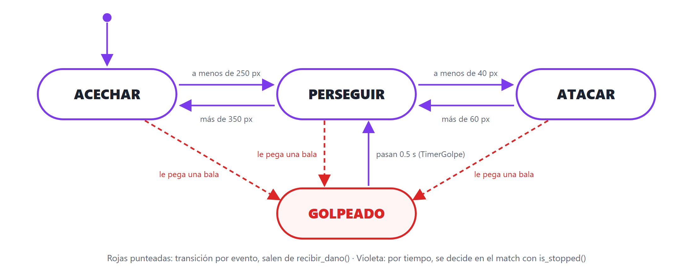

# Trabajo Práctico 4 — El jefe piensa

> **Diplomatura de Videojuegos · Semana 4** (clases 8 y 8+)
> Objetivo: darle **cerebro al slime élite** del TP3 con una **máquina de estados**. Va a **acechar** de lejos, **perseguir** cuando el caballero se acerca, **atacar** cuando lo alcanza, y **sentir el golpe** de cada bala: un empujón y medio segundo congelado. El slime común **queda como está**: es la horda. Es lo de la Clase 8+, con sprites, barra de vida y balas automáticas.

---

## 🎯 Qué vas a lograr

- El **jefe** con **cuatro estados** (`ACECHAR`, `PERSEGUIR`, `ATACAR`, `GOLPEADO`) y las transiciones entre ellos, escritas con `enum` + `match`.
- Una **etiqueta sobre el jefe** que muestra en qué estado está: vas a *ver* la máquina funcionando.
- El jefe **ya no es kamikaze**: se frena y pega **cada segundo** mientras el caballero esté cerca.
- Cada bala lo **empuja** y lo **congela 0.5 s**: el golpe se siente.
- Una función **`cambiar_estado()`** que le da un **color** a cada estado y avisa por consola cada cambio.
- La horda **intacta**: `enemigo.gd` no se toca.

> 💡 **Tiempo estimado:** 75–100 min. Se toca **un solo script**, `slime_elite.gd`, y se le agregan tres nodos a `slime_elite.tscn`. El jugador, las balas, el spawner y el slime común quedan como estaban.

> 🔗 **Viene de:** la Clase 8 (comportamientos, detección, el spaghetti de `if`, máquinas de estado, `enum` y `match`, hacer + decidir), la Clase 8+ (el jefe escrito en vivo) y la semana 3 (herencia, `super()`, `Timer`, grupos, `distance_to`).

---

## 📍 Punto de partida

Este TP continúa el **`tp3`**. Copiá la carpeta del proyecto y renombrala **`tp4`** (así el TP3 queda como estaba), y abrila con Godot.

Confirmá que el **punto de control 5 del TP3** sigue andando: los slimes persiguen al caballero, las balas salen solas y cada 8 enemigos aparece un élite violeta con su barra.

> 🧠 **Cómo quedó el élite en el TP3.** `slime_elite.gd` hace `extends Enemigo`: en `_ready()` llama a `super()` y cambia `vida`, `velocidad`, `dano` y su `BarraVida`; en `recibir_dano()` llama a `super(cantidad)` y actualiza la barra; en `morir()` imprime y llama a `super()`. Todo lo demás lo **hereda tal cual**: perseguir en `_process` y el `_on_body_entered` kamikaze. Hoy el élite recibe **su propio `_process`**.

### 🧠 Decisión de diseño: ¿por qué solo el jefe?

Si **todos** los slimes tuvieran máquina de estados, ¿cuál sería su estado “tranquilo”? La opción clásica es **patrullar** (caminar al azar), pero en un *survivors* es un error: los slimes se irían **fuera de la pantalla**, el jugador los podría **evitar para siempre**, y el juego se llenaría de enemigos que nadie ve.

Por eso:

- La **horda** (slime común) sigue **simple y kamikaze**: siempre viene. Es previsible a propósito.
- El **jefe** es el que **piensa**. Y su estado tranquilo **no es patrullar**: es **acechar**, venir hacia el jugador pero **despacio**. Nunca se pierde, nunca se va de pantalla.

> La decisión no es técnica, es de **diseño de juego**: la IA tiene que hacer el juego más divertido, no más “inteligente” (Clase 8).

---

## 🧩 Cómo va a quedar

Solo cambia la escena del élite, que suma tres nodos:

```
slime_elite.tscn  (hereda de slime.tscn)
  SlimeElite  (Area2D)                  slime_elite.gd → extends Enemigo
  ├── AnimatedSprite2D                  ← heredado (amarillo en el árbol)
  ├── CollisionShape2D                  ← heredado
  ├── BarraVida    (ProgressBar)        ← del TP3
  ├── LabelEstado  (Label)              ← NUEVO: muestra el estado
  ├── TimerAtaque  (Timer)              ← NUEVO: un golpe por segundo
  └── TimerGolpe   (Timer)              ← NUEVO: medio segundo congelado
```

Y este es el diagrama que se implementa, el mismo de la clase:


Se construye **de a un estado por vez**, probando cada uno antes de seguir:

| Parte | Estados | Qué se ve |
| :---- | :---- | :---- |
| 1 | `ACECHAR` ⇄ `PERSEGUIR` | El jefe viene despacio; al acercarte, acelera |
| 2 | + `ATACAR` | Se frena al alcanzarte y pega cada segundo |
| 3 | + `GOLPEADO` | Cada bala lo empuja y lo congela 0.5 s |
| 4 | `cambiar_estado()` | Un color por estado y un aviso por consola |
| 5 | — | Ajustar los números hasta que se sienta bien |

---

## ✏️ Parte 0 — Dibujar antes de programar

Antes de escribir una línea, respondé estas tres preguntas **mirando el diagrama**:

1. El jefe está **acechando** y el caballero pasa a **200 px**. ¿En qué estado queda?
2. El jefe está **persiguiendo** y el caballero está a **300 px**. ¿Cambia de estado?
3. El jefe está **atacando** y el caballero se aleja a **50 px**. ¿Cambia? ¿Y si se aleja a **70 px**?

<details>
<summary>Respuestas (abrí después de pensarlas)</summary>

1. **`PERSEGUIR`**: 200 es menos de 250, así que cruza la flecha de “lo vio”.
2. **No.** 300 no es menos de 40 (no ataca) ni más de 350 (no lo perdió). **Se queda persiguiendo.** Las flechas solo se cruzan cuando se cumple su condición.
3. A **50 px sigue atacando** (50 no es más de 60). A **70 px vuelve a `PERSEGUIR`**.

> 🧠 **¿Por qué entra a atacar a 40 y sale a 60?** Si el número fuera el mismo, un jugador parado justo en el borde haría que el jefe **parpadee** entre atacar y perseguir cada frame. Dejar un margen entre “entrar” y “salir” se llama **histéresis**, y se usa en toda máquina de estados.
</details>

✅ **Punto de control 0:** contestaste las tres, entendés que cada flecha tiene **su** condición, y por qué los números de entrada y salida son distintos.

---

## 🕵️ Parte 1 — Dos estados: ACECHAR y PERSEGUIR

> **Concepto:** el jefe deja de usar el `_process` de `Enemigo` y trae **el suyo**, con la máquina de estados. Se arranca con **dos** estados y una **etiqueta** que muestra cuál está activo.

### 1.1 · La etiqueta

1. Abrí **`slime_elite.tscn`**.
2. Hijo de `SlimeElite` → **`Label`** → renombralo **`LabelEstado`**. **Position** ≈ `-40, -70` (arriba de la barra). En **Text** poné `ACECHAR`, para verla en el editor.

### 1.2 · El script

3. **Reemplazá `slime_elite.gd`** por esta versión:

```gdscript
extends Enemigo

enum Estado { ACECHAR, PERSEGUIR }

var estado = Estado.ACECHAR
var jugador = null

func _ready():
	super()                        # grupo y señal, como la madre
	vida = 12                      # es el jefe: aguanta más
	velocidad = 70
	dano = 15
	$BarraVida.max_value = vida
	$BarraVida.value = vida
	jugador = get_tree().get_first_node_in_group("jugador")

func _process(delta):              # REEMPLAZA el _process de Enemigo
	if jugador == null:
		return
	var d = position.distance_to(jugador.position)
	match estado:
		Estado.ACECHAR:
			acechar(delta)                            # hacer
			if d < 250: estado = Estado.PERSEGUIR     # decidir
		Estado.PERSEGUIR:
			perseguir(delta)
			if d > 350: estado = Estado.ACECHAR
	$LabelEstado.text = Estado.keys()[estado]       # mostrar el estado

# ---- Cada estado, una función ----

func acechar(delta):               # hacia el jugador, a MITAD de velocidad
	var dir = (jugador.position - position).normalized()
	position += dir * velocidad * 0.5 * delta
	$AnimatedSprite2D.flip_h = dir.x < 0

func perseguir(delta):             # hacia el jugador, a toda velocidad
	var dir = (jugador.position - position).normalized()
	position += dir * velocidad * delta
	$AnimatedSprite2D.flip_h = dir.x < 0

# ---- Vida: igual que en el TP3 ----

func recibir_dano(cantidad):
	super(cantidad)
	$BarraVida.value = vida

func morir():
	print("💜 ¡Cayó un élite!")
	super()
```

> 🧠 **Sobreescribir `_process`.** Si la hija define una función con el mismo nombre que la madre, para ese objeto corre **la de la hija**. Acá, a propósito, **sin `super()`**: si lo llamara, el jefe además perseguiría siempre, como el slime común. Los slimes comunes siguen usando el `_process` de `Enemigo`: por eso no cambian.

> 🧠 **`jugador` se busca una sola vez**, en `_ready()`. El slime común lo busca **en cada frame**; funciona, pero es trabajo repetido, porque el jugador es siempre el mismo nodo. El `if jugador == null: return` es por si no lo encontró: mejor no hacer nada que romperse.

> 🧠 **`Estado.keys()[estado]`** convierte el número del `enum` en su nombre (`"ACECHAR"`). Es *la* herramienta para depurar una máquina de estados: si algo anda raro, se mira la etiqueta y se sabe en qué estado está.
>
> Y el patrón de siempre: en cada estado, primero **hacer** (llamar a la función), después **decidir** (¿cambio?).

### 1.3 · Probarlo

4. Esperar 8 slimes cada vez es lento. En `arena.tscn`, seleccioná **`Enemigos`** → cadena 🔗 → **`slime_elite.tscn`**, y ubicalo **lejos** del caballero. Al terminar el TP, borralo.
5. **F6**.

✅ **Punto de control 1:** el jefe viene **despacio** con `ACECHAR` encima. Al acercarte a menos de 250 px la etiqueta cambia a **`PERSEGUIR`** y **acelera**. Si te alejás más de 350, vuelve a **`ACECHAR`**. Los slimes verdes siguen igual, sin etiqueta. **Por ahora el jefe sigue siendo kamikaze** (eso se arregla en la Parte 2).

🛟 **Errores comunes en esta parte**

<details>
<summary>Abrí para ver soluciones</summary>

- **El jefe se queda quieto y la etiqueta no cambia:** `jugador` es `null`. Si lo instanciaste a mano, tiene que estar **dentro de `Enemigos`**, que va **debajo** de `Jugador` en el árbol: así el jugador ya se anotó en su grupo cuando el jefe arranca.
- **`Node not found: "LabelEstado"`:** el `Label` no está en `slime_elite.tscn`, o tiene otro nombre (mayúsculas incluidas). Ojo: va en la escena del **élite**, no en `slime.tscn`.
- **`Identifier "PERSEGUIR" not declared`:** los nombres van **en mayúsculas exactas** y con `Estado.` adelante.
- **Los slimes verdes también cambiaron:** tocaste `enemigo.gd`. En este TP ese archivo **no se modifica**.
- **La etiqueta parpadea entre los dos estados:** pusiste el mismo número en las dos flechas. Es la histéresis de la Parte 0.
</details>

---

## ⚔️ Parte 2 — Tercer estado: ATACAR

> **Concepto:** al alcanzar al caballero, el jefe **se frena** y pega **cada segundo** mientras esté cerca. Es un estado más y una función más: nada del resto se toca. Y deja de ser kamikaze.

1. En `slime_elite.tscn`, hijo de `SlimeElite` → **`Timer`** → renombralo **`TimerAtaque`**. **Wait Time** `1`, **One Shot** activado, **Autostart** desactivado.
2. En `slime_elite.gd`, agregá el estado al `enum`:

```gdscript
enum Estado { ACECHAR, PERSEGUIR, ATACAR }
```

3. En el `match`, la rama de `PERSEGUIR` pasa a tener **dos salidas**, y se suma la de `ATACAR`:

```gdscript
		Estado.PERSEGUIR:
			perseguir(delta)
			if d < 40: estado = Estado.ATACAR
			elif d > 350: estado = Estado.ACECHAR
		Estado.ATACAR:
			atacar()
			if d > 60: estado = Estado.PERSEGUIR
```

4. Y dos funciones nuevas, junto a las otras:

```gdscript
func atacar():                     # quieto: no se mueve
	if $TimerAtaque.is_stopped():  # ¿ya pasó el segundo desde el último golpe?
		jugador.recibir_dano(dano)
		$TimerAtaque.start()

func _on_body_entered(body):       # ANULA el kamikaze de Enemigo
	pass
```

> 🧠 **Cómo funciona el golpe cada segundo.** `TimerAtaque` es *one shot*: al entrar en `ATACAR` está **frenado**, así que pega **enseguida** y lo arranca. Mientras corre (1 s), `is_stopped()` da `false` y no pega. Al terminar se frena solo, y en el frame siguiente vuelve a pegar. Sin variables extra, sin contar `delta` a mano. Y `atacar()` **no mueve** al jefe: estar quieto también es un comportamiento.

> 🧠 **Anular una función heredada.** `Enemigo` conecta `body_entered` a `_on_body_entered` en su `_ready()` (que el jefe llama con `super()`). Como el jefe **redefine** esa función **vacía** (`pass`), la señal sigue llegando, pero ahora llama a la de la hija, que no hace nada. El ataque llega por un **estado**, no por el choque.

5. **F6**. Dejá que el jefe te alcance.

✅ **Punto de control 2:** la etiqueta pasa a **`ATACAR`**, el jefe se frena pegado al caballero y la barra de vida baja **15 cada segundo**, sin que el jefe desaparezca. Date un paso atrás: vuelve a **`PERSEGUIR`**. Compará con el diagrama: **cada `if` es una flecha**.

> 💡 Para probar tranquilo, bajá `dano = 15` a `dano = 2` un rato, y después volvelo.

🛟 **Errores comunes en esta parte**

<details>
<summary>Abrí para ver soluciones</summary>

- **`Node not found: "TimerAtaque"`:** falta el nodo en `slime_elite.tscn`, o tiene otro nombre.
- **Pega todo el tiempo, no cada segundo:** falta el `$TimerAtaque.start()` después de pegar.
- **Pega una sola vez y nunca más:** **One Shot** está desactivado. El Timer se reinicia solo y `is_stopped()` nunca vuelve a dar `true`.
- **El jefe sigue desapareciendo al tocarte:** la función tiene que llamarse **exactamente** `_on_body_entered`, con un parámetro, igual que en `enemigo.gd`. Si no, no está anulando nada.
- **Nunca llega a `ATACAR`:** 40 px es poco si el sprite del jefe es grande. Probá con `d < 60` y `d > 80`.
</details>

---

## 💥 Parte 3 — Cuarto estado: GOLPEADO

> **Concepto:** agregar un estado **sin romper nada**, y con dos flechas distintas a las de antes: se **entra** por un **evento** (recibir una bala) y se **sale** por **tiempo** (pasan 0.5 s).

Hoy, cuando una bala le pega al jefe, la barra baja y nada más: sigue caminando como si nada. Se busca que **se sienta**: un **empujón** hacia atrás y **medio segundo congelado**, en rojo. Nada de huir: en un *survivors*, un jefe que escapa es un jefe que no se enfrenta.



1. En `slime_elite.tscn`, otro **`Timer`** → **`TimerGolpe`**. **Wait Time** `0.5`, **One Shot** activado, **Autostart** desactivado.
2. El `enum`, completo:

```gdscript
enum Estado { ACECHAR, PERSEGUIR, ATACAR, GOLPEADO }
```

3. En el `match`, la rama de `GOLPEADO`, **al final**, debajo de la de `ATACAR`:

```gdscript
		Estado.GOLPEADO:
			golpeado()
			if $TimerGolpe.is_stopped():      # pasó el medio segundo
				modulate = Color.WHITE        # se le va el rojo
				estado = Estado.PERSEGUIR
```

4. La función, junto a las otras:

```gdscript
func golpeado():                   # congelado: ni se mueve ni pega
	modulate = Color(1, 0.4, 0.4)  # rojo, para que se note
```

5. Y la **flecha de entrada**, en `recibir_dano()`:

```gdscript
func recibir_dano(cantidad):
	super(cantidad)                # resta vida; si llega a 0, muere
	$BarraVida.value = vida
	if vida > 0:                   # si murió, no hay golpe que valga
		position += (position - jugador.position).normalized() * 20   # empujón
		$TimerGolpe.start()                                         # medio segundo
		estado = Estado.GOLPEADO
```

> 🧠 **Dos flechas nuevas, dos disparadores nuevos.** Las transiciones de antes viven en el `match` y se deciden por **distancia**. La de **entrada** a `GOLPEADO` vive en `recibir_dano()` y se dispara por un **evento**: recibir un golpe. Una máquina de estados no exige que todas las flechas salgan del mismo lugar. La de **salida** se decide por **tiempo**, con el mismo truco de `is_stopped()` de `atacar()`.

> 🧠 **El empujón** es “perseguir al revés”: `(position - jugador.position)` es la dirección **del jugador hacia el jefe**, y `* 20` la convierte en 20 píxeles. **No lleva `delta`** porque no es un movimiento por frame: es un salto, una sola vez, en el momento del golpe.

> 🧠 **`modulate`** (sin `$` adelante) es el color del **jefe entero**: tiñe el sprite, la barra y la etiqueta. `Color.WHITE` es “sin teñir”.

6. **F6**. Dejá que las balas le peguen al jefe.

✅ **Punto de control 3:** con cada bala el jefe retrocede un poco, se pone **rojo**, la etiqueta dice **`GOLPEADO`** y se queda clavado medio segundo. Después vuelve a **`PERSEGUIR`**, con su color normal. Con varias balas seguidas se lo ve trabarse a cada golpe: eso hace que un jefe se sienta **pesado**. Los slimes comunes no cambiaron.

🛟 **Errores comunes en esta parte**

<details>
<summary>Abrí para ver soluciones</summary>

- **`Identifier "GOLPEADO" not declared`:** falta agregarlo al `enum`.
- **No se congela ni se pone rojo:** las tres líneas van **después** de `super(cantidad)`, adentro del `if vida > 0:`, y la última tiene que ser `estado = Estado.GOLPEADO`.
- **Nunca sale de `GOLPEADO` mientras le disparás:** el `TimerDisparo` tira una bala cada **0.4 s**, más seguido que los 0.5 s del congelado. Si el jefe es el blanco más cercano, cada bala **reinicia** el Timer y queda trabado hasta morir (*stun lock*). En muchos *survivors* eso es a propósito. Si no te gusta, bajá el **Wait Time** de `TimerGolpe` a `0.3`.
- **Queda rojo para siempre:** el `modulate = Color.WHITE` va en la **salida** (adentro del `if` del `match`), no en `golpeado()`.
- **Retrocede pero casi no se nota:** probá `40` en vez de `20`. Mucho más y parece que se teletransporta.
</details>

---

## 🚦 Parte 4 — Que se note: `cambiar_estado()`

> **Concepto:** hay cosas que tienen que pasar **una sola vez**, justo al cambiar de estado: cambiar el cartel, el color, avisar. Hoy están repartidas: `estado = …` aparece en seis lugares, la etiqueta se reescribe **cada frame**, y el rojo se pone en un lado y se saca en otro. Se juntan en **una función**.

1. Agregá esta función a `slime_elite.gd`:

```gdscript
func cambiar_estado(nuevo):
	estado = nuevo
	var nombre = Estado.keys()[estado]
	$LabelEstado.text = nombre
	print("Jefe → " + nombre)
	match estado:
		Estado.ACECHAR: modulate = Color(1, 1, 1, 0.5)    # medio transparente: al acecho
		Estado.PERSEGUIR: modulate = Color.WHITE
		Estado.ATACAR: modulate = Color(1, 0.6, 0.2)       # naranja
		Estado.GOLPEADO: modulate = Color(1, 0.4, 0.4)     # rojo
```

2. Al **final** de `_ready()`: `cambiar_estado(Estado.ACECHAR)`.
3. Reemplazá **cada** `estado = Estado.ALGO` por `cambiar_estado(Estado.ALGO)`: son **cinco** en el `match` y **una** en `recibir_dano()`. (La de arriba, `var estado = Estado.ACECHAR`, queda: es la declaración.)
4. Borrá lo que ahora hace la función:
   - la línea `$LabelEstado.text = Estado.keys()[estado]` del final de `_process`;
   - la función `golpeado()` y su llamada en el `match`;
   - el `modulate = Color.WHITE` de la rama `GOLPEADO`.

   La rama de `GOLPEADO` queda así:

```gdscript
		Estado.GOLPEADO:                      # quieto: no hace nada
			if $TimerGolpe.is_stopped():
				cambiar_estado(Estado.PERSEGUIR)
```

> 🧠 **“Cada frame” contra “una vez al cambiar”.** El `match` de `_process` corre 60 veces por segundo: ahí va lo que el estado **hace** continuamente. `cambiar_estado()` corre **una vez por flecha**: ahí va lo que pasa **al entrar** a un estado. Es el lugar natural para un sonido, una animación o un “**!**” como el de *Metal Gear* (semana 5).

5. **F6**.

✅ **Punto de control 4:** el jefe es **medio transparente** mientras acecha, normal al perseguir, **naranja** al atacar y **rojo** al recibir una bala. En la consola, una línea por cada cambio, por ejemplo:

```
Jefe → ACECHAR
Jefe → PERSEGUIR
Jefe → ATACAR
Jefe → GOLPEADO
Jefe → PERSEGUIR
```

🛟 **Errores comunes en esta parte**

<details>
<summary>Abrí para ver soluciones</summary>

- **La consola se llena de líneas iguales, 60 por segundo:** el `print` quedó en `_process`, o se llama a `cambiar_estado()` fuera de un `if`.
- **La etiqueta ya no cambia:** algún `estado = …` quedó sin reemplazar. Buscalos con **Ctrl + F** en el script.
- **Queda rojo:** la salida de `GOLPEADO` todavía hace `estado = Estado.PERSEGUIR` en vez de `cambiar_estado(Estado.PERSEGUIR)`.
- **`Node not found: "LabelEstado"` al arrancar:** el `cambiar_estado(Estado.ACECHAR)` tiene que ir **al final** de `_ready()`, después del `super()`.
</details>

---

## 🎛️ Parte 5 — Ajustar los números

Ya está todo. Ahora hay que **jugar** y ajustar hasta que el jefe se sienta bien: ni imposible ni de relleno. Todo lo que define cómo se siente son estos números:

| Dónde | Qué | Qué cambia |
| :---- | :---- | :---- |
| `_ready()` del jefe | `vida`, `velocidad`, `dano` | Cuánto aguanta, qué tan rápido persigue (acecha a la mitad), cuánto pega |
| `_process` del jefe | `250` / `350` | Desde cuán lejos lo ve y cuándo se calma |
| `_process` del jefe | `40` / `60` | Cuándo ataca y cuándo deja de atacar |
| `TimerAtaque` | Wait Time | Cada cuánto pega |
| `TimerGolpe` | Wait Time | Cuánto queda congelado por cada bala |
| `recibir_dano()` del jefe | el `20` del empujón | Cuánto retrocede |
| `spawner.gd` | `contador % 8` | Cada cuántos enemigos aparece un jefe |

(Opcional) Para la versión final, ocultá la etiqueta: seleccioná `LabelEstado` y destildá **Visible**. O dejala: muestra que el jefe piensa.

✅ **Punto de control 5 (final):** jugaste al menos tres partidas cambiando números, y el jefe se siente **distinto** de la horda: acecha, acelera, se frena para pegar y acusa cada bala. ¡Terminaste el TP! 🎉

---

## 📤 Entrega

Entregá **una** de estas opciones (según indique el/la docente):

1. La **carpeta del proyecto** comprimida en `.zip` (sin la carpeta `.godot/`), **o**
2. Un **video corto** (o GIF) de una partida donde se vea al jefe acechando de lejos, acelerando, atacando y frenándose con cada bala, con la etiqueta y los colores.

**Nombre del archivo:** `tp4-ApellidoNombre.zip`

### ✔️ Checklist de autoevaluación

- [ ] `slime_elite.gd` tiene `enum Estado` con **cuatro** estados y **su propio** `_process` con `match`, **sin** `super()`.
- [ ] Cada comportamiento tiene **su función** (`acechar`, `perseguir`, `atacar`).
- [ ] El jefe **acecha** despacio, **persigue** a menos de 250 px y se **calma** a más de 350.
- [ ] Al alcanzar al caballero **se frena** y pega **una vez por segundo**; ya no desaparece al tocarlo.
- [ ] Cada bala lo **empuja y lo congela** 0.5 s (flecha desde `recibir_dano()`), y al terminar el `TimerGolpe` vuelve a perseguir.
- [ ] Todos los cambios de estado pasan por **`cambiar_estado()`**, que actualiza la etiqueta, el color y la consola.
- [ ] El slime común quedó **igual que en el TP3**: kamikaze y sin etiqueta. **`enemigo.gd` no se tocó.**

---

## 📄 Código completo de referencia

Por si te perdiste en algún paso, así tiene que quedar `slime_elite.gd` al final. **`enemigo.gd` es el mismo del TP3, sin cambios.**

<details>
<summary><code>slime_elite.gd</code> completo</summary>

```gdscript
extends Enemigo

enum Estado { ACECHAR, PERSEGUIR, ATACAR, GOLPEADO }

var estado = Estado.ACECHAR
var jugador = null

func _ready():
	super()
	vida = 12
	velocidad = 70
	dano = 15
	$BarraVida.max_value = vida
	$BarraVida.value = vida
	jugador = get_tree().get_first_node_in_group("jugador")
	cambiar_estado(Estado.ACECHAR)

func _process(delta):
	if jugador == null:
		return
	var d = position.distance_to(jugador.position)
	match estado:
		Estado.ACECHAR:
			acechar(delta)
			if d < 250: cambiar_estado(Estado.PERSEGUIR)
		Estado.PERSEGUIR:
			perseguir(delta)
			if d < 40: cambiar_estado(Estado.ATACAR)
			elif d > 350: cambiar_estado(Estado.ACECHAR)
		Estado.ATACAR:
			atacar()
			if d > 60: cambiar_estado(Estado.PERSEGUIR)
		Estado.GOLPEADO:
			if $TimerGolpe.is_stopped():
				cambiar_estado(Estado.PERSEGUIR)

func cambiar_estado(nuevo):
	estado = nuevo
	var nombre = Estado.keys()[estado]
	$LabelEstado.text = nombre
	print("Jefe → " + nombre)
	match estado:
		Estado.ACECHAR: modulate = Color(1, 1, 1, 0.5)
		Estado.PERSEGUIR: modulate = Color.WHITE
		Estado.ATACAR: modulate = Color(1, 0.6, 0.2)
		Estado.GOLPEADO: modulate = Color(1, 0.4, 0.4)

func acechar(delta):
	var dir = (jugador.position - position).normalized()
	position += dir * velocidad * 0.5 * delta
	$AnimatedSprite2D.flip_h = dir.x < 0

func perseguir(delta):
	var dir = (jugador.position - position).normalized()
	position += dir * velocidad * delta
	$AnimatedSprite2D.flip_h = dir.x < 0

func atacar():
	if $TimerAtaque.is_stopped():
		jugador.recibir_dano(dano)
		$TimerAtaque.start()

func _on_body_entered(body):
	pass

func recibir_dano(cantidad):
	super(cantidad)
	$BarraVida.value = vida
	if vida > 0:
		position += (position - jugador.position).normalized() * 20
		$TimerGolpe.start()
		cambiar_estado(Estado.GOLPEADO)

func morir():
	print("💜 ¡Cayó un élite!")
	super()
```
</details>

---

## 🌟 Extra (opcional, para los que quieran más)

- **El aviso antes del golpe** (el desafío de la Clase 8+). Un estado `AVISO` entre `PERSEGUIR` y `ATACAR`: a menos de 40 px el jefe se queda quieto y **amarillo** 0.4 s (un `TimerAviso`); al terminar, si el caballero sigue a menos de 60 px, `ATACAR`; si no, `PERSEGUIR`. Es la animación de aviso de *Hollow Knight*: el jugador que la lee a tiempo, se salva.
- **Un quinto estado: `EMBESTIR`.** Desde `PERSEGUIR`, si el caballero está entre 100 y 150 px, que cargue en línea recta al triple de velocidad durante medio segundo (guardando la dirección al entrar) y después vuelva a perseguir. Es el ataque clásico de un jefe.
- **Un jefe que dispara.** Que en vez de acercarse a pegar, se **frene a distancia** y cada segundo instancie una bala hacia el caballero. Todo lo que hace falta ya está en `bala.gd` y en `disparar()` del jugador (ojo: esa bala tiene que dañar al **jugador**, no a los enemigos).
- **Un jefe a la vez.** En `_ready()` del jefe, `add_to_group("jefe")`; en el spawner, que solo cree uno si `get_tree().get_nodes_in_group("jefe").size() == 0`.
- **Dificultad progresiva.** Que la `velocidad` y el radio de visión del jefe suban un poco con cada jefe nuevo (una variable en el spawner que se le pasa antes del `add_child`, como la posición).
- **¿Y si la horda también pensara?** Se podría darle una máquina a `enemigo.gd`. Pero antes contestá: ¿cuál sería su estado tranquilo? Si la respuesta es “patrullar al azar”, releé la decisión de diseño del principio.

---

## 📚 Recursos

- `enum` y `match` en GDScript: **[GDScript basics](https://docs.godotengine.org/es/4.x/tutorials/scripting/gdscript/gdscript_basics.html)**
- Máquinas de estado en Godot, con más profundidad: **[GDQuest — Finite State Machine](https://www.gdquest.com/tutorial/godot/design-patterns/finite-state-machine/)**
- El nodo `Timer`: **[referencia de Timer](https://docs.godotengine.org/es/4.x/classes/class_timer.html)**
- La propiedad `modulate`: **[CanvasItem](https://docs.godotengine.org/es/4.x/classes/class_canvasitem.html)**

> Diagramas: elaboración propia para la diplomatura. Sprites de **Brackeys**, licencia **CC0**, heredados del TP3 (ver [`assets/LICENSE-brackeys.txt`](assets/LICENSE-brackeys.txt)).
