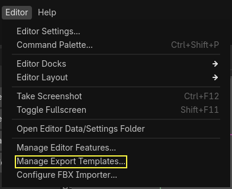

# Trabajo Práctico 5 — Terminar el juego

> **Diplomatura de Videojuegos · Semana 5** (clases 7 y 6)
> Objetivo: convertir el survivors del TP4 en un **juego terminado**: arranca en un **menú**, el HUD muestra la **vida, el tiempo y los slimes**, al perder aparece una pantalla de **Game Over** con el resultado y el récord, y cada acción **se ve y se oye**. Después se **exporta** a un `.exe` y se le suma **el aporte propio**: una idea personal que se muestra en la semana 6.

---

## 🎯 Al finalizar este TP

- Un Autoload **`Partida`** que guarda el tiempo y los slimes eliminados, aunque cambie la escena.
- Un **HUD** con su propio script: barra de vida que cambia de color, tiempo y contador.
- Un **menú de inicio** y una pantalla de **Game Over** con el resultado, el récord y “Reintentar”.
- **Música y efectos de sonido**: disparo, golpe, slime que cae, game over.
- **Game feel**: los enemigos destellan al recibir una bala y hacen *pop* al morir; el caballero parpadea y la pantalla tiembla cuando lo golpean.
- El juego **exportado**: un `.exe` que corre en una computadora sin Godot.
- **El aporte propio**: una cosa que no estaba en ningún TP, contada en un `aporte.md`.

> 💡 **Tiempo estimado:** 2 a 3 horas en total. Las partes 1 a 5 son lo de las clases (unos 90 min); la 6 es exportar (15 min); la 7 es el aporte propio, y lleva el tiempo que cada uno decida. **Escribir el código a mano**, y leer el “por qué” de cada bloque.

> 🔗 **Viene de:** la Clase 7 (animación, `AnimationPlayer`, `Tween`, sonido, game feel, la planilla de feedback), la Clase 6 (HUD, menú, Autoload, Game Over, escritos en vivo) y los TP3 y TP4.

---

## 📍 Punto de partida

Este TP continúa el **`tp4`**. Copiar la carpeta del proyecto y renombrarla **`tp5`** (así el TP4 queda como estaba), y abrirla con Godot.

Confirmar que el **punto de control 5 del TP4** sigue andando: los slimes persiguen al caballero, las balas salen solas, y cada 8 enemigos aparece el jefe con su etiqueta de estado y sus colores.

> 🧠 **Qué cambia y qué no.** El spawner, las balas y la máquina de estados del jefe **no se tocan**. Se modifican `jugador.gd` (el HUD, el sonido, el game feel) y `enemigo.gd` (el destello y el *pop*). Todo lo demás son **escenas y scripts nuevos**.

---

## 🧩 Cómo va a quedar el proyecto

Tres escenas que se van relevando, y un Autoload que las sobrevive a todas:

```
menu.tscn          Menu (Control)                           menu.gd
  ├── Fondo (ColorRect)
  └── Botonera (VBoxContainer): Titulo, BtnJugar, BtnSalir

arena.tscn         Arena (Node2D)                           arena.gd      ← NUEVO script
  ├── Jugador                                               jugador.gd
  │   ├── AnimatedSprite2D, CollisionShape2D, TimerDisparo
  │   ├── SfxDisparo, SfxGolpe, SfxKill (AudioStreamPlayer) ← NUEVOS
  │   └── AnimationPlayer                                   ← NUEVO: parpadeo
  ├── Spawner, Enemigos, Balas                              (sin cambios)
  ├── Camara (Camera2D)                                     ← NUEVO: para temblar
  ├── Musica (AudioStreamPlayer)                            ← NUEVO
  └── HUD (CanvasLayer)                                     hud.gd        ← NUEVO script
      ├── BarraVida, LabelKills
      └── LabelTiempo                                       ← NUEVO

game_over.tscn     GameOver (Control)                       game_over.gd
  ├── Fondo (ColorRect), SfxGameOver (AudioStreamPlayer)
  └── Botonera: Titulo, LabelResultado, LabelRecord, BtnReintentar, BtnMenu

partida.gd         Autoload "Partida": kills, tiempo, mejor_tiempo
```

| Parte | Qué se hace | Qué se ve |
| :---- | :---- | :---- |
| 0 | Sonidos al proyecto | — |
| 1 | `Partida` + HUD con script | Tiempo y slimes en pantalla; barra con colores |
| 2 | Menú de inicio | F5 abre el menú |
| 3 | Game Over | Resultado y récord al perder |
| 4 | Sonido | Música y efectos |
| 5 | Game feel | Destello, *pop*, parpadeo, temblor |
| 6 | Exportar | Un `.exe` que anda sin Godot |
| 7 | Aporte propio | Algo personal, para mostrar |

---

## 🔊 Parte 0 — Los sonidos

Están en la carpeta [`assets/`](assets/) de esta semana. Son **sintetizados para el curso** (no hay samples de nadie): se pueden usar libremente.

| Archivo | Para qué |
| :---- | :---- |
| `musica.wav` | Loop de 16 s para la arena |
| `disparo.wav` | “Pip” corto del arma |
| `golpe.wav` | El caballero recibe daño |
| `plop.wav` | Cae un slime |
| `game_over.wav` | Pantalla de Game Over |
| `clic.wav` | Botones (para el extra) |

1. En el **FileSystem**, clic derecho en `res://` → **New → Folder** → `sonidos`. Arrastrar los seis archivos adentro.
2. **La música en loop:** seleccionar `musica.wav` en el FileSystem → pestaña **Import** (arriba, al lado de *Scene*) → **Loop Mode** = **Forward** → **Reimport**.

> 🧠 **¿Por qué el loop se configura al importar?** Porque es una propiedad **del archivo**, no del nodo que lo reproduce: cualquier `AudioStreamPlayer` que use `musica.wav` la va a repetir sin cortes. Los efectos quedan sin loop: suenan una vez y listo.

✅ **Punto de control 0:** la carpeta `sonidos` tiene los seis `.wav`, y al hacer doble clic en `musica.wav` el Inspector muestra el loop activado.

---

## 🗂️ Parte 1 — `Partida` y un HUD con su propio script

### 1.1 · El Autoload `Partida`

> **Concepto (Clase 6, bloque 3):** al cambiar de escena, Godot **descarga la anterior entera**. Si el tiempo y los slimes viven en el jugador, la pantalla de Game Over no los puede leer. Van en un **Autoload**: un script que Godot mantiene cargado **siempre**, sea cual sea la escena.

1. En el **FileSystem**, clic derecho en `res://` → **New → Script…** → **Inherits: `Node`**, path **`res://partida.gd`** → **Create**. Escribir:

```gdscript
extends Node

var kills = 0
var tiempo = 0.0
var mejor_tiempo = 0.0

func reiniciar():
	kills = 0
	tiempo = 0.0
```

2. **Project → Project Settings → Globals → Autoload**. En **Path** elegir `partida.gd`; en **Node Name** escribir **`Partida`** → **Add**. Tiene que quedar en la lista, con **Global Variable** tildado.

   

> 🧠 **`mejor_tiempo` no se reinicia** a propósito: es el récord de la sesión. Dura mientras el juego esté abierto.

### 1.2 · Contar el tiempo

3. Seleccionar **`Arena`** → **Attach Script** → `res://arena.gd` (si ya tenía script, por ejemplo por la bomba del extra del TP3, agregarle solo la línea de `Partida`):

```gdscript
extends Node2D

func _process(delta):
	Partida.tiempo += delta
```

> 🧠 **`delta` son los segundos reales** que pasaron desde el frame anterior (Clase 3). Sumándolo en cada frame, `Partida.tiempo` cuenta segundos exactos, a 30 o a 144 FPS.

### 1.3 · El HUD, con su script

4. En `arena.tscn`, hijo de **`HUD`** → **`Label`** → renombrarlo **`LabelTiempo`**. **Text** = `Tiempo: 0`. Ubicarlo debajo de `LabelKills`.
5. Seleccionar **`HUD`** → **Attach Script** → `res://hud.gd`:

```gdscript
extends CanvasLayer

@onready var barra = $BarraVida

func _ready():
	actualizar_vida(100)

func _process(delta):
	$LabelTiempo.text = "Tiempo: " + str(int(Partida.tiempo))
	$LabelKills.text = "Slimes: " + str(Partida.kills)

func actualizar_vida(vida):
	barra.value = vida
	if vida <= 25:
		barra.modulate = Color.RED
	elif vida <= 50:
		barra.modulate = Color.YELLOW
	else:
		barra.modulate = Color.GREEN
```

> 🧠 **El jugador avisa, el HUD muestra.** El jugador ya no toca los `Label` ni la barra: le pide al HUD `actualizar_vida()`. Y el tiempo y los slimes el HUD los lee **solo**, de `Partida`, en cada frame. Si mañana la vida se muestra con corazones, se cambia **solo este script**.

> 🧠 **`@onready`** guarda `$BarraVida` **cuando el árbol ya está armado**. Sin `@onready`, la variable se llenaría al crear el script, antes de que exista el nodo.

### 1.4 · El jugador, más liviano

6. En **`jugador.gd`**:
   - **Borrar** `var kills = 0` (ahora vive en `Partida`).
   - **Borrar** la función `actualizar_hud()` entera, y su llamada en `_ready()`.
   - Agregar la línea del `@onready` y cambiar `recibir_dano()` y `sumar_kill()`:

```gdscript
@onready var hud = get_node("../HUD")      # NUEVO, arriba con las variables

func recibir_dano(cantidad):
	vida -= cantidad
	hud.actualizar_vida(vida)             # antes: actualizar_hud()
	if vida <= 0:
		get_tree().reload_current_scene()   # (se cambia en la Parte 3)

func sumar_kill():
	Partida.kills += 1                    # antes: kills += 1 y actualizar_hud()
```

> 🧠 **¿Por qué `sumar_kill()` sigue en el jugador?** En la clase, `morir()` escribía directo en `Partida`. Acá el slime ya le avisa al jugador (TP3), y se deja así porque en la Parte 4 el **sonido** de cada kill va a vivir en el jugador: el slime se borra, y un sonido que es hijo del slime se borraría con él (Clase 7).

7. **F6** con `arena.tscn` abierta.

✅ **Punto de control 1:** el HUD muestra `Tiempo: 1, 2, 3…` y `Slimes:` sube con cada kill. La barra es **verde**; al recibir golpes baja, se pone **amarilla** por debajo de 50 y **roja** por debajo de 25. Dejarse matar: la escena se reinicia… **y el tiempo sigue desde donde estaba**. No es un error: `Partida` vive **fuera** de la escena. Ponerlo en cero es trabajo del menú.

🛟 **Errores comunes en esta parte**

<details>
<summary>Ver soluciones</summary>

- **`Identifier "Partida" not declared`:** falta el Autoload, o el *Node Name* no es exactamente `Partida`. Revisar **Project Settings → Globals → Autoload**.
- **`Invalid call. Nonexistent function 'actualizar_hud'`:** quedó una llamada a la función que se borró (en `_ready()` o en otro lado). Buscarla con **Ctrl+F**.
- **`Node not found: "../HUD"`:** el HUD tiene otro nombre, o no es hijo de `Arena`.
- **La barra no cambia de color:** revisar que `actualizar_vida()` tiña la **`barra`**, no el HUD.
</details>

---

## 🚪 Parte 2 — El menú de inicio

> **Concepto (Clase 6, bloque 2):** los menús se arman con nodos **`Control`** que ocupan toda la pantalla. Las **anclas** los pegan a una parte de la pantalla, y un **`VBoxContainer`** acomoda los botones solo.

1. **Scene → New Scene** → **Otro Nodo** → **`Control`** → renombrarlo **`Menu`**. Guardar como **`menu.tscn`**.
2. Hijo de `Menu` → **`ColorRect`** → renombrarlo **`Fondo`**. Con `Fondo` seleccionado, en la barra de arriba del Viewport abrir el menú de **anclas** y elegir **Full Rect**. Elegir un **Color** oscuro.

   

3. Hijo de `Menu` → **`VBoxContainer`** → renombrarlo **`Botonera`**. Ancla → **Center**. **Theme Overrides → Constants → Separation** = `16`.
4. Hijos de `Botonera`, en este orden:
   - **`Label`** → **`Titulo`**. **Text** = `Sobreviví a los slimes`. **Theme Overrides → Font Sizes → Font Size** = `48`. **Horizontal Alignment** = `Center`.
   - **`Button`** → **`BtnJugar`**. **Text** = `Jugar`.
   - **`Button`** → **`BtnSalir`**. **Text** = `Salir`.

```
Menu  (Control)
├── Fondo     (ColorRect)      ← ancla Full Rect
└── Botonera  (VBoxContainer)  ← ancla Center
    ├── Titulo    (Label)
    ├── BtnJugar  (Button)
    └── BtnSalir  (Button)
```

5. Seleccionar **`Menu`** → **Attach Script** → `res://menu.gd`:

```gdscript
extends Control

func _ready():
	$Botonera/BtnJugar.pressed.connect(_on_jugar)
	$Botonera/BtnSalir.pressed.connect(_on_salir)
	$Botonera/BtnJugar.grab_focus()

func _on_jugar():
	Partida.reiniciar()
	get_tree().change_scene_to_file("res://arena.tscn")

func _on_salir():
	get_tree().quit()
```

6. **Project → Project Settings → Application → Run → Main Scene** = **`menu.tscn`**.
7. Apretar **F5** (no F6).

> 🧠 **`pressed`** es la señal del `Button`: se conecta igual que `body_entered` o `timeout`. **`change_scene_to_file()`** descarga el menú entero y carga la arena. **`grab_focus()`** deja “Jugar” seleccionado: se puede empezar con **Enter**, sin mouse.

> 🧠 **F5 vs F6:** F6 corre **la escena abierta**; F5 corre **el juego**, desde la *Main Scene*. De ahora en más, el juego completo se prueba con F5.

✅ **Punto de control 2:** **F5** abre el menú con el título y los dos botones centrados. **Jugar** lleva a la arena con el tiempo en 0. **Salir** cierra la ventana.

🛟 **El menú se ve mal o los botones no responden**

<details>
<summary>Ver soluciones</summary>

- **Los botones quedan en una esquina:** falta el ancla **Center** en la `Botonera`, o los botones no son hijos del `VBoxContainer`.
- **El fondo tapa todo:** el `Fondo` tiene que estar **arriba** de la `Botonera` en el árbol. En 2D, lo que está más abajo se dibuja encima.
- **Jugar no hace nada:** la ruta `"res://arena.tscn"` tiene que coincidir exacta con el FileSystem, mayúsculas incluidas. Revisar la consola.
- **F5 abre la arena, no el menú:** falta la *Main Scene*, o apunta a otra escena.
</details>

---

## 💀 Parte 3 — La pantalla de Game Over

1. En el FileSystem, clic derecho en **`menu.tscn`** → **Duplicate…** → **`game_over.tscn`**. Abrirla.
2. Renombrar la raíz a **`GameOver`**. Clic derecho en ella → **Detach Script** (se lleva el script del menú; va a tener el suyo).
3. Cambiar el **Color** del `Fondo` por un rojo oscuro.
4. En la `Botonera`:
   - `Titulo` → **Text** = `GAME OVER`.
   - Agregar dos **`Label`** debajo del título: **`LabelResultado`** y **`LabelRecord`** (**Horizontal Alignment** = `Center` en los dos).
   - Renombrar `BtnJugar` → **`BtnReintentar`** (**Text** = `Reintentar`) y `BtnSalir` → **`BtnMenu`** (**Text** = `Menú`).

```
GameOver  (Control)
├── Fondo      (ColorRect)      ← Full Rect, rojo oscuro
└── Botonera   (VBoxContainer)  ← Center
    ├── Titulo          (Label)   "GAME OVER"
    ├── LabelResultado  (Label)
    ├── LabelRecord     (Label)
    ├── BtnReintentar   (Button)
    └── BtnMenu         (Button)
```

5. **Attach Script** en `GameOver` → `res://game_over.gd`:

```gdscript
extends Control

func _ready():
	var segundos = str(int(Partida.tiempo))
	$Botonera/LabelResultado.text = "Sobreviviste " + segundos + " s y eliminaste " + str(Partida.kills) + " slimes"
	if Partida.tiempo > Partida.mejor_tiempo:
		Partida.mejor_tiempo = Partida.tiempo
		$Botonera/LabelRecord.text = "¡Nuevo récord!"
	else:
		$Botonera/LabelRecord.text = "Récord: " + str(int(Partida.mejor_tiempo)) + " s"
	$Botonera/BtnReintentar.pressed.connect(_on_reintentar)
	$Botonera/BtnMenu.pressed.connect(_on_menu)
	$Botonera/BtnReintentar.grab_focus()

func _on_reintentar():
	Partida.reiniciar()
	get_tree().change_scene_to_file("res://arena.tscn")

func _on_menu():
	get_tree().change_scene_to_file("res://menu.tscn")
```

6. En **`jugador.gd`**, al quedarse sin vida, al Game Over:

```gdscript
	if vida <= 0:
		get_tree().change_scene_to_file("res://game_over.tscn")   # antes: reload_current_scene()
```

> 🧠 **El récord** es una comparación: si el tiempo de esta partida supera a `mejor_tiempo`, pasa a ser el nuevo `mejor_tiempo`. Funciona porque `Partida` no se borra entre escenas. Al **cerrar el juego**, sí se pierde: está en memoria, no en un archivo (guardarlo es un extra).

> 🧠 **`int(Partida.tiempo)`** corta los decimales: `37.82` → `37`. Y `str()` convierte el número en texto para poder pegarlo con `+`.

✅ **Punto de control 3:** con **F5**, jugar y perder. Aparece la pantalla roja con, por ejemplo, `Sobreviviste 37 s y eliminaste 12 slimes` y `¡Nuevo récord!`. **Reintentar** arranca de cero. Si la segunda partida dura menos, dice `Récord: 37 s`. **Menú** vuelve al inicio.

🛟 **Errores comunes con el Game Over**

<details>
<summary>Ver soluciones</summary>

- **`Node not found: "Botonera/LabelResultado"`:** el nombre del `Label` no coincide, o no es hijo de `Botonera`.
- **Los botones hacen lo del menú:** no se desconectó `menu.gd`. Revisar que la raíz tenga **`game_over.gd`**.
- **Siempre dice “¡Nuevo récord!”:** `mejor_tiempo` se está poniendo en 0 en `reiniciar()`. Solo se reinician `kills` y `tiempo`.
- **El tiempo del Game Over no coincide con el del HUD:** falta `Partida.reiniciar()` en algún botón que lleva a la arena.
</details>

---

## 🎵 Parte 4 — Sonido

> **Concepto (Clase 7):** un **`AudioStreamPlayer`** reproduce un archivo con `play()`. Lo que más se repite suena **más bajo**; lo importante, más fuerte.

### 4.1 · La música

1. En `arena.tscn`, hijo de `Arena` → **`AudioStreamPlayer`** → renombrarlo **`Musica`**. **Stream** = `musica.wav` (arrastrarlo desde el FileSystem). **Autoplay** ✔. **Volume dB** = `-8`.

> 🧠 Como la música es hija de la arena, **se corta sola** al pasar al Game Over. Es lo buscado: el silencio también es una respuesta.

### 4.2 · Los efectos del caballero

2. Tres hijos de **`Jugador`**, todos **`AudioStreamPlayer`**:

   | Nodo | Stream | Volume dB |
   | :---- | :---- | :---- |
   | **`SfxDisparo`** | `disparo.wav` | `-14` |
   | **`SfxGolpe`** | `golpe.wav` | `0` |
   | **`SfxKill`** | `plop.wav` | `-6` |

3. En **`jugador.gd`**, una línea (o dos) en cada lugar:

```gdscript
func disparar():
	# ... todo lo que ya estaba, y al final:
	$SfxDisparo.pitch_scale = randf_range(0.9, 1.1)
	$SfxDisparo.play()

func recibir_dano(cantidad):
	vida -= cantidad
	hud.actualizar_vida(vida)
	$SfxGolpe.play()                     # NUEVO
	if vida <= 0:
		get_tree().change_scene_to_file("res://game_over.tscn")

func sumar_kill():
	Partida.kills += 1
	$SfxKill.play()                      # NUEVO
```

> 🧠 **`pitch_scale` al azar:** el arma dispara 150 veces por minuto. El mismo sonido idéntico cansa enseguida; variar el tono un 10 % hace que suene distinto cada vez, con un solo archivo.

> 🧠 **¿Por qué el *plop* no está en el slime?** Porque el slime hace `queue_free()`: si el sonido fuera su hijo, se borraría en el mismo frame en que empieza a sonar. El jugador sigue vivo, así que el sonido suena entero.

### 4.3 · El Game Over suena

4. En `game_over.tscn`, hijo de `GameOver` → **`AudioStreamPlayer`** → **`SfxGameOver`**. **Stream** = `game_over.wav`, **Autoplay** ✔.

✅ **Punto de control 4:** con **F5**: al entrar a la arena arranca la música en loop. Cada disparo hace un *pip* bajito, cada slime que cae hace *plop*, cada golpe al caballero suena fuerte. Al perder, se corta la música y suena el acorde del Game Over.

🛟 **No suena nada**

<details>
<summary>Ver soluciones</summary>

- **Ningún sonido:** revisar el volumen de la computadora y el **Stream** de cada nodo (si está vacío, dice `<empty>`).
- **La música no suena:** falta **Autoplay**.
- **La música suena una vez y se corta:** falta el **Loop Mode = Forward** en la importación (Parte 0).
- **`Node not found: "SfxDisparo"`:** el nodo tiene otro nombre, o no es hijo de `Jugador`.
- **El disparo tapa todo:** bajarle más el **Volume dB** (`-20`).
</details>

---

## ✨ Parte 5 — Game feel: la planilla de la Clase 7

> **Concepto:** cada evento tiene una respuesta **proporcional**. La bala que pega: un destello chico. El slime que cae: un *pop*. El caballero golpeado, que es información vital: parpadeo, temblor y sonido.

### 5.1 · El destello: un `Tween` en la clase madre

1. En **`enemigo.gd`**, cambiar `recibir_dano()` y agregar `destello()`:

```gdscript
func recibir_dano(cantidad):
	vida -= cantidad
	destello()                  # NUEVO
	if vida <= 0:
		morir()

func destello():
	$AnimatedSprite2D.modulate = Color(1, 0.3, 0.3)
	var tween = create_tween()
	tween.tween_property($AnimatedSprite2D, "modulate", Color.WHITE, 0.15)
```

> 🧠 **Un `Tween` anima una propiedad desde el código:** el sprite se pone rojo de golpe, y el tween lo lleva de vuelta a blanco en 0.15 s. Se crea, anima y desaparece solo.

> 🧠 **Herencia, otra vez:** está en `Enemigo`, así que lo **heredan todos**. El jefe llama a `super(cantidad)` en su `recibir_dano()`, y con eso ya destella. Se anima el `modulate` del **sprite**, no el del nodo raíz: el jefe usa el del raíz para sus colores de estado, y así no se pisan.

### 5.2 · El *pop* al morir

2. En **`enemigo.gd`**, reemplazar `morir()`:

```gdscript
func morir():
	var jugador = get_tree().get_first_node_in_group("jugador")
	if jugador != null:
		jugador.sumar_kill()
	# en vez de borrarse de golpe: se infla, se desvanece y recién ahí se borra
	remove_from_group("enemigo")          # el arma ya no le apunta
	set_process(false)                    # deja de perseguir (o de pensar, si es el jefe)
	set_deferred("monitorable", false)    # las balas lo atraviesan
	set_deferred("monitoring", false)     # y ya no le pega a nadie
	var tween = create_tween()
	tween.tween_property(self, "scale", scale * 1.6, 0.12)
	tween.parallel().tween_property(self, "modulate:a", 0.0, 0.12)
	tween.tween_callback(queue_free)
```

> 🧠 **Durante 0.12 s el slime es un fantasma:** sigue en pantalla para que se vea el *pop*, pero ya no está en el grupo (el arma no lo elige), no se mueve y no choca. `set_deferred()` cambia la propiedad **al final del frame**, porque Godot no deja apagar colisiones en medio de un choque.

> 🧠 **`tween.parallel()`** hace que el paso siguiente corra **al mismo tiempo** que el anterior: se infla **y** se desvanece a la vez. **`tween_callback(queue_free)`** llama a `queue_free()` cuando terminan los dos.

### 5.3 · El parpadeo del caballero: `AnimationPlayer`

3. En `arena.tscn`, hijo de **`Jugador`** → **`AnimationPlayer`**.
4. Con el `AnimationPlayer` seleccionado, abajo se abre el panel **Animation**. Botón **Animation → New** → nombre **`golpe`**. Poner el largo en **`0.4`** (el campo con el reloj, a la derecha del panel).
5. Seleccionar el **`AnimatedSprite2D`** del jugador (el panel Animation queda abierto). Con el cursor de la línea de tiempo en **0**, en el Inspector, buscar **Visibility → Modulate** y hacer clic en la **llave 🔑** de al lado. Godot pregunta si crear la pista: **Create**.
6. Mover el cursor a **0.1**, poner **Modulate** en rojo (`ff5555`) y clic en la llave. Repetir: **0.2** blanco, **0.3** rojo, **0.4** blanco.

   

7. En **`jugador.gd`**, en `recibir_dano()`, debajo del sonido:

```gdscript
	$AnimationPlayer.play("golpe")       # NUEVO
```

> 🧠 **`AnimationPlayer` o `Tween`?** El parpadeo es **siempre igual**: se puede dibujar antes de jugar, en la línea de tiempo, y ajustar mirándolo. El destello del slime es tan corto que una línea de código alcanza. Regla de la Clase 7: si se puede dibujar, `AnimationPlayer`; si depende del momento, `Tween`.

> ⚠️ El último keyframe **tiene que ser blanco**: la animación deja la propiedad con el valor del último keyframe. Si termina en rojo, el caballero queda rojo para siempre.

### 5.4 · La pantalla tiembla

8. En `arena.tscn`, hijo de **`Arena`** → **`Camera2D`** → renombrarlo **`Camara`**. **Position** = `0, 0`. **Anchor Mode** = **Fixed Top Left**. Ahora la cámara muestra exactamente lo mismo que antes: solo está para poder moverla.
9. En **`jugador.gd`**, una función nueva, y su llamada en `recibir_dano()`:

```gdscript
func sacudir_camara():
	var camara = get_node("../Camara")
	var tween = create_tween()
	for i in 5:
		var salto = Vector2(randf_range(-6, 6), randf_range(-6, 6))
		tween.tween_property(camara, "offset", salto, 0.03)
	tween.tween_property(camara, "offset", Vector2.ZERO, 0.03)
```

```gdscript
	sacudir_camara()                     # NUEVO, en recibir_dano()
```

> 🧠 **Un `for` que arma un `Tween`:** cada vuelta agrega un paso que mueve el `offset` de la cámara a un punto al azar cerca del centro; al final, un paso que lo devuelve a cero. En total, 0.18 s de temblor.

> 🧠 **¿Y el HUD?** No tiembla: vive en un `CanvasLayer`, pegado a la pantalla, no al mundo (Clase 6).

✅ **Punto de control 5:** cada bala que le pega al jefe lo hace **destellar**; cada slime que cae se **infla y desaparece**. Cuando un slime o el jefe tocan al caballero, este **parpadea en rojo**, la arena **tiembla** un instante y el HUD queda quieto. Jugar cinco minutos con sonido: ¿sobra algo? ¿falta algo? Ajustar los números (el `6` del temblor, los `0.12` del *pop*) hasta que el resultado convenza.

🛟 **Errores comunes con el game feel**

<details>
<summary>Ver soluciones</summary>

- **El caballero queda rojo:** el último keyframe de `golpe` no es blanco, o el largo de la animación es mayor que 0.4 y el último key no está al final.
- **`Animation not found: "golpe"`:** la animación tiene otro nombre (mayúsculas incluidas).
- **Se ve todo corrido o con zoom:** la `Camara` no está en `0, 0`, o su **Anchor Mode** quedó en *Drag Center*.
- **Los slimes “muertos” le siguen pegando al caballero:** falta el `set_deferred("monitoring", false)`.
- **El arma le sigue disparando a slimes que ya cayeron:** falta el `remove_from_group("enemigo")`.
- **Un slime suma dos kills:** dos balas le pegaron en el mismo frame. Es raro y no rompe nada; para evitarlo, al principio de `morir()`: `if not is_in_group("enemigo"): return`.
</details>

---

## 📦 Parte 6 — Exportar: el juego fuera de Godot

> **Concepto:** hasta ahora el juego solo existe dentro del editor. **Exportar** es empaquetarlo en un `.exe` que cualquiera puede abrir. Godot necesita unas **plantillas** (los ejecutables base de cada plataforma) que se bajan una sola vez.

### 6.1 · Antes de exportar

- **Main Scene** = `menu.tscn` (Parte 2).
- **Project → Project Settings → Application → Config → Name** = el nombre del juego.
- (Opcional) **Application → Config → Icon**: un `.png` de 256×256 para el ícono del `.exe`.
- Jugar una vez de punta a punta **sin errores rojos** en la consola.

> ⚠️ Si en algún script se escribió una ruta como `C:\Users\...` en vez de `res://`, funciona en la computadora propia y **se rompe en cualquier otra**. Es el error número uno al exportar.

### 6.2 · Exportar a Windows en 4 pasos

1. **Editor → Manage Export Templates → Download and Install**. Una sola vez; pesan bastante. Esperar a que diga que están instaladas.

   

2. **Project → Export… → Add… → Windows Desktop**.

   

3. Abajo, **Export Project…**: elegir una carpeta **nueva** (por ejemplo `export/`, **fuera** de la carpeta del proyecto) y el nombre `mi_juego.exe`. Destildar **Export With Debug** para la versión final.
4. Godot genera **dos archivos**: `mi_juego.exe` y `mi_juego.pck`. **Van siempre juntos**: el `.exe` es el motor y el `.pck` es el juego. Sin el `.pck`, el `.exe` no arranca.

> 💡 Para tener un solo archivo: en el preset, **Binary Format → Embed PCK** ✔. Queda todo dentro del `.exe`.

5. **Probarlo de verdad:** cerrar Godot, abrir `mi_juego.exe` desde la carpeta y jugar una partida entera: menú, arena, Game Over, Reintentar. Si es posible, pasárselo a alguien que no tenga Godot.

✅ **Punto de control 6:** el `.exe` corre en una computadora **sin Godot**, arranca en el menú, se escucha, y se juega igual que en el editor.

🛟 **Errores comunes al exportar**

<details>
<summary>Ver soluciones</summary>

- **“No export template found”:** las plantillas no se instalaron, o son de **otra versión** de Godot. Volver a *Manage Export Templates* y verificar que la versión coincida.
- **El `.exe` abre y se cierra:** falta el `.pck` al lado, o se copió solo el `.exe` a otra carpeta.
- **Ventana negra:** la *Main Scene* no está configurada, o apunta a una escena borrada.
- **En otra computadora no encuentra un sonido o una imagen:** una ruta absoluta (`C:\...`) en algún script, o un archivo fuera de la carpeta del proyecto. Todo tiene que estar dentro de `res://`.
</details>

---

## 🧩 Parte 7 — Aporte propio: algo que no estaba en ningún TP

> **Concepto:** el juego ya está terminado. Ahora se le **agrega una cosa propia**. No importa cuál: importa elegirla, hacerla andar y poder explicar cómo se hizo. Es lo que se va a **mostrar en la semana 6**.

### Las reglas

1. **Una sola cosa.** Bien hecha vale más que tres a medias.
2. **Se tiene que notar jugando.** Si hay que leer el código para darse cuenta, no cuenta.
3. **Con lo ya visto.** Todo lo de la lista se hace con nodos y funciones de las semanas 1 a 5. No hace falta buscar nada nuevo (aunque se puede).
4. **Del tamaño justo:** un script nuevo **o** una función nueva. Si necesita más de dos escenas nuevas, es demasiado grande.
5. **Contarla** en un archivo **`aporte.md`** dentro del proyecto, de 5 a 10 líneas.

### Elegir una de estas (o proponer una propia)

La pista **no es la solución**: es el empujón.

| # | Aporte | Qué se usa | Pista |
| :--- | :--- | :--- | :--- |
| 1 | **Disparo triple:** tres balas en abanico. | `for` (sem. 1), vectores (sem. 2) | En `disparar()`, `for angulo in [-15, 0, 15]:` y cada bala con `direccion.rotated(deg_to_rad(angulo))`. |
| 2 | **Orbe que gira** alrededor del caballero y daña lo que toca. | `Area2D` y señales (sem. 2), `delta` | Un `Area2D` hijo del `Jugador`; en `_process`: `angulo += 3 * delta` y `position = Vector2(60, 0).rotated(angulo)`. En `area_entered`, `if area is Enemigo: area.recibir_dano(1)`. |
| 3 | **Bomba cada 10 s:** una explosión alrededor del caballero. | Instanciar y `Timer` (sem. 3) | `bomba.tscn`: un `Area2D` con un círculo grande que se instancia sobre el jugador y se borra a los 0.2 s. En `area_entered`, `recibir_dano(99)`. |
| 4 | **Slime veloz:** rápido y frágil, cada 5 enemigos. | Herencia (sem. 3) | Escena heredada de `slime.tscn`, script `extends Enemigo` con `velocidad = 150`, `dano = 5` y `Modulate` amarillo. Un `contador % 5` en el spawner. |
| 5 | **El jefe dispara:** en vez de acercarse, se frena a distancia y tira balas. | Máquina de estados (sem. 4) | Una `bala_enemiga.tscn` que use `body_entered` y le pegue al grupo `"jugador"`. Que el jefe entre en `ATACAR` a 200 px y en `atacar()` instancie una hacia el caballero. |
| 6 | **Corazones que curan:** cada 15 s aparece uno. | `body_entered` (sem. 2, las monedas), `Timer` | `corazon.tscn`; al tocarlo, `vida = min(vida + 20, 100)`, `hud.actualizar_vida(vida)` y `queue_free()`. |
| 7 | **Mejora cada 10 kills:** el arma dispara más rápido. | `%` (sem. 1), `Timer` | En `sumar_kill()`: `if Partida.kills % 10 == 0: $TimerDisparo.wait_time *= 0.8`. Un aviso en el HUD durante un segundo. |
| 8 | **Dificultad que sube** con el tiempo. | `Partida`, `Timer` | En `spawnear()`: `$Timer.wait_time = max(0.25, 1.0 - Partida.tiempo / 120)`. Mostrar el “nivel” en el HUD. |
| 9 | **Esquive:** con Shift, un *dash* y medio segundo invulnerable. | Input Map (sem. 2), `Timer` one shot | Un `TimerInvulnerable`; `recibir_dano()` no hace nada mientras corre. `modulate.a = 0.5` mientras dura. |
| 10 | **Menú de pausa:** Esc congela el juego, con botones Seguir y Menú. | El desafío de la Clase 6, botones | `get_tree().paused`, y el `CanvasLayer` de la pausa con **Process → Mode = Always**. Importante: al ir al menú, sacar la pausa antes de cambiar de escena. |
| 11 | **Récord que no se borra:** el mejor tiempo sobrevive a cerrar el juego. | `Partida`, `FileAccess` | Al terminar, `FileAccess.open("user://record.txt", FileAccess.WRITE)` y `store_string(str(mejor_tiempo))`; al abrir el juego, leerlo en `_ready()` de `Partida` si `FileAccess.file_exists(...)`. |

**¿Otra idea?** Se puede: **consultarla antes** de empezar (un mensaje con dos líneas: qué se quiere hacer y con qué nodos). Así se asegura que sea del tamaño justo.

### El archivo `aporte.md`

Guardarlo en la raíz del proyecto, al lado de `project.godot`. Plantilla:

```markdown
# Mi aporte: <nombre de la idea>

**Qué agregué:** una o dos líneas.
**Dónde está:** archivos nuevos o modificados (por ejemplo: jugador.gd → disparar(); bomba.tscn + bomba.gd).
**Cómo se prueba:** qué hay que hacer en el juego para verlo.
**Qué me costó / qué cambiaría:** (opcional) una línea honesta.
```

> 🎤 **Para la semana 6:** cada uno muestra su juego **exportado** durante unos minutos: una partida corta, y después **el aporte propio** en acción, contando cómo se hizo. `aporte.md` sirve de guía.

✅ **Punto de control 7 (final):** el aporte propio se nota jugando, el resto del juego sigue funcionando igual, y `aporte.md` lo explica. Juego terminado. 🎉

---

## 📤 Entrega

Entregar **dos cosas**:

1. La **carpeta del proyecto** comprimida en `.zip` (sin la carpeta `.godot/`), con **`aporte.md`** adentro.
2. El **juego exportado**: `mi_juego.exe` + `mi_juego.pck` (o el `.exe` con el PCK embebido) en otro `.zip`.

**Nombres:** `tp5-ApellidoNombre.zip` y `tp5-ApellidoNombre-exe.zip`

### ✔️ Checklist de autoevaluación

- [ ] `Partida` es un **Autoload** con `kills`, `tiempo` y `mejor_tiempo`, y `reiniciar()` no borra el récord.
- [ ] El **HUD** tiene su script: la barra cambia de color y muestra tiempo y slimes leyendo `Partida`.
- [ ] El jugador **no** toca los nodos del HUD: le pide `actualizar_vida()`.
- [ ] **F5** abre el **menú**; Jugar lleva a la arena con todo en 0; Salir cierra.
- [ ] Al perder aparece el **Game Over** con el resultado, el récord, Reintentar y Menú.
- [ ] Hay **música en loop** y efectos de disparo, golpe, kill y game over; el disparo es el más bajito.
- [ ] Los enemigos **destellan** al recibir una bala y hacen **pop** al morir (en `enemigo.gd`, heredado por el jefe).
- [ ] El caballero **parpadea** (`AnimationPlayer`) y la pantalla **tiembla** al recibir daño; el HUD no tiembla.
- [ ] El `.exe` exportado corre **sin Godot**.
- [ ] **El aporte propio** se nota jugando y está explicado en `aporte.md`.

---

## 📄 Código completo de referencia

Como referencia, por si algún paso no quedó claro. **`spawner.gd`, `bala.gd` y `slime_elite.gd` quedan igual que en el TP4.**

<details>
<summary><code>partida.gd</code>, <code>arena.gd</code> y <code>hud.gd</code></summary>

```gdscript
# partida.gd  (Autoload "Partida")
extends Node

var kills = 0
var tiempo = 0.0
var mejor_tiempo = 0.0

func reiniciar():
	kills = 0
	tiempo = 0.0
```

```gdscript
# arena.gd
extends Node2D

func _process(delta):
	Partida.tiempo += delta
```

```gdscript
# hud.gd
extends CanvasLayer

@onready var barra = $BarraVida

func _ready():
	actualizar_vida(100)

func _process(delta):
	$LabelTiempo.text = "Tiempo: " + str(int(Partida.tiempo))
	$LabelKills.text = "Slimes: " + str(Partida.kills)

func actualizar_vida(vida):
	barra.value = vida
	if vida <= 25:
		barra.modulate = Color.RED
	elif vida <= 50:
		barra.modulate = Color.YELLOW
	else:
		barra.modulate = Color.GREEN
```
</details>

<details>
<summary><code>jugador.gd</code> completo</summary>

```gdscript
extends CharacterBody2D

var velocidad = 200
var vida = 100
var escena_bala = preload("res://bala.tscn")

@onready var hud = get_node("../HUD")

func _ready():
	add_to_group("jugador")
	$TimerDisparo.timeout.connect(disparar)

func _physics_process(delta):
	var direccion = Input.get_vector("mover_izquierda", "mover_derecha", "mover_arriba", "mover_abajo")
	velocity = direccion * velocidad
	move_and_slide()

	if direccion != Vector2.ZERO:
		$AnimatedSprite2D.play("run")
		$AnimatedSprite2D.flip_h = direccion.x < 0
	else:
		$AnimatedSprite2D.play("idle")

	var limites = get_viewport_rect().size
	position.x = clamp(position.x, 0, limites.x)
	position.y = clamp(position.y, 0, limites.y)

func recibir_dano(cantidad):
	vida -= cantidad
	hud.actualizar_vida(vida)
	$SfxGolpe.play()
	$AnimationPlayer.play("golpe")
	sacudir_camara()
	if vida <= 0:
		get_tree().change_scene_to_file("res://game_over.tscn")

func sumar_kill():
	Partida.kills += 1
	$SfxKill.play()

func sacudir_camara():
	var camara = get_node("../Camara")
	var tween = create_tween()
	for i in 5:
		var salto = Vector2(randf_range(-6, 6), randf_range(-6, 6))
		tween.tween_property(camara, "offset", salto, 0.03)
	tween.tween_property(camara, "offset", Vector2.ZERO, 0.03)

func disparar():
	var objetivo = enemigo_mas_cercano()
	if objetivo == null:
		return
	var bala = escena_bala.instantiate()
	bala.position = position
	bala.direccion = (objetivo.position - position).normalized()
	get_node("../Balas").add_child(bala)
	$SfxDisparo.pitch_scale = randf_range(0.9, 1.1)
	$SfxDisparo.play()

func enemigo_mas_cercano():
	var mas_cercano = null
	var menor_distancia = INF
	for enemigo in get_tree().get_nodes_in_group("enemigo"):
		var distancia = position.distance_to(enemigo.position)
		if distancia < menor_distancia:
			menor_distancia = distancia
			mas_cercano = enemigo
	return mas_cercano
```
</details>

<details>
<summary><code>enemigo.gd</code> completo</summary>

```gdscript
class_name Enemigo
extends Area2D

var vida = 1
var velocidad = 60
var dano = 10

func _ready():
	add_to_group("enemigo")
	body_entered.connect(_on_body_entered)

func _process(delta):
	var jugador = get_tree().get_first_node_in_group("jugador")
	if jugador == null:
		return
	var direccion = (jugador.position - position).normalized()
	position += direccion * velocidad * delta
	$AnimatedSprite2D.flip_h = direccion.x < 0

func recibir_dano(cantidad):
	vida -= cantidad
	destello()
	if vida <= 0:
		morir()

func destello():
	$AnimatedSprite2D.modulate = Color(1, 0.3, 0.3)
	var tween = create_tween()
	tween.tween_property($AnimatedSprite2D, "modulate", Color.WHITE, 0.15)

func morir():
	var jugador = get_tree().get_first_node_in_group("jugador")
	if jugador != null:
		jugador.sumar_kill()
	remove_from_group("enemigo")
	set_process(false)
	set_deferred("monitorable", false)
	set_deferred("monitoring", false)
	var tween = create_tween()
	tween.tween_property(self, "scale", scale * 1.6, 0.12)
	tween.parallel().tween_property(self, "modulate:a", 0.0, 0.12)
	tween.tween_callback(queue_free)

func _on_body_entered(body):
	if body.is_in_group("jugador"):
		body.recibir_dano(dano)
		queue_free()
```
</details>

<details>
<summary><code>menu.gd</code> y <code>game_over.gd</code></summary>

```gdscript
# menu.gd
extends Control

func _ready():
	$Botonera/BtnJugar.pressed.connect(_on_jugar)
	$Botonera/BtnSalir.pressed.connect(_on_salir)
	$Botonera/BtnJugar.grab_focus()

func _on_jugar():
	Partida.reiniciar()
	get_tree().change_scene_to_file("res://arena.tscn")

func _on_salir():
	get_tree().quit()
```

```gdscript
# game_over.gd
extends Control

func _ready():
	var segundos = str(int(Partida.tiempo))
	$Botonera/LabelResultado.text = "Sobreviviste " + segundos + " s y eliminaste " + str(Partida.kills) + " slimes"
	if Partida.tiempo > Partida.mejor_tiempo:
		Partida.mejor_tiempo = Partida.tiempo
		$Botonera/LabelRecord.text = "¡Nuevo récord!"
	else:
		$Botonera/LabelRecord.text = "Récord: " + str(int(Partida.mejor_tiempo)) + " s"
	$Botonera/BtnReintentar.pressed.connect(_on_reintentar)
	$Botonera/BtnMenu.pressed.connect(_on_menu)
	$Botonera/BtnReintentar.grab_focus()

func _on_reintentar():
	Partida.reiniciar()
	get_tree().change_scene_to_file("res://arena.tscn")

func _on_menu():
	get_tree().change_scene_to_file("res://menu.tscn")
```
</details>

---

## 🌟 Extra (opcional, para los que quieran más)

- **El clic que no se escucha.** Agregar un `AudioStreamPlayer` con `clic.wav` al menú y hacerlo sonar en `_on_jugar()`. No se oye: el cambio de escena lo borra en el mismo frame (la trampa de la Clase 7). Arreglo: `$SfxClic.play()`, después `await $SfxClic.finished`, y recién ahí cambiar de escena.
- **Hit stop cuando cae el jefe.** En `morir()` de `slime_elite.gd`: `Engine.time_scale = 0.05`, `await get_tree().create_timer(0.08, true, false, true).timeout` y `Engine.time_scale = 1.0`, antes del `super()`. Solo para el jefe: con cada slime, el juego viviría congelado.
- **Partículas al morir.** Una escena `explosion.tscn` con un `CPUParticles2D` (**One Shot** ✔, **Emitting** ✔, **Explosiveness** `1`, **Spread** `180`, **Gravity** `0, 0`, **Initial Velocity** `80`–`140`) y un script con `finished.connect(queue_free)`. El slime la instancia en su posición, en `Balas` o en la arena, antes del *pop*.
- **Volumen de la música.** Panel **Audio** (abajo): agregar los buses `Musica` y `Efectos` y asignar cada `AudioStreamPlayer` al suyo. En el menú, un `HSlider` de 0 a 1 que haga `AudioServer.set_bus_volume_db(AudioServer.get_bus_index("Musica"), linear_to_db(value))`.
- **Cámara que sigue y piso infinito.** Llevar la `Camara` adentro del `Jugador` (con **Anchor Mode** en *Drag Center* y la ruta de `sacudir_camara()` cambiada a `$Camara`), y sacar el `clamp`. Hay que cambiar también de dónde salen los slimes. La guía completa, con otros nombres de escena, está en las partes 1 y 2 del [TP8 de la versión anterior](../../trabajos-practicos/trabajo-practico-8.md).
- **Ranking con nombres.** Un `LineEdit` en el menú para el nombre, y un top 5 guardado en `user://ranking.json`. Está paso a paso en las partes 4 a 6 del mismo [TP8 anterior](../../trabajos-practicos/trabajo-practico-8.md).

---

## 📚 Recursos

- Autoloads: **[Singletons (Autoload)](https://docs.godotengine.org/es/4.x/tutorials/scripting/singletons_autoload.html)**
- Anclas y contenedores: **[Size and anchors](https://docs.godotengine.org/es/4.x/tutorials/ui/size_and_anchors.html)** y **[Using Containers](https://docs.godotengine.org/es/4.x/tutorials/ui/gui_containers.html)**
- Cambiar de escena: **[Change scenes manually](https://docs.godotengine.org/es/4.x/tutorials/scripting/change_scenes_manually.html)**
- Sonido: **[Audio streams](https://docs.godotengine.org/es/4.x/tutorials/audio/audio_streams.html)** y **[Audio buses](https://docs.godotengine.org/es/4.x/tutorials/audio/audio_buses.html)**
- `AnimationPlayer`: **[Introduction to the animation features](https://docs.godotengine.org/es/4.x/tutorials/animation/introduction.html)**
- `Tween`: **[referencia de Tween](https://docs.godotengine.org/es/4.x/classes/class_tween.html)**
- Exportar: **[Exporting projects](https://docs.godotengine.org/es/4.x/tutorials/export/exporting_projects.html)**

> Sonidos: síntesis propia para la diplomatura (`v2/herramientas/generar-sonidos.py`), uso libre. Sprites de **Brackeys**, licencia **CC0**, heredados del TP3 (ver [`assets/LICENSE-brackeys.txt`](assets/LICENSE-brackeys.txt)). Capturas del editor: documentación oficial de **Godot Engine**, CC BY 4.0.
